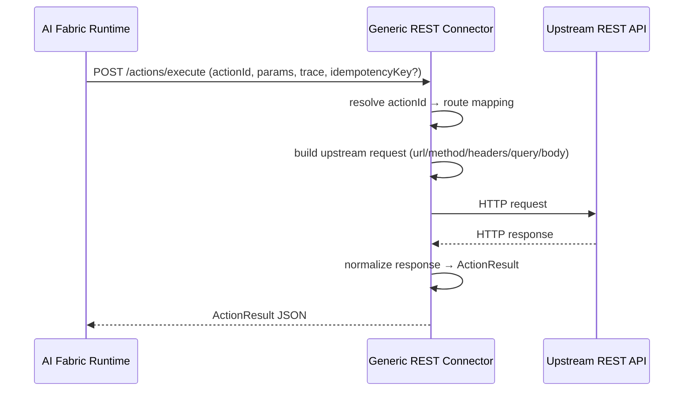

# Generic REST API Connector (Action → Endpoint) — Architecture & Developer Guide (V1)

This document describes the **Generic REST API Connector**: a runnable service that implements the **Customer Connector API** (`POST /actions/execute`) but executes actions by routing:

`actionId → upstream REST endpoint`

It is **domain-agnostic** and intended for “API-ready” systems (Shopify, ERP, internal services, etc.) where you want AI Fabric to orchestrate actions while you keep business logic in existing APIs.

Related docs:
- Customer Connector API contract: `Final_Documentation/Development_Guides/CUSTOMER_CONNECTOR_IMPLEMENTATION_GUIDE.md`
- Actions architecture (local + connector + relay): `Final_Documentation/Development_Guides/ACTIONS_CONNECTOR_AND_RELAY_GUIDE.md`

Code:
- Runnable service: `ai-infrastructure-module/ai-infrastructure-generic-rest-connector`

---

## Status (as of 2026-09-27)

- **Implemented:**
  - `/actions/execute` connector endpoint (runtime-compatible)
  - File-based routing config (`actions-routing.yml`)
  - API-key inbound auth (fail-closed by default)
  - Upstream HTTP execution with timeouts + optional bounded retries
  - Idempotency (in-memory) keyed by `idempotencyKey` + params fingerprint
  - Response normalization to `ActionResult` payload rules (object vs list payload)
  - Provider-neutral connection profiles with approved HTTPS hosts
  - API-key and bounded form-token-exchange provider authentication
  - Immutable protected-resource bindings with server-owned path, query,
    header, or body placement
  - Capability-grant checks at profile, binding, and route/source boundaries
  - Deployment-local `HTTP_JSON` baseline synchronization with page/size or
    cursor pagination
  - Record projection, protected-resource equality, tombstones, bounded
    response sizes, and runtime Data Sync/index-work reconciliation
  - Raw-body HMAC provider webhooks with replay-window checks, durable dedupe,
    retry, controlled replay, and dead-letter status
  - PostgreSQL/Flyway integration state in a connector-owned schema and
    restricted role
  - Safe integration posture, source/work status, bounded webhook event
    summaries, and authorized reconcile/replay operations
- **Intentionally package-owned or out of scope:**
  - Provider route names, token field names, resource semantics, schemas,
    signature header names, and exact retry durations
  - Arbitrary auth protocols, arbitrary webhook code, or arbitrary plugin code
  - A central Platform data proxy or shared provider bridge
  - Browser access to provider credentials or connector/runtime service keys

The external-provider substrate is generic and locally verified. A specific
provider is supported only after its immutable Marketplace package and hosted
provider evidence pass their own release gates.

### Current external-integration topology

```text
provider API/event
  <-> deployment-local Generic REST Connector
       -> connector-owned PostgreSQL schema
       -> private deployment-local runtime Data Sync and indexing status

Platform control plane
  -> validates, compiles, provisions, observes, reconciles, and retires
  -> does not proxy routine provider records or events
```

The connector and runtime use stable private service names on Coolify for
`EXTERNAL_SYNC_HTTP`. The connector receives privileged database bootstrap
credentials for its first start only. After it creates the restricted role and
schema, Platform inventories standard and preview environment rows, requires
every expected bootstrap key to exist, deletes every matching row, verifies by
readback that none remain, redeploys it, and requires it to become healthy
using only the restricted role.

---

## 1) When to use this vs the Relay

Use the **Generic REST Connector** when:
- You already have upstream APIs that do **not** implement the Customer Connector API
- You want a mapping layer: `actionId → method/url/body/headers`
- You want AI Fabric runtime to call **one** connector base URL, while upstream remains arbitrary REST

Use the **Relay** (`ai-infrastructure-relay`) when:
- Your upstream service already implements the Customer Connector API and returns `ActionResult`
- You mainly need security hardening (inbound auth, idempotency, SSRF-safe routing) + forwarding

---

## 2) Runtime ↔ Connector contract (stable)

Important posture update:

- the connector should be treated as an internal execution surface
- browser and customer integrations should target runtime or a trusted host/backend facade
- operational reads such as connector health and action catalog overview should be exposed through runtime-backed admin routes rather than direct connector reachability

AI Fabric Runtime calls:
- `POST {connectorBaseUrl}/actions/execute`

Request JSON:
- `actionId` (string, required)
- `params` (object, optional; defaults to `{}`)
- `idempotencyKey` (string, optional; present for write actions)
- `trace` (object, optional; `requestId`, `conversationId`, `userId`, `sessionId`, optional `tenantId`)

Response JSON (`ActionResult`-compatible):
- `success` (boolean)
- `message` (string, optional)
- `data` (object, optional)
- `pinnedTargets` (array, optional)
- `errorCode` (string, optional)

Payload rules:
- Object payload: any keys except reserved list keys
- List payload: must use `_items` (array) + `_count` (number equal to `_items.length`) + optional `_totalCount`, `_cursor`

---

## 3) Routing configuration (file-based)

### 3.1 Config file location

The service loads routing config from:
- `rest-connector.routing-config-location` (default `classpath:actions-routing.yml`)

You typically override it in Docker/Kubernetes via env:
- `REST_CONNECTOR_ROUTING_CONFIG_LOCATION=file:/config/actions-routing.yml`

### 3.2 YAML schema (MVP)

```yaml
connector:
  inbound-auth:
    allow-unauthenticated: false
    api-key:
      enabled: true
      header: X-AIFABRIC-API-KEY
      value: ${CONNECTOR_API_KEY}

  upstream:
    base-url: "https://customer-api.example.com"
    auth:
      type: api_key
      header: Authorization
      value: "Bearer ${UPSTREAM_API_KEY}"

  http:
    connect-timeout-ms: 2000
    timeout-ms: 8000
    retry:
      enabled: true
      max-attempts: 2
      backoff-ms: 200
      retry-on: [429, 502, 503, 504]

  idempotency:
    enabled: true
    ttl-seconds: 300
    in-progress-max-wait-ms: 2000

actions:
  add_to_cart:
    method: POST
    path: /cart/items
    headers:
      X-Request-Source: ai-fabric
    request:
      query: {}
      body:
        userId: "{{trace.userId}}"
        sku: "{{params.sku}}"
        quantity: "{{params.quantity}}"
    response:
      success-http-status: [200, 201]
      message: "Added to cart"
      result: "{{body}}"
```

### 3.3 Templating (supported roots)

The connector supports `{{...}}` placeholders in:
- `url`, `path`
- `headers[*]`
- `request.query[*]`
- `request.body`
- `response.message`
- `response.result`
- `response.pinned-targets`

Supported roots:
- `actionId`
- `idempotencyKey`
- `params.*`
- `trace.*`
- `body.*` (upstream JSON body)
- `status` (upstream HTTP status)
- `headers.*` (upstream response headers; first value only)

Notes:
- If the entire string is a placeholder (e.g. `"{{params.items}}"`), the value is inserted as its native JSON type.
- If the placeholder is part of a larger string, it is interpolated as text.
- Unsupported roots fail fast (mapping error).

### 3.4 External HTTP integration contract

Marketplace compiles reviewed DATA/ACTION contributions into these connector
sections:

- `connection-profiles`: environment, HTTPS base/token origins, host allowlist,
  auth strategy, grants, rate policy, error mappings, and safe correlation
  response headers;
- `protected-resources`: immutable resource ID, environment, type, grants, and
  connection-profile ownership;
- `data-sources`: method/path, server-owned resource placements, pagination,
  projections, source version, schedule, limits, and tombstone policy;
- `webhooks`: method/content type, raw-body verifier, resource/event pointers,
  allowed event types, retry/dead-letter policy, and optional operator replay;
  and
- `runtime-data-sync`: private runtime URL, deployment-scoped API key,
  deployment/tenant identity, and bounded indexing-work polling.

Safety rules:

- provider and token origins must be clean HTTPS URLs on the profile allowlist;
- package input can reference secrets but cannot contain resolved credential
  values;
- all required grants must exist on both profile and protected resource;
- every protected path placeholder must be bound server-side;
- a resource placement cannot target the provider authentication header;
- every provider record and accepted event must carry the exact protected
  resource ID before it can reach Data Sync;
- cursor state is reused only while the immutable source version is unchanged;
- absent-record deletion is allowed only for a proven-complete snapshot, never
  an incremental cursor feed; and
- provider and runtime response bodies are size bounded before JSON parsing.

Supported provider auth strategies in this release:

- `API_KEY`
- `FORM_TOKEN_EXCHANGE`

`FORM_TOKEN_EXCHANGE` is deliberately bounded to a package-declared `POST`,
secret-backed form fields, a token JSON Pointer, exactly one absolute or
relative expiry pointer, an approved token host, and a configured authorization
header/scheme. Token values are held in memory and are not written to connector
state or admin responses.

### 3.5 Durable integration state

Enable durable state with:

```bash
REST_CONNECTOR_PERSISTENCE_ENABLED=true
REST_CONNECTOR_JDBC_URL=jdbc:postgresql://<private-db>:5432/<database>
REST_CONNECTOR_JDBC_USERNAME=<restricted-role>
REST_CONNECTOR_JDBC_PASSWORD=<restricted-role-secret>
REST_CONNECTOR_PERSISTENCE_SCHEMA=integration_connector
```

The one-time bootstrap URL/user/password/role variables are provisioning-only.
They must be removed after the first healthy start. The connector must then be
restarted and verified with only its restricted operational role.

Durable state contains source cursors/versions/counts, source record IDs and
fingerprints, indexing work references, provider correlation evidence, and
webhook lifecycle metadata. It does not contain provider credential or access
token values. Invalid or unauthenticated webhook attempts are retained only as
fixed-cardinality counters by source and error class; their payloads, event
identities, hashes, and resource fingerprints are never persisted.

Hard deployment deletion removes the connector/database resources and clears
the deployment-generated connector service credential and restricted database
password from the Platform secret store. Provider credentials supplied through
customer/deployment secret references retain their existing owner and cleanup
policy.

---

## 4) Execution flow (who talks to whom)



---

## 5) Error codes (connector → runtime)

The connector returns stable `errorCode`s:
- `INVALID_REQUEST` (missing actionId, invalid JSON)
- `ACTION_NOT_SUPPORTED` (no route mapping)
- `MAPPING_ERROR` (invalid route config or template usage)
- `RATE_LIMITED` (upstream HTTP 429)
- `TIMEOUT` (timeout)
- `SERVICE_UNAVAILABLE` (upstream 5xx / network failure)
- `UPSTREAM_ERROR` (other upstream non-success statuses)

AI Fabric Runtime retry behavior is derived from `errorCode` + idempotency safety (`RATE_LIMITED`, `TIMEOUT`, `SERVICE_UNAVAILABLE` are retriable).

---

## 6) Deployment

### 6.1 Runnable module

- Service module: `ai-infrastructure-module/ai-infrastructure-generic-rest-connector`
- Default port: `8082` (supports `PORT` override via `server.port=${PORT:8082}`)

### 6.3 Verification endpoints (debug)

These endpoints help confirm which routes are loaded at runtime (useful for "ACTION_NOT_SUPPORTED" debugging):

- Health:
  - `GET /actuator/health`
- Routes overview (admin):
  - `GET /api/admin/overview`
  - `GET /api/admin/actions/overview`
  - `GET /api/admin/actions/{actionId}`

Security:
- When `connector.inbound-auth.allow-unauthenticated=false`, the admin endpoints are protected by the same inbound API key as `/actions/execute`.
- Send your inbound auth header (default `X-AIFABRIC-API-KEY`) when calling them.

Runtime-first recommendation:

- first-party/operator tooling should prefer:
  - `GET /api/admin/connector/health`
  - `GET /api/admin/connector/overview`
  - `GET /api/admin/connector/actions/overview`
- direct connector admin routes should be treated as compatibility or internal-only access

External-integration operations are exposed through the runtime-backed admin
surface and Platform deployment workspace:

- `GET /api/admin/connector/integrations`
- `GET /api/admin/connector/integrations/sources/{sourceId}`
- `POST /api/admin/connector/integrations/sources/{sourceId}/reconcile`
- `GET /api/admin/connector/integrations/webhooks/{sourceId}/events`
- `POST /api/admin/connector/integrations/webhooks/{sourceId}/events/{eventId}/replay`

The public provider callback is deployment-specific:

- `{connectorPublicBaseUrl}/integrations/webhooks/{sourceId}`

The callback URL is safe to display to an operator. Its verifier secret is not.
Manual replay must be enabled by the immutable package contract and never
replays rejected/unauthenticated payload evidence.

Operator projections deliberately omit source record IDs, source payload
hashes, and protected-resource fingerprints from indexing-work and webhook
event rows. They expose only the bounded state needed to diagnose freshness,
completion, classified failure, duplicate, replay, and dead-letter behavior.

### 6.4 Optional: Runtime Proxy (Indexing Alias)

For some demo setups you may want the connector to be the **single base URL** for both:
- action execution (`POST /actions/execute`)
- managed indexing calls (Runtime Data Sync push API)

When enabled, the connector exposes a small set of **alias** endpoints under:
- `/api/ai/data-sync/*`

These endpoints **forward** to the configured runtime.

Enable:

```bash
REST_CONNECTOR_RUNTIME_PROXY_ENABLED=true
REST_CONNECTOR_RUNTIME_PROXY_BASE_URL="https://<runtime>.up.railway.app"
```

Optional runtime auth header (only if your runtime is protected by an external gateway):

```bash
REST_CONNECTOR_RUNTIME_PROXY_API_KEY_HEADER="X-ADMIN-API-KEY"
REST_CONNECTOR_RUNTIME_PROXY_API_KEY="<secret>"
```

Exposed endpoints (when enabled):
- `GET /api/ai/data-sync/vector-spaces`
- `POST /api/ai/data-sync/upsert`
- `POST /api/ai/data-sync/delete`
- `POST /api/ai/data-sync/batch`

Also exposed (read-only admin inspection, when enabled):
- `GET /api/admin/indexing/overview`
- `GET /api/admin/indexing/vectors?entityType=...&offset=...&limit=...`

Security:
- These endpoints are protected by the same inbound API key filter as `/actions/execute` (unless you explicitly set `connector.inbound-auth.allow-unauthenticated=true`).

### 6.2 Docker image

Build:
- `ai-infrastructure-module/ai-infrastructure-generic-rest-connector/Dockerfile`
- Railway-friendly Dockerfile (bakes a template routing config):
  - `ai-infrastructure-module/ai-infrastructure-generic-rest-connector/deploy/railway/Dockerfile`
  - Guide: `ai-infrastructure-module/ai-infrastructure-generic-rest-connector/deploy/railway/RAILWAY_DEPLOYMENT_GUIDE.md`

Run pattern:
- mount `actions-routing.yml` to `/config/actions-routing.yml`
- set `REST_CONNECTOR_ROUTING_CONFIG_LOCATION=file:/config/actions-routing.yml`
- set secrets via env (`CONNECTOR_API_KEY`, `UPSTREAM_API_KEY`, etc)
