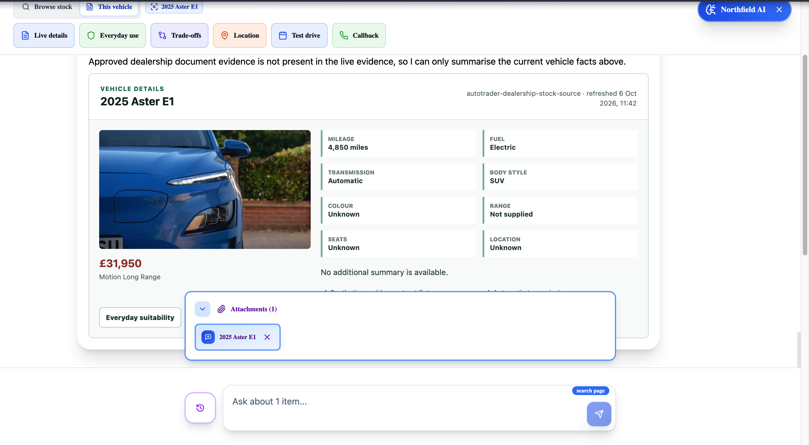
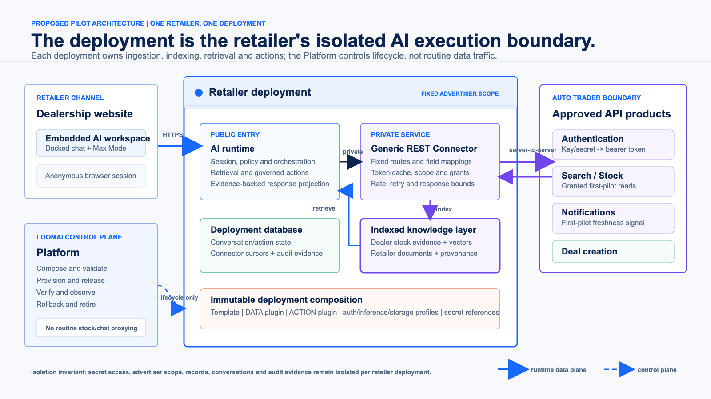
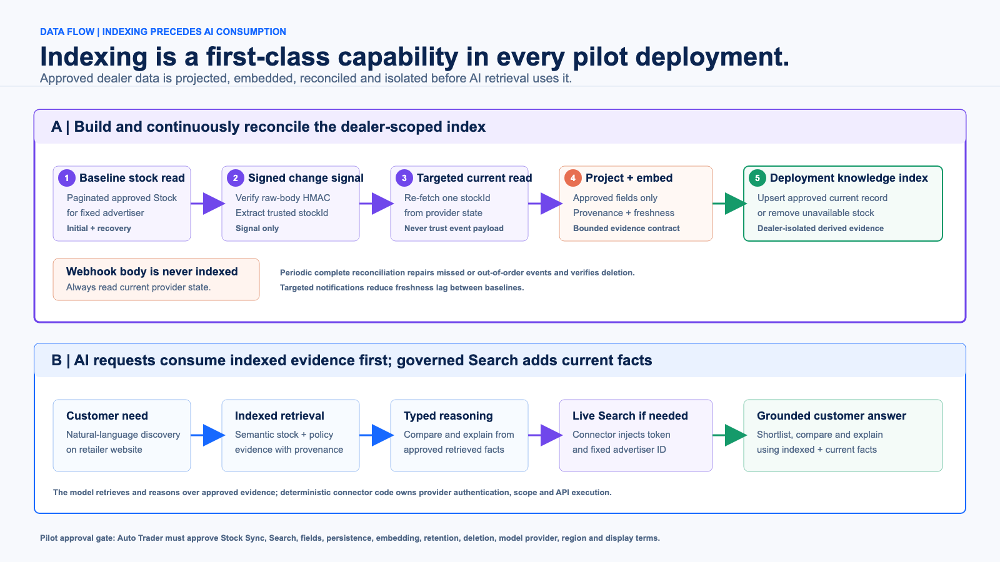
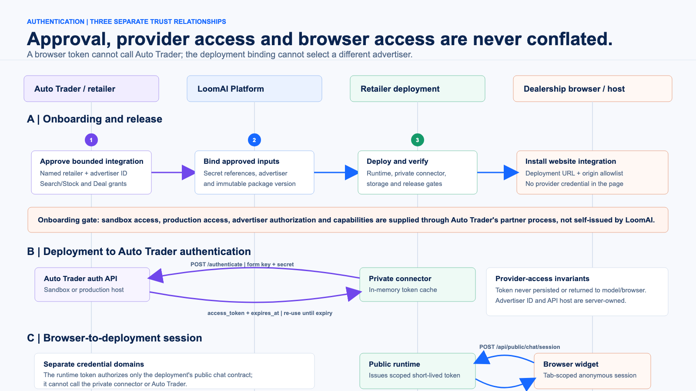
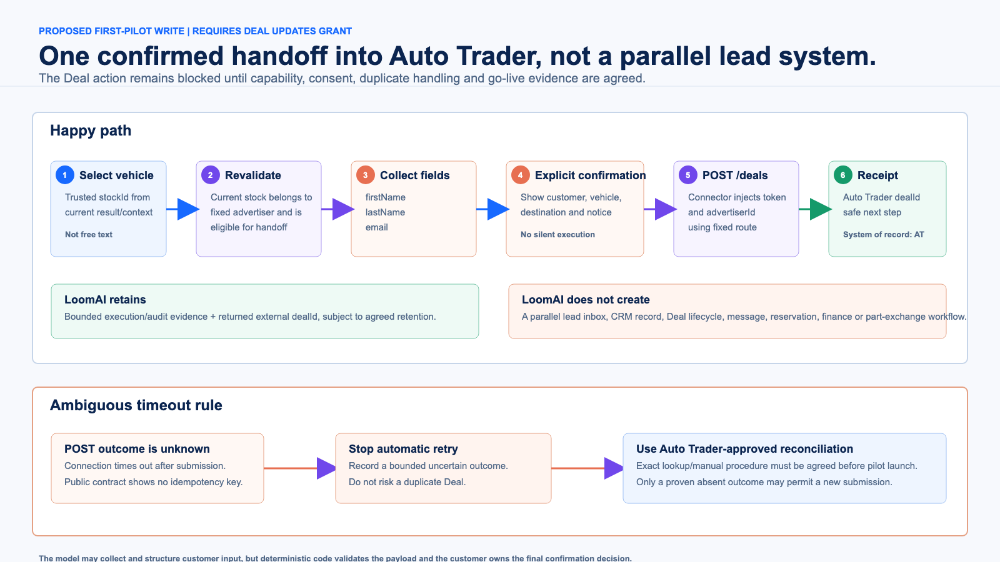

# Auto Trader Technical Integration Proposal

## Dealer-Scoped Indexed Intelligence And Governed Deal Handoff

**Prepared by Loom AI Labs**

**Prepared for:** Technical discussion with Auto Trader

**Date:** 8 October 2026

**Proposal status:** Request for technical validation and a bounded pilot path.
LoomAI has no Auto Trader sandbox or production access, certification,
endorsement or participating retailer yet.

**Purpose:** Answer the technical questions raised in the 6 October 2026
meeting: the exact API use cases, requested data, data movement, indexing,
authentication, AI authority boundary, Deal handoff, and decisions required for
a pilot.

## Proposed Pilot And API Surface

### Proposed first pilot

One named retailer receives one isolated LoomAI deployment for its website. A
visitor can:

1. discover the retailer's permitted stock through a deployment-local index
   kept current from Auto Trader Stock Sync;
2. compare selected vehicles using indexed evidence and governed live facts;
3. combine vehicle facts with separately owned retailer policy documents; and
4. explicitly confirm one handoff into Auto Trader through `POST /deals`.

Auto Trader remains the stock, advertiser-product and Deal authority. LoomAI
does not create a marketplace, cross-retailer corpus, parallel lead inbox or
post-creation Deal workflow.

### Partnership opportunity

- Auto Trader supplies the trusted inventory and Deal capabilities for each participating retailer.
- LoomAI turns those capabilities into an intelligent, installable workspace on the retailer's website.
- Visitors can discover, compare and understand vehicles through natural language grounded in current data.
- Governed conversations can qualify intent and collect the minimum consented details needed for a handoff.
- Confirmed opportunities return to Auto Trader's Deal flow, improving completion and lead quality without creating a competing lead system.

### Intelligent workspace experience



*The dealership experience can expand from a docked assistant into an
AI-enabled workspace with contextual tools, attached vehicle context, indexed
evidence, live facts and governed customer actions. It is not limited to a
chatbot response stream.*

| Use | Endpoint or mechanism | Public capability | Proposed treatment |
| --- | --- | --- | --- |
| Authenticate | `POST /authenticate` | Integration authentication | Connector-only key/secret exchange; cache bearer token until expiry |
| Indexed dealer stock | Paginated `GET /stock`, Stock Notifications, targeted `GET /stock?...&stockId=...` | **Stock Sync** | Required first-pilot ingestion and freshness path; maintain a deployment-only projection and remove stale stock |
| Governed live lookup | `GET /search?advertiserId=...` | **Search** | First-pilot query-time companion for current dealer-scoped reads and verification |
| Customer handoff | `POST /deals?advertiserId=...` | **Deal Updates** | Explicitly confirmed first name, last name, email and trusted stock target |

LoomAI requests dealer-scoped **Stock Sync** and **Search**, not **Search
Adverts**. The first pilot does not request Stock Updates, price/availability
writes, media writes, Deal lifecycle updates, messages, finance or part
exchange.

### Current evidence versus requested access

- **Implemented with synthetic data:** token exchange, advertiser binding,
  paginated stock reads, signed notifications, targeted refresh, field
  projection, indexing/removal, grounded answers and governed confirmation.
- **Not yet proven:** Auto Trader credentials, exact sandbox behavior, granted
  capabilities, permitted AI processing, permitted indexing or Deal creation.

<div style="page-break-after: always;"></div>

## Retailer-Isolated Deployment Architecture



### What one deployment contains

| Component | Technical responsibility |
| --- | --- |
| AI runtime | Browser session, typed intent, retrieval, policy, confirmation and safe response |
| Private connector | Fixed Auto Trader hosts/routes, token cache, advertiser injection, grants, rate/retry bounds and response projection |
| Indexing pipeline | Baseline ingestion, notification verification, targeted refresh, projection, embedding, upsert and deletion |
| Deployment database | Conversation/action state and connector cursor, replay and bounded audit state |
| Indexed knowledge layer | Dealer-scoped stock evidence, vectors, retailer documents, provenance and freshness metadata |
| Immutable composition | Template, DATA/ACTION plugins, profiles, limits and protected secret references |

The LoomAI Platform is the control plane used to compose, release, verify,
rollback and retire a deployment. Routine customer queries and Auto Trader API
calls stay in the retailer deployment data plane rather than passing through a
shared LoomAI gateway.

### Isolation and authority invariants

- One deployment has one non-overridable advertiser binding.
- Browser and model cannot choose host, route, method, credential, token,
  advertiser or capability grant.
- The connector is private and returns only approved projected fields.
- Auto Trader credential scope follows Auto Trader policy; each deployment has
  isolated secret access even if a credential is integration-scoped.
- Records, conversations, index content and audit state are not shared between
  retailer deployments.

<div style="page-break-after: always;"></div>

## Indexed Data Flow And Freshness



### First-pilot indexed mode: Stock Sync

A DATA plugin performs a paginated baseline for the fixed advertiser, reduces
each response to the approved field allowlist and builds a deployment-local
search/vector projection. A signed notification is treated only as a change
signal: the connector verifies the raw-body HMAC, extracts `stockId`, fetches
the current record and then upserts or removes the projected record. A periodic
complete baseline repairs missed or out-of-order events and proves deletion.

The index supports semantic discovery and comparison alongside separately
owned retailer documents. It is derived evidence, not the stock system of
record. Pilot acceptance requires a successful initial baseline, targeted
freshness updates and verified removal of unavailable stock.

### Query-time cooperation: Search

For a request needing a current dealer-scoped lookup or verification, the
connector injects the fixed advertiser and token, calls Search and projects
only approved response fields. Those facts may be combined with indexed
evidence for the current answer. Search complements the synchronized index; it
does not replace the first-pilot indexing and freshness path.

### Requests rehearsed by the current synthetic simulator

```http
POST /authenticate
GET /stock?advertiserId=<fixed>&lifecycleState=FORECOURT&page=1&pageSize=200
PUT <deployment webhook>  AutoTrader-Signature: t=<epoch>,v1=<hmac>
GET /stock?advertiserId=<fixed>&stockId=<event-stock-id>&page=1&pageSize=1
```

The operator-only simulator mutation routes are not Auto Trader endpoints.

### Proposed data allowlist

| Class | Fields | Purpose |
| --- | --- | --- |
| Scope/identity | advertiser ID, stock ID, search ID | Isolation and trusted targeting |
| Freshness | provider update time, version, lifecycle, published status | Staleness and removal |
| Vehicle | make, model, derivative, year, fuel, body, transmission, mileage | Search and comparison |
| Commercial | displayed GBP price | Current shortlist fact |
| Descriptive/media | selected features, approved primary image reference | Explanation and presentation |

Registration, VIN, supplied price, free advert copy, reservation state,
customer data, Deals, messages, finance, part exchange, valuations and response
metrics are excluded unless separately justified and approved.

<div style="page-break-after: always;"></div>

## Authentication And Governed Search



### Three separate trust relationships

1. **Onboarding:** Auto Trader approves the integration, named retailer,
   advertiser and capabilities; LoomAI binds references and releases a verified
   deployment package.
2. **Provider authentication:** the private connector exchanges `key` and
   `secret` for a 15-minute bearer token and reuses it until expiry.
3. **Browser session:** the retailer site obtains a short-lived deployment
   runtime token. That token cannot call the connector or Auto Trader.

```http
POST /authenticate HTTP/1.1
Host: api-sandbox.autotrader.co.uk
Content-Type: application/x-www-form-urlencoded

key=<protected-value>&secret=<protected-value>
```

```json
{"access_token":"<token>","expires_at":"<ISO timestamp>"}
```

### Search request and projected response

```http
GET /search?advertiserId=<trusted-advertiser-id>&fuelType=Electric HTTP/1.1
Host: api-sandbox.autotrader.co.uk
Authorization: Bearer <connector-owned-token>
```

```json
{
  "stockId": "<trusted-stock-id>",
  "vehicle": {"make":"Example","model":"SUV","fuelType":"Electric"},
  "displayedPriceGBP": 31950,
  "sourceUpdatedAt": "<provider timestamp>"
}
```

The JSON above is LoomAI's proposed reduced projection, not the full Auto
Trader response. The model may propose typed filters and reason over returned
facts; deterministic code owns advertiser scope, validation, execution and
field projection.

<div style="page-break-after: always;"></div>

## Confirmed Deal Handoff And Pilot Decisions



### The only proposed first-pilot write

After a customer selects a current vehicle, LoomAI revalidates that the trusted
`stockId` belongs to the fixed advertiser. The UI displays the vehicle,
destination, privacy wording and exact customer fields. Only explicit
confirmation resumes the pending action.

```http
POST /deals?advertiserId=<trusted-advertiser-id> HTTP/1.1
Host: api-sandbox.autotrader.co.uk
Authorization: Bearer <connector-owned-token>
Content-Type: application/json
```

```json
{
  "consumer": {
    "firstName": "<confirmed-first-name>",
    "lastName": "<confirmed-last-name>",
    "email": "<confirmed-email>"
  },
  "stockId": "<trusted-stock-id>",
  "advertiserId": "<trusted-advertiser-id>"
}
```

```json
{"dealId":"<auto-trader-deal-id>"}
```

LoomAI retains only bounded execution evidence and the returned `dealId`. It
does not create a second lead record or manage the Deal after handoff. Because
the public create contract shows no idempotency key, an ambiguous timeout is
not blindly retried; Auto Trader must define the reconciliation procedure.

### Decisions required from Auto Trader

1. Confirm **Stock Sync** and **Search** as the dealer-site read capabilities
   and provide a test advertiser or named-retailer onboarding route.
2. Approve the exact field projection, model/provider, processing region,
   no-training/retention terms, image/display rules and consumer attribution.
3. Approve Stock Sync persistence/embedding for the pilot and define retention,
   deletion, notification registration and freshness obligations.
4. Confirm that Deal Updates may create this externally originated Deal and
   define consent, duplicate and ambiguous-timeout handling.
5. Define sandbox/go-live tests, rate limits, support ownership and production
   promotion evidence.

**Technical intent:** Auto Trader grants the retailer, capability, data and
Deal boundary. LoomAI makes that boundary usable by AI without giving the model
API authority.

---

Official contract references:
[Authentication](https://developers.autotrader.co.uk/api#authentication),
[Search](https://developers.autotrader.co.uk/api#search-api),
[Stock](https://developers.autotrader.co.uk/api#stock-api),
[Notifications](https://developers.autotrader.co.uk/api#notifications-webhook),
and [Create a Deal](https://developers.autotrader.co.uk/api#create-a-deal).
