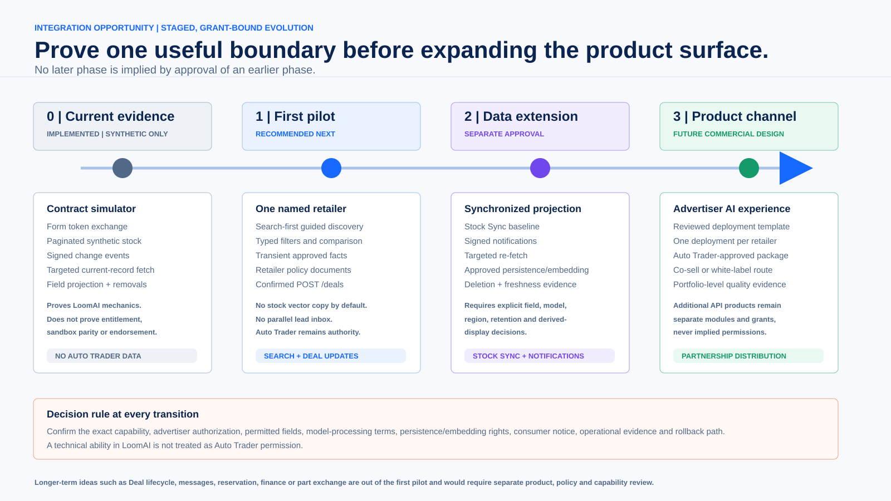
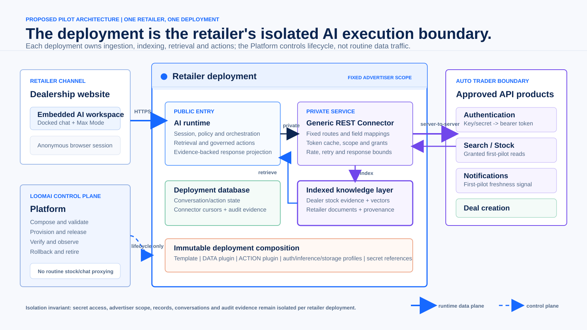
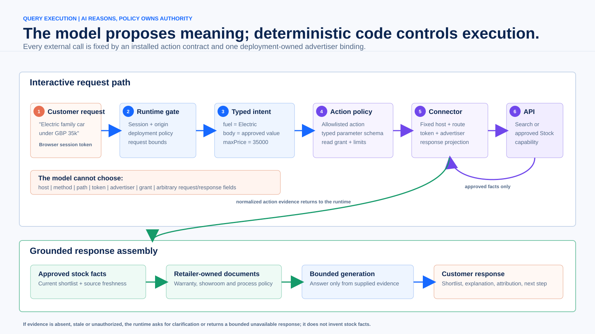
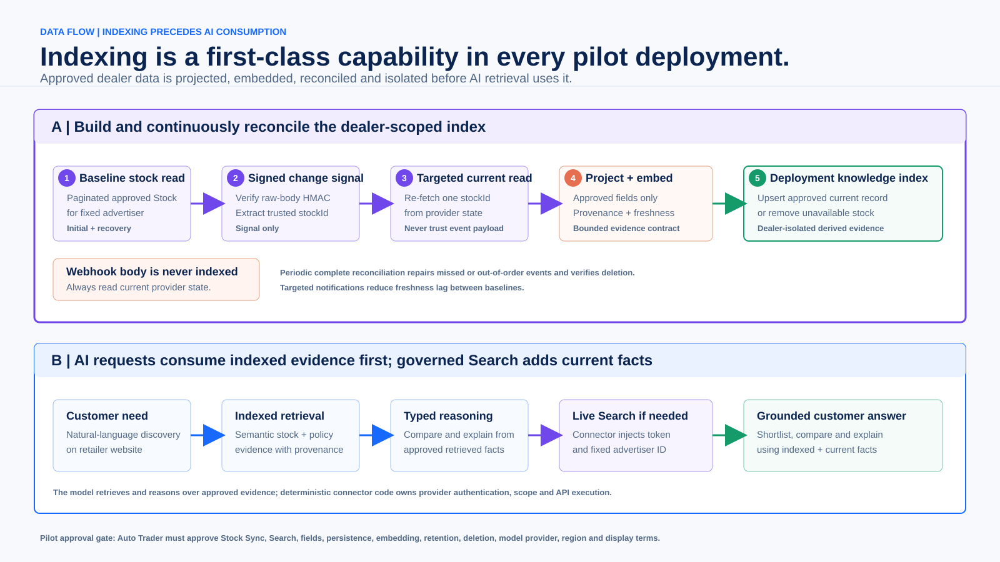
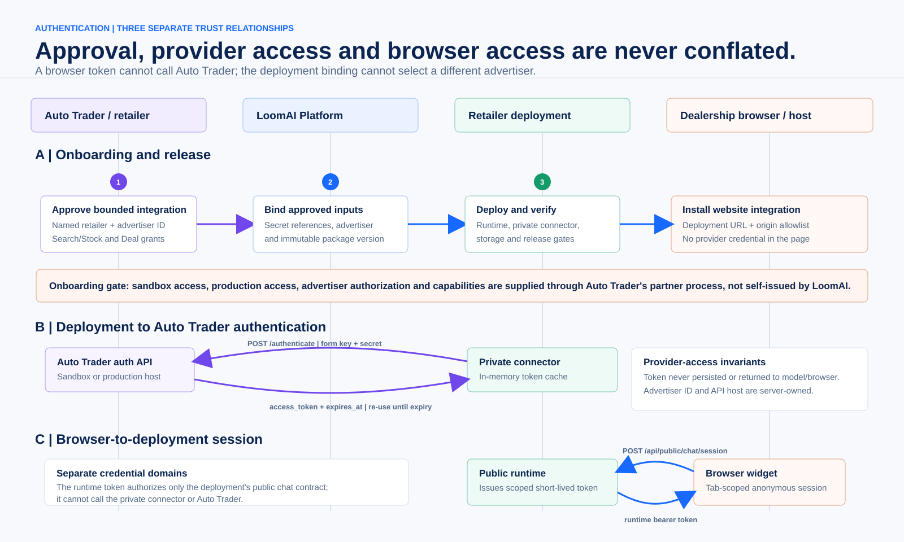
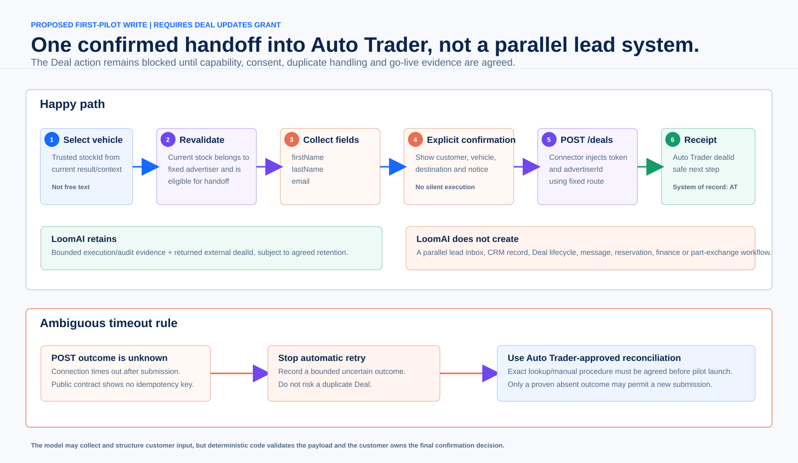

# LoomAI and Auto Trader Technical Integration Proposal

**Status:** Technical discussion draft; not an Auto Trader certification, sandbox
approval, production approval, endorsement, or request for unrestricted API access

**Date:** 8 October 2026

**Audience:** Auto Trader Connect, architecture, security, data-governance and
product engineering teams; LoomAI architecture and engineering teams

**Purpose:** Explain the intended integration precisely enough to agree the
correct Auto Trader API products, data-use boundary, authentication model,
first-pilot contract and technical evidence required for approval.

**Condensed meeting version:**
[Five-page technical integration brief](AUTOTRADER_LOOMAI_FIVE_PAGE_TECHNICAL_INTEGRATION_BRIEF.md)

---

## Contents

- [1. Reading Guide And Contract Labels](#1-reading-guide-and-contract-labels)
- [2. Executive Technical Position](#2-executive-technical-position)
- [3. Integration Opportunity: Now And Later](#3-integration-opportunity-now-and-later)
- [4. LoomAI Deployment Architecture](#4-loomai-deployment-architecture)
- [5. Current And Proposed Use Cases](#5-current-and-proposed-use-cases)
- [6. Governed Query Execution](#6-governed-query-execution)
- [7. Auto Trader To LoomAI Data Movement](#7-auto-trader-to-loomai-data-movement)
- [8. LoomAI To Auto Trader Data Movement](#8-loomai-to-auto-trader-data-movement)
- [9. Authentication And Onboarding](#9-authentication-and-onboarding)
- [10. Request And Response Examples](#10-request-and-response-examples)
- [11. Confirmed Deal Creation Control Model](#11-confirmed-deal-creation-control-model)
- [12. Data Purpose, Storage And Retention](#12-data-purpose-storage-and-retention)
- [13. Security And Failure Controls](#13-security-and-failure-controls)
- [14. Simulator Evidence And Limitations](#14-simulator-evidence-and-limitations)
- [15. Pilot Delivery Plan And Technical Gates](#15-pilot-delivery-plan-and-technical-gates)
- [16. Proposed Acceptance Criteria](#16-proposed-acceptance-criteria)
- [17. Decisions Requested From Auto Trader](#17-decisions-requested-from-auto-trader)
- [18. Proposed Shared Contract Matrix](#18-proposed-shared-contract-matrix)
- [19. Technical Intent In One Diagram](#19-technical-intent-in-one-diagram)
- [20. Official References Reviewed](#20-official-references-reviewed)

---

## 1. Reading Guide And Contract Labels

This proposal deliberately separates what exists today from what is requested.
Each significant capability is classified as follows:

| Label | Meaning |
| --- | --- |
| **OFFICIAL** | Described by current public Auto Trader Connect documentation. Final granted behavior still depends on the integration contract and environment. |
| **IMPLEMENTED** | Implemented and tested by LoomAI against synthetic data or LoomAI-owned services. It does not imply Auto Trader access or approval. |
| **PROPOSED PILOT** | The narrow behavior LoomAI wants to validate with Auto Trader and one authorized retailer. |
| **OPTIONAL FUTURE** | A later separately granted module. It is not implied by approval of the first pilot. |
| **DECISION REQUIRED** | A point on which LoomAI will not guess or proceed without Auto Trader direction. |

The intended first integration is not an autonomous agent with general API
access. It is a deployment-local, policy-governed application in which:

1. a model may translate customer language into a typed request;
2. deterministic code validates that request against an installed contract;
3. a private connector executes only a fixed route using server-owned scope and
   credentials; and
4. only an approved response projection can be used as AI evidence.

---

## 2. Executive Technical Position

### 2.1 Proposed first pilot

LoomAI proposes one bounded retailer-site use case:

> A visitor searches and compares the current permitted stock of one named
> retailer, receives an explanation grounded in an approved subset of vehicle
> facts and retailer-owned policy documents, then may explicitly confirm the
> creation of an externally originated Auto Trader Deal for one selected
> vehicle.

The deployment will be bound to one Auto Trader advertiser. Auto Trader remains
the authority for the API product, advertiser relationship, licensed stock
data, Deal record and downstream Deal lifecycle.

The requested query-time read capability is **Search**, constrained to the
deployment's permitted advertiser. LoomAI is not requesting **Search Adverts**,
which the public documentation describes as search across vehicles publicly
advertised on Auto Trader.

### 2.2 What LoomAI is not proposing

The first pilot is not:

- direct model access to Auto Trader;
- whole-market or cross-retailer search;
- an independent stock authority or vehicle marketplace;
- an Auto Trader data lake;
- model training on Auto Trader data;
- a parallel LoomAI lead database, dealership lead inbox or CRM;
- autonomous creation or mutation of stock, price, adverts or availability;
- finance, valuation, part-exchange, reservation or message automation; or
- automatic Deal lifecycle management after creation.

### 2.3 Recommended data posture

The recommended first pilot is **Search-first and query-time**:

- use the Auto Trader API product selected by Auto Trader for consumer-facing
  retailer stock discovery;
- request only records for the deployment's fixed advertiser;
- map customer language to an approved typed filter set;
- use a small approved response projection transiently for the answer; and
- persistently index only retailer-owned policy and operational documents.

A synchronized and potentially vectorized stock projection is an optional
future mode requiring separate written agreement on fields, purpose, model
processing, embedding, retention, deletion, region and display terms.

### 2.4 Proposed Auto Trader API surface

| Purpose | Public route or mechanism | Public capability | Data treatment | Proposal status |
| --- | --- | --- | --- | --- |
| Server authentication | `POST /authenticate` | Integration authentication | Key/secret stay in protected configuration; bearer token is cached in connector memory until expiry | Required for every mode |
| Consumer-facing dealer stock search | `GET /search?advertiserId=...` | **Search** | Approved response fields are used as transient request evidence | First-pilot read path |
| Dealer stock synchronization and indexing | Paginated `GET /stock`, Stock Notifications, targeted `GET /stock?...&stockId=...` | **Stock Sync** | Approved fields may enter a deployment-only typed/vector projection | Separate approval; optional pilot extension or later phase |
| Confirmed customer handoff | `POST /deals?advertiserId=...` | **Deal Updates** | Confirmed first name, last name, email and trusted stock target are sent; returned `dealId` is retained as bounded evidence | First-pilot write request, subject to grant |

The pilot does not request **Search Adverts**, Stock Updates, availability
updates, media writes, Deal lifecycle updates, messages, finance or part
exchange.

---

## 3. Integration Opportunity: Now And Later



### 3.1 Current LoomAI evidence

**IMPLEMENTED:** LoomAI has a synthetic, public-document-informed simulator and
a live fictional dealership demonstration. They prove the generic mechanics of:

- form-encoded key/secret token exchange;
- bearer-token reuse and expiry handling;
- one server-owned advertiser binding;
- paginated synthetic stock reads;
- raw-body HMAC notification validation;
- duplicate/replay controls;
- targeted current-record reconciliation;
- approved field projection;
- upsert and removal from deployment-only evidence;
- grounded search, comparison and current-vehicle explanations;
- retailer-owned document indexing; and
- governed confirmation and action execution.

The simulator contains fictional vehicles and credentials. It is not an Auto
Trader sandbox, complete emulator, certification or evidence of entitlement.
Its current stock path proves synchronization mechanics, not that Stock Sync is
the right product for the consumer-facing pilot.

### 3.2 Proposed first pilot

**PROPOSED PILOT:** one authorized retailer, one advertiser, one isolated
deployment, dealer-scoped **Search** guided discovery and one confirmed
`POST /deals` handoff under a separately granted **Deal Updates** capability.
The requested read grant is not **Search Adverts**.

The pilot should prove:

- useful natural-language stock discovery;
- deterministic advertiser isolation;
- correct grounding and attribution;
- no API authority in the model or browser;
- explicit customer confirmation before the only write;
- no parallel lead system; and
- operational evidence sufficient for Auto Trader and the retailer to review.

### 3.3 Optional future integration modules

The same deployment model can support additional modules without broadening the
first-pilot grant:

| Future module | Possible value | Additional decision required |
| --- | --- | --- |
| Approved synchronized stock projection | Lower-latency semantic discovery and richer comparison over one retailer's current stock | Stock Sync grant, field allowlist, persistence/embedding rights, deletion SLA and notification contract |
| Event-triggered stock-quality analysis | Detect incomplete or inconsistent retailer content and produce a review result | Approved operational fields, event purpose, recipients and non-writing boundary |
| Multi-specialist buyer workspace | Coordinate inventory facts, retailer policies and separately approved guidance domains | Each specialist's data source, action grant and output boundary |
| Fixed sequential or parallel plans | Revalidate stock, retrieve policy and compose one reviewable answer through a predefined plan | Plan definition, latency limits, failure behavior and grants for every step |
| Additional Deal operations | Support an agreed post-creation workflow | Separate capability, product, privacy and duplicate-handling review per operation |
| Advertiser-package distribution | Repeat a reviewed template for eligible retailers while keeping one deployment per advertiser | Commercial packaging, retailer onboarding, support and portfolio governance |

No future module receives an Auto Trader credential or capability merely because
the retailer has the first conversational pilot.

---

## 4. LoomAI Deployment Architecture



### 4.1 One retailer, one deployment

The proposed isolation invariant is:

```text
one participating retailer
  = one LoomAI deployment
  = one server-owned advertiser binding
  = one independent runtime/connector secret-access boundary
```

This invariant does not assume that Auto Trader issues a different API key to
every retailer. If credentials are integration-scoped, each deployment still
receives only a protected secret reference and a fixed advertiser binding;
Auto Trader remains the authority on credential scope and reuse.

The deployment is the data plane. Browser chat traffic goes to that deployment,
and its private connector makes approved provider calls. Routine chat, stock and
Deal traffic does not pass through a central LoomAI Platform API.

### 4.2 What a deployment contains

| Component | Responsibility | Exposure |
| --- | --- | --- |
| AI runtime | Browser session validation, orchestration policy, typed intent, retrieval, action confirmation, evidence assembly and safe response projection | Public only through the deployment's selected auth mode and origin policy |
| Generic REST Connector | Auto Trader authentication, host/route allowlists, protected advertiser placement, capability checks, request execution, response bounds and field projection | Private; callable by the runtime and protected operational routes only |
| Deployment database | Runtime state and a connector-owned restricted schema for cursors, fingerprints, webhook lifecycle and bounded audit evidence | Private |
| Retailer knowledge source | Approved dealership policy and operational documents | Deployment-only retrieval |
| Optional stock evidence store | Approved typed or vector stock projection when synchronized mode is expressly enabled | Deployment-only; absent from Search-first mode |
| Immutable composition | Reviewed template, DATA/ACTION plugins, provider profiles, auth policy, limits and secret references | Applied through the Platform release lifecycle |

### 4.3 What the LoomAI Platform does

The Platform is a control plane. It:

- validates a deployment draft;
- compiles reviewed plugin contracts;
- provisions deployment-local services;
- binds secret references and server-owned advertiser scope;
- publishes immutable versions;
- runs release and security verification;
- exposes bounded health and posture evidence;
- rolls back or retires a deployment.

The Platform does not proxy routine Auto Trader records, customer conversations
or Deal submissions. This avoids turning one central LoomAI service into the
data-plane dependency for every retailer.

### 4.4 Platform primitives used by this integration

The Auto Trader integration is assembled from existing generic primitives:

| Primitive | Auto Trader use |
| --- | --- |
| Deployment template | Pins the conversational behavior, UI surface, plugins, profiles, limits and verification suite |
| DATA plugin | Defines an approved Stock synchronization source, field projection and freshness/removal contract when synchronized mode is enabled; it is not required for Search-first stock persistence |
| ACTION plugin | Defines query-time Search/current-record reads and the separately confirmed Deal-create action |
| Connection profile | Defines approved hosts, token exchange, secret references, grants, rate limits and error mapping |
| Protected resource | Binds the deployment to one advertiser ID that the model and browser cannot replace |
| Knowledge plugin | Adds retailer-owned policy documents as a separately attributed evidence source |
| Inference profile | Binds an approved model/provider and processing settings without exposing provider secrets to the browser |
| Release version | Makes the exact composition reviewable, testable, repeatable and reversible |

The connector remains provider-neutral. Auto Trader paths, fields, capability
names and notification pointers belong in a reviewed immutable package rather
than provider-specific branches in the generic connector code.

---

## 5. Current And Proposed Use Cases

### 5.1 Guided stock discovery

**PROPOSED PILOT**

Example customer questions:

- "Show me this dealer's electric family cars under GBP 35,000."
- "Which automatic SUVs have fewer than 20,000 miles?"
- "Find a practical motorway car in the retailer's current stock."

Technical behavior:

1. The runtime converts the words into a typed filter object.
2. Policy rejects unsupported fields, values and result counts.
3. The connector supplies the fixed advertiser and bearer token.
4. The approved Search or read product returns current records.
5. The connector drops every field outside the agreed projection.
6. The runtime ranks or summarizes only those approved facts.

### 5.2 Vehicle comparison and suitability explanation

**PROPOSED PILOT**

The customer selects two or more returned vehicles. The runtime pins trusted
stock identities, then compares only evidence returned for those targets. It
may explain dimensions such as price, mileage, fuel, transmission, body type,
selected features and other expressly approved consumer-facing facts.

The answer must distinguish:

- source facts;
- retailer-policy evidence;
- reasoned trade-offs; and
- unavailable or unapproved facts.

It must not infer finance eligibility, safety guarantees, vehicle condition or
other unsupported claims.

### 5.3 Current vehicle details

**PROPOSED PILOT**

When the website supplies a trusted current-page stock identity, the runtime can
request the exact current record. The identity is application context rather
than model-generated free text. If the record no longer belongs to the fixed
advertiser or is unavailable, the action fails closed and the UI removes or
qualifies stale detail.

### 5.4 Retailer policy questions

**IMPLEMENTED GENERIC CAPABILITY**

Retailer-owned documents can answer questions such as:

- warranty process;
- test-drive requirements;
- showroom locations and opening procedures;
- reservation policy;
- customer support and complaint handling.

These documents use a separate knowledge source and attribution. They do not
grant permission to copy Auto Trader stock into that source, and retailer policy
must not override a current provider fact.

### 5.5 Confirmed Auto Trader Deal creation

**PROPOSED PILOT; BLOCKED ON GRANT AND CONTRACT REVIEW**

After a customer selects a current vehicle, LoomAI proposes exactly one provider
write: create an externally originated Auto Trader Deal after explicit customer
confirmation. The request contains only the fields shown in the public create
contract: first name, last name, email, trusted stock ID and trusted advertiser
ID.

The current fictional demo's callback/test-drive inbox is not the proposed
pilot architecture. It is demo-only and will not run in parallel with the Auto
Trader Deal handoff.

---

## 6. Governed Query Execution



The model is used where interpretation is valuable and excluded where authority
is required.

### 6.1 Model responsibilities

The model may:

- interpret natural language;
- propose a typed, schema-constrained intent;
- identify which installed read action is relevant;
- compare approved facts supplied to it;
- explain trade-offs with source attribution; and
- collect missing customer fields before a proposed action.

### 6.2 Deterministic responsibilities

Application code and policy own:

- session and origin validation;
- allowed actions and parameter schemas;
- endpoint host, path and method;
- capability grant checks;
- advertiser injection;
- credential and token use;
- request/response size and field bounds;
- action confirmation state;
- provider call execution;
- retry and ambiguity behavior; and
- final safe response projection.

### 6.3 Values the model and browser never select

Neither the model nor the browser supplies:

- the Auto Trader API host;
- authentication endpoint;
- integration key or secret;
- bearer token;
- advertiser identifier;
- notification secret;
- arbitrary HTTP method or path;
- capability grant; or
- unrestricted provider request/response fields.

This is the central answer to the concern about an AI calling Auto Trader. An
LLM can request a reviewed capability through a typed contract; it cannot wield
the underlying API authority.

---

## 7. Auto Trader To LoomAI Data Movement



### 7.1 Mode A: Search-first, query-time

**RECOMMENDED PROPOSED PILOT: SEARCH, NOT SEARCH ADVERTS**

1. A customer sends a request to the retailer's deployment.
2. LoomAI produces and validates typed search filters.
3. The connector calls the dealer-scoped **Search** capability approved for
   this use case.
4. The connector validates advertiser scope and response bounds.
5. It projects only approved fields.
6. The runtime uses the projected facts for the current answer.
7. Stock facts are discarded after the bounded request/logging lifecycle.

In this mode no persistent Auto Trader stock vector index is required. Retailer
documents remain a distinct persistent source.

### 7.2 Mode B: synchronized projection

**OPTIONAL PILOT EXTENSION OR FUTURE MODE; SEPARATE STOCK SYNC APPROVAL**

If Auto Trader approves Stock Sync and persistence/embedding:

1. A periodic baseline reads the complete permitted stock for the fixed
   advertiser.
2. Each record must contain the exact protected advertiser ID.
3. The connector maps a written field allowlist and records stable identity and
   freshness.
4. A valid notification is treated as a change signal, not authoritative index
   content.
5. The connector extracts a bounded `stockId`, then re-fetches current provider
   state for that record.
6. Zero/declared-absent current records cause removal; exactly one matching
   current record causes upsert.
7. Multiple results, identity mismatch, advertiser mismatch or malformed data
   fail closed.
8. A periodic complete baseline repairs missed, duplicate or out-of-order
   events and proves absent-record deletion.

### 7.3 Current simulator timing and bounds

The current synthetic rehearsal uses these package-level settings:

- complete baseline every 900 seconds;
- page size up to 200;
- source maximum of 20,000 records;
- provider response maximum of 10 MB;
- notification replay window of 300 seconds;
- notification body maximum of 1 MB;
- one current-record fetch after a valid stock event; and
- a deployment action staleness ceiling of 1,800 seconds.

These settings prove bounded connector mechanics. They are not proposed as Auto
Trader production limits. Production rate, schedule, retry and staleness values
must follow Auto Trader's granted contract.

### 7.4 Notification handling

The public documentation describes HTTPS `PUT` notifications with an
`AutoTrader-Signature` header containing `t` and `v1`. Verification uses HMAC
SHA-256 over:

```text
<timestamp>.<raw-request-body>
```

The deployment connector will:

- validate against the raw body before JSON transformation;
- use the deployment's notification secret reference;
- reject a bad signature with `401`;
- reject malformed required data with `400`;
- reject an unexpected advertiser with `422`;
- deduplicate by bounded event identity;
- account for out-of-order delivery using provider time/current state; and
- return only the response codes agreed for the integration.

### 7.5 Current projected stock fields

The current simulator selects this deliberately reduced set:

| Category | Current simulated projection | Intended purpose |
| --- | --- | --- |
| Scope | `advertiserId` | Enforce one-retailer boundary; never a model input |
| Identity | `stockId`, `searchId` | Stable target and current-record reconciliation |
| Freshness | last updated, version, lifecycle and published status | Staleness, convergence and removal |
| Vehicle | make, model, derivative, year, fuel, body, transmission and mileage | Search, compare and explain |
| Commercial | displayed total price in GBP | Current shortlist fact |
| Descriptive | selected features | Bounded suitability explanation |
| Media | primary image ID and approved HTTPS reference | Vehicle presentation without arbitrary media hosts |

It drops registration, VIN, supplied price, free-text advert copy, attention
grabber, reservation state and every customer/Deal/message/finance/
part-exchange/valuation/response-metric field. The production allowlist may be
smaller and will be whatever Auto Trader approves.

### 7.6 Images and media

LoomAI proposes to use only image references returned through the approved
contract and only from approved media hosts. Downloading, transforming, caching
or embedding image content will remain disabled unless branding, licensing,
cache and deletion terms are agreed. A missing or rejected image must degrade
to a non-image vehicle result rather than an arbitrary external URL.

---

## 8. LoomAI To Auto Trader Data Movement

The outbound provider traffic is intentionally small.

### 8.1 Always required server-to-server calls

- token exchange to the environment's `/authenticate` endpoint;
- the read request selected for the granted Search or Stock use case; and
- if synchronized mode is approved, current-record and baseline reads.

### 8.2 Only proposed first-pilot write

- one customer-confirmed `POST /deals` under a separately granted Deal Updates
  capability.

### 8.3 Provider response traffic

The connector receives provider responses, applies size/schema/scope checks and
projects approved fields before returning evidence to the runtime. Raw provider
credentials and tokens never appear in an action result, model context, browser
response or Platform operational view.

### 8.4 Notification acknowledgements

If synchronized mode is approved, LoomAI returns the documented response class
for accepted, intentionally ignored, malformed, unauthenticated or wrong-scope
events. A provider retry does not cause a second index mutation because event
deduplication and current-state reconciliation are deployment-local and durable.

### 8.5 Explicitly excluded outbound calls

The first pilot will not call Auto Trader to:

- create or update stock;
- change price, advert destination, availability or lifecycle;
- upload media;
- reserve, complete or cancel a Deal;
- add or update part exchange;
- create finance applications;
- send or reply to messages; or
- manage post-creation Deal components.

These remain separate potential integrations, each requiring its own purpose,
grant, schema, authorization and release evidence.

---

## 9. Authentication And Onboarding



### 9.1 Commercial and capability onboarding

**DECISION REQUIRED:** LoomAI does not yet represent a participating Auto Trader
retailer. The Northfield demonstration is fictional. A pilot should begin only
through one of these routes:

1. Auto Trader nominates a design-partner retailer.
2. LoomAI recruits a retailer, obtains written authorization and provides the
   required Dealer/advertiser identity through the standard process.
3. Auto Trader provides an Auto Trader-owned technical test advertiser before a
   named retailer pilot.

The onboarding record should establish:

- integration identity and environment;
- named retailer and advertiser ID;
- granted capability names;
- approved API hosts and paths;
- key/secret delivery and rotation process;
- notification URL/secret registration if applicable;
- approved fields and processing modes;
- model/embedding provider, region and no-training/retention terms;
- consumer notice and branding requirements;
- rate, retry, support and incident expectations; and
- sandbox and production promotion evidence.

### 9.2 Auto Trader server authentication

**OFFICIAL:** Current public documentation describes:

- `POST /authenticate` with `application/x-www-form-urlencoded` `key` and
  `secret`;
- separate sandbox and production hosts;
- `access_token` and ISO timestamp `expires_at` in the response;
- `Authorization: Bearer <token>` on subsequent API calls; and
- token expiry after 15 minutes, with guidance not to authenticate before every
  request.

**IMPLEMENTED:** The generic connector supports this bounded form-token-exchange
shape. Resolved secret values are deployment configuration, never plugin
manifest data. The access token is cached in memory and is not written to the
connector database or operational responses.

### 9.3 Deployment-internal authentication

The runtime calls the connector through a private service route using a stable,
deployment-scoped connector credential. The connector separately authenticates
to Auto Trader. This prevents a runtime/browser token from becoming a provider
credential.

### 9.4 Browser authentication

For low-risk anonymous discovery, the retailer widget uses a separate public
runtime flow. The retailer website installs it with one Platform-hosted AI
Workspace script and an opaque installation ID copied from LoomAI Console. The
origin-scoped installation resolves the retailer's current verified deployment
and reviewed assets; the retailer backend does not publish chat routes or a
runtime descriptor.

After installation, the Workspace performs the deployment-local protocol:

1. `POST /api/public/chat/session` from an allowed retailer origin.
2. The deployment validates origin and abuse limits.
3. It creates a runtime-owned anonymous identity.
4. It returns a short-lived token scoped to the deployment's chat surface.
5. The Workspace calls `/api/chat/me/query` using that token.

The browser cannot choose its tenant, customer, deployment, advertiser or
provider identity. The connector is never exposed to it. A logged-in retailer
site can instead use a separately configured authenticated public-runtime token.
Anonymous discovery does not automatically authorize Deal creation; Auto Trader
and the retailer may require a host-authenticated user, stronger anti-abuse
controls or another approved identity step before the confirmed write.

### 9.5 Secret ownership and rotation

- Auto Trader key, secret and notification secret are stored as protected
  deployment secret references.
- They are not embedded in templates, plugins, images, JavaScript or logs.
- Provider credential scope and reuse follow Auto Trader's integration policy;
  every deployment still has isolated secret access and a non-overridable
  advertiser binding.
- Rotation updates the deployment binding and is followed by a focused auth
  canary.
- Retiring a deployment removes deployment-generated service credentials and
  follows the agreed ownership policy for provider-supplied secrets.

---

## 10. Request And Response Examples

Examples below are redacted. They clarify intent and are not a substitute for
the granted sandbox schema.

### 10.1 Auto Trader token exchange

**OFFICIAL public shape**

```http
POST /authenticate HTTP/1.1
Host: api-sandbox.autotrader.co.uk
Content-Type: application/x-www-form-urlencoded

key=<deployment-secret-reference-value>&secret=<deployment-secret-reference-value>
```

```json
{
  "access_token": "<short-lived-token>",
  "expires_at": "2026-10-08T11:15:00.000Z"
}
```

The connector validates both fields, caches the token in memory and uses it only
for routes in the same approved connection profile.

### 10.2 Proposed Search-first request

**OFFICIAL base path; PROPOSED PILOT mapping**

```http
GET /search?advertiserId=<trusted-advertiser-id> HTTP/1.1
Host: api-sandbox.autotrader.co.uk
Authorization: Bearer <connector-owned-token>
Accept: application/json
```

Additional filter names will be compiled only from the granted Search contract.
The model cannot emit arbitrary query keys. A typed internal intent may look
like:

```json
{
  "fuelType": "Electric",
  "bodyType": "SUV",
  "maxPriceGBP": 35000,
  "maxResults": 8
}
```

The connector translates that object to reviewed provider query parameters. It
also injects the advertiser ID independently of the typed intent.

The official Search response is larger and follows the Stock response model.
Before AI use, LoomAI would reduce it to an agreed internal projection such as:

```json
{
  "provider": "autotrader",
  "advertiserId": "<trusted-advertiser-id>",
  "stockId": "<trusted-stock-id>",
  "searchId": "<provider-search-id>",
  "vehicle": {
    "make": "Example Make",
    "model": "Example Model",
    "derivative": "Example Derivative",
    "year": 2025,
    "fuelType": "Electric",
    "bodyType": "SUV",
    "transmissionType": "Automatic",
    "odometerReadingMiles": 4850
  },
  "displayedPriceGBP": 31950,
  "selectedFeatures": ["Example approved feature"],
  "sourceUpdatedAt": "2026-10-08T10:42:00Z",
  "primaryImage": {
    "imageId": "<approved-image-id>",
    "href": "https://<approved-media-host>/<image>"
  }
}
```

This is a proposed LoomAI projection, not a claim that Auto Trader returns this
reduced JSON shape.

### 10.3 Current simulator baseline

**IMPLEMENTED synthetic rehearsal**

```http
GET /stock?advertiserId=<fixed>&lifecycleState=FORECOURT&page=1&pageSize=200 HTTP/1.1
Host: <loomai-simulator-host>
Authorization: Bearer <synthetic-token>
Accept: application/json
```

```json
{
  "results": [
    {
      "vehicle": { "make": "Fictional Make", "model": "Fictional Model" },
      "advertiser": { "advertiserId": "<fixed>" },
      "metadata": {
        "stockId": "<synthetic-stock-id>",
        "versionNumber": 2,
        "lifecycleState": "FORECOURT"
      }
    }
  ],
  "totalResults": 1
}
```

This is useful engineering evidence for pagination, scope and projection. It is
not the recommended first-pilot API choice unless Auto Trader selects Stock Sync.

### 10.4 Stock notification

**OFFICIAL public envelope, reduced for readability**

```http
PUT /integrations/webhooks/<deployment-source-id> HTTP/1.1
Host: <retailer-deployment-connector-host>
Content-Type: application/json
AutoTrader-Signature: t=<epoch-seconds>,v1=<hmac-sha256>
```

```json
{
  "id": "<stock-event-id>",
  "time": "2026-10-08T10:42:00.000Z",
  "type": "STOCK_UPDATE",
  "integrationId": "<integration-id>",
  "data": {
    "advertiser": {
      "advertiserId": "<trusted-advertiser-id>"
    },
    "metadata": {
      "stockId": "<trusted-stock-id>",
      "versionNumber": 2,
      "lifecycleState": "FORECOURT",
      "lastUpdated": "2026-10-08T10:42:00.000Z"
    }
  }
}
```

LoomAI verifies and records bounded event metadata, then fetches current provider
state. It does not index the notification body.

### 10.5 Targeted current-record refresh

**IMPLEMENTED simulator pattern; requires approved Stock contract**

```http
GET /stock?advertiserId=<trusted-advertiser-id>&stockId=<verified-event-stock-id>&page=1&pageSize=1 HTTP/1.1
Host: api-sandbox.autotrader.co.uk
Authorization: Bearer <connector-owned-token>
Accept: application/json
```

The connector accepts zero or exactly one matching result. More than one result,
a mismatched stock ID or a mismatched advertiser fails closed.

### 10.6 Deployment-local browser session bootstrap

**IMPLEMENTED generic LoomAI runtime contract invoked by the installed
Workspace, not manually configured by retailer page code**

```http
POST /api/public/chat/session HTTP/1.1
Host: <retailer-deployment-runtime-host>
Origin: https://<retailer-website>
Content-Type: application/json

{}
```

```json
{
  "success": true,
  "tokenType": "Bearer",
  "token": "<short-lived-runtime-token>",
  "authMode": "PUBLIC_RUNTIME_ANONYMOUS",
  "subjectType": "ANONYMOUS_SESSION",
  "sessionId": "anon-<runtime-generated-id>",
  "expiresAt": "2026-10-08T11:00:00Z"
}
```

The customer query then targets the runtime, not the connector:

```http
POST /api/chat/me/query HTTP/1.1
Host: <retailer-deployment-runtime-host>
Authorization: Bearer <short-lived-runtime-token>
Content-Type: application/json

{
  "query": "Show me this dealer's electric family cars under GBP 35,000."
}
```

### 10.7 Runtime-to-connector action request

**IMPLEMENTED generic internal contract; action identifier illustrative**

```http
POST /actions/execute HTTP/1.1
Host: <private-deployment-connector>
Authorization: <deployment-service-credential>
Content-Type: application/json

{
  "actionId": "autotrader_search_inventory",
  "params": {
    "fuelType": "Electric",
    "bodyType": "SUV",
    "maxPriceGBP": 35000,
    "limit": 8
  },
  "trace": {
    "requestId": "<request-id>",
    "conversationId": "<conversation-id>",
    "sessionId": "<runtime-issued-session-id>"
  }
}
```

The request deliberately omits host, token and advertiser. Those are resolved
from deployment configuration.

### 10.8 Confirmed Auto Trader Deal creation



**OFFICIAL public create shape; PROPOSED PILOT use**

```http
POST /deals?advertiserId=<trusted-advertiser-id> HTTP/1.1
Host: api-sandbox.autotrader.co.uk
Authorization: Bearer <connector-owned-token>
Content-Type: application/json

{
  "consumer": {
    "firstName": "<confirmed-first-name>",
    "lastName": "<confirmed-last-name>",
    "email": "<confirmed-email>"
  },
  "stockId": "<trusted-selected-stock-id>",
  "advertiserId": "<trusted-advertiser-id>"
}
```

```json
{
  "dealId": "<auto-trader-deal-id>"
}
```

The public documentation notes that a Deal created through this method cannot
include a message component. The pilot will not hide a phone number, preferred
date, test-drive note or free text in another field. Any companion data requires
an expressly approved companion contract.

---

## 11. Confirmed Deal Creation Control Model

### 11.1 Preconditions

Before the action can be offered:

- Deal Updates is granted to the integration and advertiser;
- Auto Trader confirms that this retailer-site AI journey is an acceptable
  externally originated Deal source;
- the selected stock target is trusted application context;
- a current read proves that the stock belongs to the fixed advertiser;
- required privacy and consent language is approved; and
- duplicate/ambiguous-timeout handling is agreed.

### 11.2 Confirmation contract

The runtime presents:

- selected vehicle identity and approved display facts;
- first name, last name and email;
- destination as Auto Trader Deal creation for the participating retailer;
- the relevant privacy notice; and
- one explicit `Confirm and create Auto Trader Deal` decision.

Only that confirmation resumes the exact pending action. A generic "yes" from
another conversation, expired session or changed vehicle must not execute it.

### 11.3 Receipt and ownership

On success, the UI shows a bounded receipt containing the returned `dealId` and
next step. LoomAI stores that external identifier and bounded execution evidence
subject to agreed retention. It does not create a second lead or continue the
Deal lifecycle.

### 11.4 Ambiguous timeout

The public create contract does not document an idempotency key. Therefore:

- a timeout after request submission is not treated as a safe retry signal;
- LoomAI records an uncertain outcome without customer data in general logs;
- the action is not automatically submitted again; and
- an Auto Trader-approved lookup/manual reconciliation process must determine
  whether a new request is allowed.

This is a launch blocker, not an implementation detail to guess.

---

## 12. Data Purpose, Storage And Retention

### 12.1 Data-purpose matrix

| Data class | Source | Proposed use | Search-first storage | Optional synchronized storage |
| --- | --- | --- | --- | --- |
| Provider credential | Auto Trader | Server authentication | Secret reference only | Same |
| Access token | Auto Trader auth | Approved API calls | Memory only until expiry | Same |
| Advertiser ID | Onboarding | Immutable retailer scope | Deployment configuration | Same |
| Approved stock facts | Search/Stock | Search, compare and explain | Transient request evidence | Deployment-only typed/vector projection if approved |
| Stock identity/freshness | Search/Stock | Targeting, attribution and stale/removal checks | Bounded request/audit evidence | Deployment-only projection and sync state if approved |
| Image reference | Search/Stock | Vehicle presentation | Transient approved URL | Reference only if approved |
| Retailer documents | Retailer | Warranty and operational answers | Deployment-only document/vector source | Same, separate from stock source |
| Conversation | Consumer | Session continuity and answer context | Minimized deployment-local state | Same |
| Deal contact fields | Consumer | Confirmed `POST /deals` only | Pending confirmation and bounded execution lifecycle | Same |
| Auto Trader `dealId` | Deal response | Receipt and audit correlation | Bounded deployment-local evidence | Same |

### 12.2 Explicit prohibited uses

Auto Trader data will not be used to:

- train a general or customer-specific foundation model;
- create a cross-retailer stock corpus;
- benchmark or price retailers against one another;
- resell provider data;
- infer hidden personal characteristics;
- make autonomous credit, finance or eligibility decisions; or
- reconstruct Auto Trader's marketplace or lead-management products.

### 12.3 Model processing decision

Before any provider facts are sent to a model, Auto Trader must approve:

- exact projected fields;
- model and provider;
- processing region;
- no-training and retention terms;
- prompt/log redaction policy;
- subcontractor boundary; and
- derived-answer attribution and display wording.

### 12.4 Deletion and revocation

Search-first data naturally expires with the request lifecycle. If synchronized
mode is later approved, LoomAI must support:

- prompt removal of sold, deleted and unpublished records;
- complete-baseline repair for missed events;
- hard removal when the retailer is de-authorized;
- vector and typed projection deletion together;
- deletion verification; and
- deployment retirement without retaining provider payloads in Platform logs.

---

## 13. Security And Failure Controls

### 13.1 Network and SSRF controls

- Provider and token origins are immutable HTTPS URLs.
- Every host is on a reviewed allowlist.
- Actions use relative fixed routes; model input cannot become a URL.
- The connector is private and the browser cannot call it.
- Provider responses are byte-bounded before JSON parsing.

### 13.2 Scope controls

- One protected advertiser binding is compiled into the deployment.
- Every source record and notification must match it.
- A request cannot replace advertiser scope through query, path, header or body.
- Cross-retailer results fail the entire operation rather than being silently
  filtered after model exposure.

### 13.3 Schema and projection controls

- Typed action parameters have explicit names, types and bounds.
- Unknown parameters are rejected.
- Provider responses must match expected object/list cardinality.
- Only mapped fields survive into runtime evidence.
- Raw payloads and credentials are excluded from normal operational views.

### 13.4 Retry controls

- Read retries are bounded and follow provider rate/error policy.
- Token refresh follows expiry rather than authenticating per request.
- Notification retries are deduplicated and converge through current-state
  reads.
- A non-idempotent Deal creation is never blindly retried after an ambiguous
  result.

### 13.5 AI failure controls

- Missing or insufficient evidence returns clarification/unavailable behavior.
- A model cannot convert an unsupported request into another endpoint.
- Stock and retailer-policy evidence remain separately attributed.
- Action output is normalized before generation and browser rendering.
- Write execution requires exact pending-action confirmation.

### 13.6 Operational evidence

The deployment can expose authorized, bounded posture including:

- runtime/connector health;
- applied composition version;
- source status and last successful reconcile time;
- projected record count, not provider payloads;
- indexing-work status when enabled;
- notification accepted/duplicate/rejected/dead-letter counts;
- action outcome class and safe correlation identifier;
- latency and error-code distributions; and
- release verification result.

Auto Trader credentials, tokens and raw consumer/provider payloads are never part
of that posture.

---

## 14. Simulator Evidence And Limitations

### 14.1 What is implemented now

The current LoomAI simulator exposes:

```text
POST /authenticate
GET  /stock?advertiserId=...&page=...&pageSize=...
GET  /stock?advertiserId=...&stockId=...&page=1&pageSize=1
```

It also has operator-only controls that mutate fictional stock and cause signed
test events to be sent to a deployment callback. Those controls are protected by
a simulator control key and are not Auto Trader API behavior.

The deployment package rehearses:

- `FORM_TOKEN_EXCHANGE` authentication;
- `Bearer` authorization;
- protected advertiser placement;
- complete baseline and targeted record fetch;
- `STOCK_UPDATE` event allowlisting;
- raw-body HMAC verification;
- 300-second replay protection;
- advertiser and stock identity equality;
- current-state upsert/deletion;
- durable source/webhook lifecycle state; and
- deployment-local indexing status.

### 14.2 Synthetic response surface

The simulator's synthetic `/stock` wire response includes more than LoomAI
persists or exposes to the model:

| Response section | Synthetic values exercised |
| --- | --- |
| `vehicle` | Ownership condition, synthetic registration/VIN, make, model, derivative, vehicle/body/fuel/transmission types, mileage, first-registration date, year and selected taxonomy values |
| `advertiser` | Synthetic advertiser ID used for strict protected-resource equality |
| `adverts` | Synthetic reservation state, supplied/total price, attention text, description and publication status |
| `metadata` | Stock/search IDs, timestamps, version, lifecycle and forecourt date |
| `features` | Two fictional feature entries |
| `media` | One fictional image identity/reference plus empty video/spin values |

The connector validates the larger wire response but retains only the reduced
projection in Section 7.5. Registration, VIN, supplied price, free-text advert
copy, reservation state and unrelated provider fields are deliberately dropped
before indexing or AI use.

### 14.3 What is not implemented or proven

The simulator does not prove:

- Auto Trader sandbox credentials or access;
- exact production request/response parity;
- Search API parameter mapping;
- granted Stock Sync or Search rights;
- granted Deal Updates;
- Auto Trader-approved AI/model processing;
- Auto Trader-approved stock persistence or vectorization;
- production rate limits or support obligations;
- webhook registration automation; or
- Deal duplicate reconciliation.

The Deal-create route should be added to a versioned simulator/package only
after Auto Trader confirms sandbox request, response, failure and duplicate
handling. LoomAI should not invent those details beyond the published shape.

---

## 15. Pilot Delivery Plan And Technical Gates

### Phase 0: architecture and data-rights agreement

- Confirm the first use case.
- Select Search, Stock Sync, both or another correct product.
- Confirm one retailer onboarding route.
- Agree fields and AI-processing terms.
- Confirm Deal creation use and duplicate procedure.
- Define branding, attribution and customer notice.

**Exit gate:** written contract matrix with no unresolved authority or data-use
assumption.

### Phase 1: sandbox package

- Create an immutable Auto Trader sandbox connection profile.
- Bind one test advertiser and exact granted capabilities.
- Implement reviewed Search/read mapping.
- Implement only the approved response projection.
- Add the separately confirmed Deal-create action.
- Configure the exact retailer origin and anonymous/authenticated browser mode.
- Keep stock persistence/vectorization disabled unless separately approved.

**Exit gate:** package validation, empty-secret scan and deterministic contract
tests pass.

### Phase 2: sandbox integration verification

Test at minimum:

- token issue, reuse, expiry and rotation;
- allowed and rejected advertiser scope;
- expected Search/filter cases;
- empty, malformed, oversized, rate-limited and unavailable responses;
- no unapproved field in model context, logs or browser output;
- retailer-document and stock-source attribution;
- stale/unavailable vehicle handling;
- confirmation expiry, changed target and duplicate user submission;
- successful Deal response and safe receipt;
- ambiguous Deal timeout without automatic retry; and
- removal/revocation if synchronized mode is enabled.

**Exit gate:** Auto Trader and LoomAI review the same redacted traces.

### Phase 3: named-retailer canary

- Provision one clean production deployment.
- Bind production secrets through the approved process.
- Apply exact website origin and retailer identity.
- Start with a bounded traffic cohort.
- Observe quality, latency, provider errors and Deal conversion evidence.
- Keep a one-step disable/rollback path for each external capability.

**Exit gate:** agreed canary period completes without scope, data-use,
confirmation or duplicate incident.

### Phase 4: repeatable advertiser package

Only after the canary succeeds:

- freeze the reviewed template and package versions;
- define retailer eligibility and onboarding automation;
- establish joint support/escalation;
- define portfolio-level quality and security review; and
- agree commercial distribution or white-label presentation.

---

## 16. Proposed Acceptance Criteria

### Security and isolation

- A browser cannot access provider credentials, token or connector URL.
- A model cannot select provider host, route, method, advertiser or grant.
- A request for another advertiser fails before provider data reaches the model.
- Deployment A cannot query, retrieve, confirm or audit deployment B's data.

### Data governance

- Only approved fields enter model context.
- Search-first mode leaves no persistent stock/vector corpus.
- Retailer documents remain a separately attributed source.
- No raw provider or consumer payload appears in normal logs.
- Revocation/deletion behavior is proven for every persistent mode.

### Answer quality

- Search results satisfy the validated filters or clearly state limitations.
- Comparisons cite current facts and identify missing facts.
- Unsupported claims are not generated.
- Sold/unpublished/unavailable vehicles are not presented as currently
  available after the agreed freshness boundary.

### Deal safety

- The stock target is trusted and revalidated.
- Required customer fields are typed and explicitly confirmed.
- Exactly one POST is emitted for one confirmed pending action.
- Success returns the Auto Trader `dealId`.
- Ambiguous timeout does not cause a blind second POST.
- No parallel LoomAI/dealership lead record is created.

### Operations

- Release composition and provider package versions are observable.
- Health and source status are available without exposing payloads.
- Credentials can be rotated.
- External capability can be disabled independently.
- Deployment can be rolled back or retired cleanly.

---

## 17. Decisions Requested From Auto Trader

The next technical session should answer these concrete questions:

1. Is guided stock discovery on one participating retailer's own website an
   acceptable Auto Trader Connect use case?
2. Is Search, Stock Sync, both, or another product the correct first read
   capability?
3. Can the Search/read API be restricted to the participating advertiser, and
   what is the required onboarding binding?
4. Which fields may be used for search, comparison and explanation?
5. May those projected fields be sent transiently to an approved LLM? Under
   which provider, region, no-training and retention conditions?
6. Is any dealer-scoped persistence or embedding permitted? If yes, for which
   fields, purpose and retention period?
7. What freshness and deletion obligations apply to sold, deleted, unpublished
   or de-authorized stock?
8. What image, branding, attribution and derived-answer rules apply?
9. Will Deal Updates be granted for a customer-confirmed externally originated
   Deal from this retailer-site journey?
10. What privacy/consent wording is required before `POST /deals`?
11. What is the required duplicate/ambiguous-timeout reconciliation procedure?
12. Can Auto Trader provide a test advertiser before a named retailer, or must
    retailer authorization precede sandbox access?
13. How should the notification endpoint be registered and rotated if Stock Sync
    is approved?
14. What rate limits, call logs, conformance tests and production evidence are
    required?
15. Who owns the Auto Trader product, Connect integration, data-governance and
    production-go-live decisions?

---

## 18. Proposed Shared Contract Matrix

This table should become the signed technical source of truth before build-out.

| Contract area | Proposed first-pilot value | Final owner |
| --- | --- | --- |
| Retailer | One named, authorized design partner | Auto Trader + retailer |
| Advertiser scope | One immutable advertiser ID per deployment | Auto Trader |
| Read product | Dealer-scoped Search requested; not Search Adverts | Auto Trader |
| Read fields | Minimal consumer-facing allowlist | Auto Trader |
| Persistent stock copy | Disabled by default; Stock Sync is a separately approved extension | Auto Trader |
| Stock embeddings | Disabled by default; separately approved fields, purpose and retention required | Auto Trader |
| Retailer documents | Separate retailer-owned knowledge source | Retailer |
| Model processing | Bounded projected facts only | Auto Trader + retailer |
| Provider credentials | Deployment secret references | Auto Trader issues; LoomAI protects |
| Browser identity | Short-lived deployment token | LoomAI runtime |
| Provider write | Confirmed `POST /deals` only | Auto Trader grant |
| Lead/Deal authority | Auto Trader | Auto Trader |
| Retry after ambiguous Deal timeout | No blind retry; agreed reconciliation | Auto Trader |
| Operational evidence | Bounded health, counts, correlation and outcomes | Joint agreement |
| Rollback | Disable package/action or retire deployment | LoomAI operator + agreed process |

---

## 19. Technical Intent In One Diagram

```text
Retailer website
  -> retailer-isolated LoomAI runtime
       -> typed intent + deterministic policy
       -> private connector
            -> fixed Auto Trader host and granted route
            -> server-owned token and advertiser ID
            -> approved response projection
       -> evidence-backed customer answer

Customer-confirmed Deal only
  -> revalidate trusted stock target
  -> confirm firstName + lastName + email + vehicle + destination
  -> private connector POST /deals
  -> return Auto Trader dealId
  -> no parallel LoomAI lead record
```

The proposal is therefore not "give an AI access to Auto Trader." It is:

> Auto Trader defines the authorized retailer, API product, data fields and Deal
> boundary. LoomAI exposes those approved capabilities through an isolated,
> deterministic execution layer that allows AI reasoning without transferring
> API authority to the model.

---

## 20. Official References Reviewed

Reviewed on 8 October 2026:

- [Auto Trader Connect developer API](https://developers.autotrader.co.uk/api)
- [Authentication](https://developers.autotrader.co.uk/api#authentication)
- [Search API](https://developers.autotrader.co.uk/api#search-api)
- [Stock API](https://developers.autotrader.co.uk/api#stock-api)
- [Notifications Webhook](https://developers.autotrader.co.uk/api#notifications-webhook)
- [Create a Deal](https://developers.autotrader.co.uk/api#create-a-deal)
- [19 November 2025 API release note](https://developers.autotrader.co.uk/api#19th-november-2025)
- [Auto Trader Connect advertiser business rules](https://www.autotrader.co.uk/partners/retailer/terms-and-conditions/auto-trader-connect)
- [Add a retailer to an integration](https://www.autotrader.co.uk/partners/retailer/platform/autotrader-connect/add-to-an-integration)

Public documentation is informative but not itself a grant. The sandbox
contract, capability assignment and production integration agreement remain the
authoritative launch inputs.
