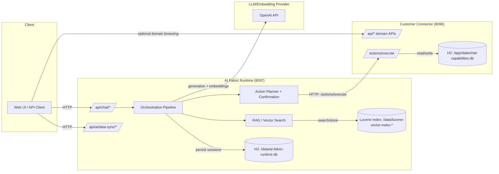
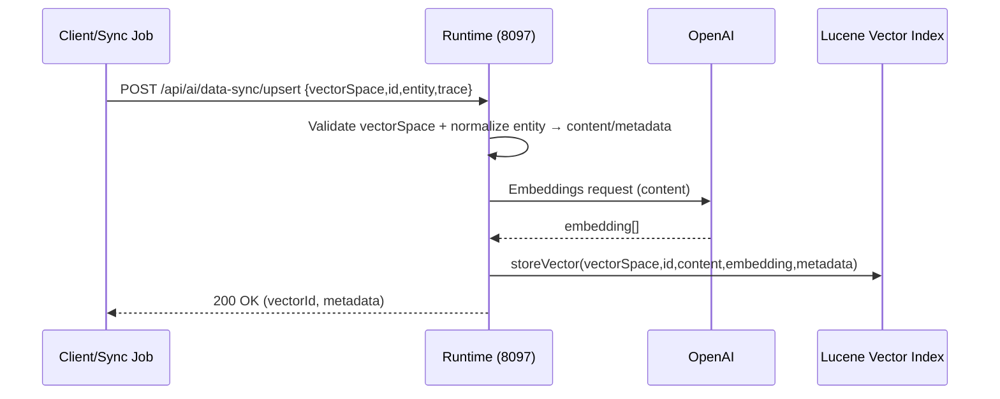
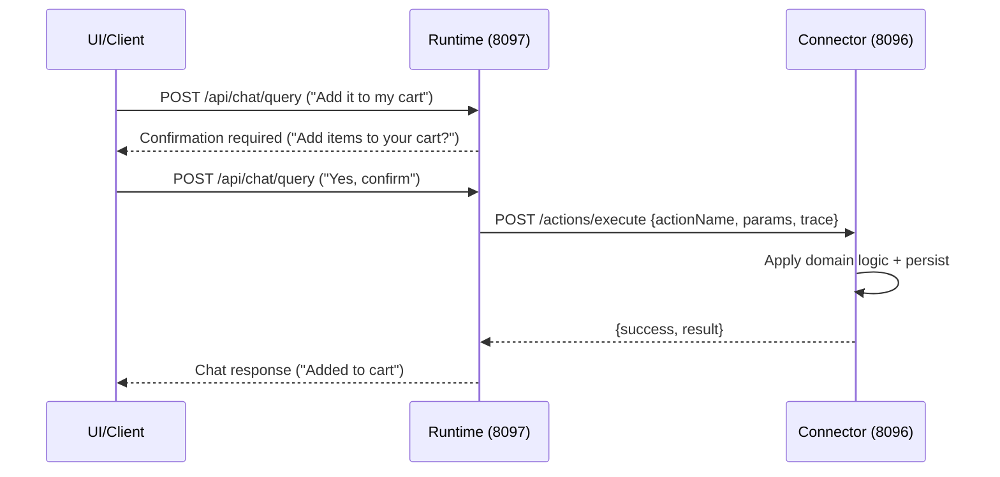

# Running Flow & Architecture (Runtime + Customer Connector)

This document describes the current runnable demo architecture (2 services) and the end-to-end request flows: ingestion (Data Sync), chat (RAG), and action execution (via connector).

## 1) Components (what runs)

### A) Client(s)
- **API client / UI**: anything that calls the runtime HTTP API (e.g., your web chat UI, Postman, `.http` files).

### B) AI Fabric Runtime (container: `ai-fabric-runtime`, port `8097`)
- **Responsibilities**
  - Chat orchestration (`/api/chat/*`)
  - Intent extraction, modes, confirmation flow
  - RAG retrieval (vector search + prompt assembly)
  - Action planning + action execution orchestration
  - Data Sync ingestion API (`/api/ai/data-sync/*`)
- **Persistence**
  - H2 DB (conversation/session persistence): `jdbc:h2:file:/data/ai-fabric-runtime.db`
  - Vector index (Lucene, dev): `/data/lucene-vector-index-*`
- **External dependencies**
  - LLM + embeddings provider (OpenAI in this demo) for generation + embeddings

### C) Customer Connector (container: `chat-capabilities-connector-demo`, port `8096`)
- **Responsibilities**
  - “Domain system” APIs (products/cart/orders/etc)
  - Action execution endpoint used by the runtime: `POST /actions/execute`
  - Idempotency handling for action execution (in-memory for demo)
- **Persistence**
  - H2 DB (domain state like products/cart/orders): `jdbc:h2:file:./data/chat-capabilities.db` inside container volume `/app/data`

### D) Configuration (mounted into runtime container)
- **Entity config** (vector spaces): `deploy/runtime/config/ai-entity-config.yml`
- **Action contract(s)**: `deploy/runtime/config/ai-actions.yml`
- **Runtime app config**: `deploy/runtime/config/application.yml`

## 2) Who talks to whom (connections)

- **Client → Runtime** (HTTP)
  - Chat: `POST /api/chat/query`, `POST /api/chat/suggestions`, `GET /api/chat/conversations`
  - Ingestion: `POST /api/ai/data-sync/upsert|delete|batch`, `GET /api/ai/data-sync/vector-spaces`
- **Runtime → Provider (OpenAI)** (HTTP)
  - Generation + embeddings
- **Runtime → Lucene index** (local filesystem)
  - Vector storage + similarity search
- **Runtime → Connector** (HTTP)
  - Execute actions: `POST http://connector:8096/actions/execute`
- **Connector → H2 DB** (local filesystem)
  - Domain state (products/cart/orders/etc)

## 3) Architecture diagram (system view)

## 4) Detailed running flows

### Flow A — Boot / configuration wiring

1. Docker Compose starts **connector** and **runtime**.
2. Runtime loads configuration:
   - `application.yml` for runtime settings + feature toggles.
   - `ai-entity-config.yml` for vector spaces (what can be indexed/retrieved).
   - `ai-actions.yml` for actions contract (names, params schema, confirmation requirements, routing to connector).
3. Runtime initializes:
   - H2 DB (conversation/session persistence).
   - Lucene vector index (dev vector DB).
   - Provider clients (OpenAI enabled only when env vars are set).

### Flow B — Data Sync ingestion (push into runtime)

Use this when your domain system is the source of truth (Shopify, internal APIs, etc.).

**Goal**: turn domain objects into searchable vectors in the runtime.

1. Client (or a sync job) calls runtime:
   - `POST /api/ai/data-sync/upsert` with:
     - `vectorSpace` (e.g. `product`)
     - `id` (e.g. `SKU-0001`)
     - `entity` payload (arbitrary JSON)
     - `trace` (request metadata)
2. Runtime:
   - Validates `vectorSpace` exists in `ai-entity-config.yml`.
   - Normalizes content using configured searchable + metadata fields.
   - Calls provider embeddings API to create an embedding for the normalized content.
   - Stores vector + metadata into Lucene index.

**Sequence (Data Sync upsert)**

### Flow C — Chat query (RAG + orchestration)

**Goal**: answer a user question using RAG context from the vector index and runtime prompts/config.

1. Client calls runtime:
   - `POST /api/chat/query`
2. Runtime:
   - Writes/updates conversation state in runtime H2 DB.
   - Uses embeddings to vector-search relevant documents (RAG) from Lucene.
   - Calls provider LLM to produce the response, grounded by retrieved documents.
3. Runtime returns:
   - Answer text + (optionally) retrieved documents and metadata.

### Flow D — Action execution (via connector) + confirmation

**Goal**: runtime decides an action is needed, asks for confirmation (if configured), then executes via connector.

1. Client calls runtime:
   - `POST /api/chat/query` (e.g. “Add it to my cart” + optional attachments)
2. Runtime:
   - Determines the most likely action (from curated prompts + `ai-actions.yml` contract).
   - If action is **write/side-effecting**, runtime returns a **confirmation-required** response (e.g. “Add items to your cart?”).
3. Client confirms:
   - `POST /api/chat/query` with “Yes, confirm”
4. Runtime executes:
   - Calls connector: `POST /actions/execute` with:
     - `actionName`
     - `params`
     - `trace` (user/session/conversation identifiers)
5. Connector:
   - Validates request and applies domain logic (cart/order/etc).
   - Persists domain state to connector H2 DB.
   - Returns action result payload.
6. Runtime:
   - Incorporates result into the chat response and persists session updates.

**Sequence (Action with confirmation)**

## 5) What to change when swapping the “connector demo” for a real system (e.g., Shopify)

Only two things change structurally:

1. **Connector implementation** changes:
   - The runtime continues calling `POST /actions/execute`.
   - Your connector’s action handlers switch from local DB logic to Shopify APIs (or your domain APIs).
2. **Data Sync producer** changes:
   - Instead of manually calling Data Sync, you run a Shopify sync job (webhooks + backfill) that pushes products/policies/etc to the runtime via `/api/ai/data-sync/*`.

The runtime stays the same (same config mounting pattern, same vector DB interface), unless you decide to swap Lucene for a managed vector DB in production.

