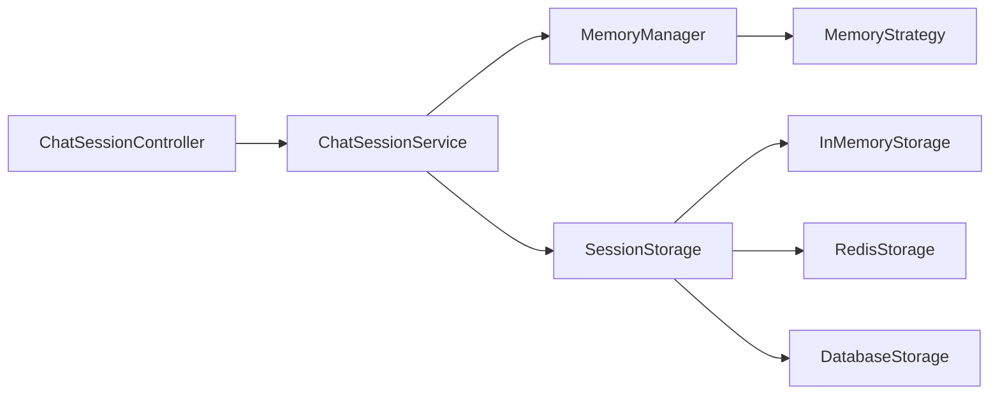

# AI Chat Session Management - Comprehensive Implementation Guide

**Version:** 1.0.0  
**Status:** Implementation Ready  
**Related Spec:** [AI_CHAT_SESSION_TECHNICAL_SPEC.md](./AI_CHAT_SESSION_TECHNICAL_SPEC.md)  
**Last Updated:** December 28, 2025

---

## Table of Contents

1. [Overview](#1-overview)
2. [Module Structure](#2-module-structure)
3. [Phase 1: Foundation - Data Models](#3-phase-1-foundation---data-models)
4. [Phase 2: Core Services](#4-phase-2-core-services)
5. [Phase 3: Memory Strategies](#5-phase-3-memory-strategies)
6. [Phase 4: Integration Layer](#6-phase-4-integration-layer)
7. [Phase 5: API Layer](#7-phase-5-api-layer)
8. [Configuration Management](#8-configuration-management)
9. [Error Handling & Resilience](#9-error-handling--resilience)
10. [Performance Considerations](#10-performance-considerations)
11. [Integration Tests Specification](#11-integration-tests-specification)
12. [Deployment Checklist](#12-deployment-checklist)

---

## 1. Overview

### 1.1 Implementation Goals

- **Zero Breaking Changes**: Existing AI Core functionality must continue working without modifications
- **Backward Compatibility**: All services should work with or without session management
- **Progressive Enhancement**: Features can adopt session awareness incrementally
- **Testability**: Each component must be independently testable

### 1.2 Technology Stack

- **Spring Boot**: 3.x
- **Java**: 17+
- **Persistence**: JPA/Hibernate + Optional Redis
- **Testing**: JUnit 5, Mockito, TestContainers
- **Validation**: Jakarta Validation
- **Serialization**: Jackson

---

## 2. Module Structure

### 2.1 Package Organization

```
ai-infrastructure-core/
└── src/
    └── main/
        └── java/
            └── com/thebase/ai/
                ├── session/
                │   ├── domain/
                │   │   ├── ChatSession.java
                │   │   ├── ChatTurn.java
                │   │   └── SessionMetadata.java
                │   ├── service/
                │   │   ├── ChatSessionService.java
                │   │   ├── ChatSessionServiceImpl.java
                │   │   └── MemoryManager.java
                │   ├── strategy/
                │   │   ├── MemoryStrategy.java
                │   │   ├── SlidingWindowMemoryStrategy.java
                │   │   ├── SummaryMemoryStrategy.java
                │   │   └── VectorMemoryStrategy.java
                │   ├── storage/
                │   │   ├── SessionStorage.java
                │   │   ├── InMemorySessionStorage.java
                │   │   ├── RedisSessionStorage.java
                │   │   └── DatabaseSessionStorage.java
                │   ├── config/
                │   │   └── ChatSessionConfiguration.java
                │   └── exception/
                │       ├── SessionNotFoundException.java
                │       ├── SessionExpiredException.java
                │       └── SessionStorageException.java
                └── controller/
                    └── ChatSessionController.java
```

### 2.2 Dependency Diagram



---

## 3. Phase 1: Foundation - Data Models

### 3.1 ChatSession Domain Model

**File:** `domain/ChatSession.java`

```java
package com.thebase.ai.session.domain;

import jakarta.persistence.*;
import jakarta.validation.constraints.NotBlank;
import lombok.*;

import java.time.LocalDateTime;
import java.util.*;

/**
 * Represents an AI conversation session with state management.
 * Designed to be serializable for Redis/Cache storage.
 */
@Entity
@Table(name = "chat_sessions", indexes = {
    @Index(name = "idx_user_id", columnList = "userId"),
    @Index(name = "idx_last_interaction", columnList = "lastInteractionAt")
})
@Data
@Builder
@NoArgsConstructor
@AllArgsConstructor
public class ChatSession {

    @Id
    @Column(length = 36)
    private String id;

    @NotBlank
    @Column(nullable = false, length = 100)
    private String userId;

    @Column(nullable = false)
    private LocalDateTime createdAt;

    @Column(nullable = false)
    private LocalDateTime lastInteractionAt;

    @Enumerated(EnumType.STRING)
    @Column(nullable = false)
    private SessionStatus status;

    @OneToMany(cascade = CascadeType.ALL, orphanRemoval = true, fetch = FetchType.LAZY)
    @JoinColumn(name = "session_id")
    @OrderBy("timestamp ASC")
    private List<ChatTurn> turns = new ArrayList<>();

    @Convert(converter = MetadataConverter.class)
    @Column(columnDefinition = "TEXT")
    private Map<String, Object> metadata = new HashMap<>();

    @Version
    private Long version;

    // Business Methods

    public void addTurn(ChatTurn turn) {
        if (this.turns == null) {
            this.turns = new ArrayList<>();
        }
        this.turns.add(turn);
        this.lastInteractionAt = LocalDateTime.now();
    }

    public List<ChatTurn> getRecentTurns(int limit) {
        if (turns == null || turns.isEmpty()) {
            return Collections.emptyList();
        }
        int size = turns.size();
        int fromIndex = Math.max(0, size - limit);
        return new ArrayList<>(turns.subList(fromIndex, size));
    }

    public int getTurnCount() {
        return turns != null ? turns.size() : 0;
    }

    public boolean isExpired(int ttlMinutes) {
        return LocalDateTime.now().isAfter(
            lastInteractionAt.plusMinutes(ttlMinutes)
        );
    }

    public enum SessionStatus {
        ACTIVE,
        EXPIRED,
        ARCHIVED,
        INVALIDATED
    }
}
```

### 3.2 ChatTurn Value Object

**File:** `domain/ChatTurn.java`

```java
package com.thebase.ai.session.domain;

import jakarta.persistence.*;
import lombok.*;

import java.time.LocalDateTime;
import java.util.*;

/**
 * Represents a single user-AI exchange within a session.
 * Immutable by design to ensure conversation integrity.
 */
@Entity
@Table(name = "chat_turns")
@Data
@Builder
@NoArgsConstructor
@AllArgsConstructor
public class ChatTurn {

    @Id
    @GeneratedValue(strategy = GenerationType.IDENTITY)
    private Long id;

    @Column(nullable = false, columnDefinition = "TEXT")
    private String userQuery;

    @Column(nullable = false, columnDefinition = "TEXT")
    private String aiResponse;

    @Column(nullable = false)
    private LocalDateTime timestamp;

    @ElementCollection
    @CollectionTable(name = "turn_document_refs", 
                     joinColumns = @JoinColumn(name = "turn_id"))
    @Column(name = "document_id")
    private List<String> documentIds = new ArrayList<>();

    @Column
    private Integer tokensUsed;

    @Column(length = 50)
    private String modelUsed;

    @Convert(converter = MetadataConverter.class)
    @Column(columnDefinition = "TEXT")
    private Map<String, Object> turnMetadata = new HashMap<>();

    // Factory Method
    public static ChatTurn create(String query, String response) {
        return ChatTurn.builder()
            .userQuery(query)
            .aiResponse(response)
            .timestamp(LocalDateTime.now())
            .documentIds(new ArrayList<>())
            .turnMetadata(new HashMap<>())
            .build();
    }

    public String toPromptFormat() {
        return String.format("User: %s\nAssistant: %s", userQuery, aiResponse);
    }
}
```

### 3.3 Session Metadata

**File:** `domain/SessionMetadata.java`

```java
package com.thebase.ai.session.domain;

import lombok.Builder;
import lombok.Data;

import java.util.*;

/**
 * Extensible metadata container for session-level information.
 */
@Data
@Builder
public class SessionMetadata {
    
    private String applicationContext;  // e.g., "customer-support", "research-assistant"
    private String languagePreference;
    private Map<String, String> customAttributes;
    
    // Analytics
    private Integer totalTokensUsed;
    private Double averageResponseTime;
    
    // RAG Context
    private List<String> activeDocumentCollections;
    private String preferredRetrievalMode;
}
```

### 3.4 Metadata Converter

**File:** `domain/MetadataConverter.java`

```java
package com.thebase.ai.session.domain;

import com.fasterxml.jackson.core.JsonProcessingException;
import com.fasterxml.jackson.databind.ObjectMapper;
import jakarta.persistence.AttributeConverter;
import jakarta.persistence.Converter;
import lombok.extern.slf4j.Slf4j;

import java.util.HashMap;
import java.util.Map;

@Slf4j
@Converter
public class MetadataConverter implements AttributeConverter<Map<String, Object>, String> {

    private static final ObjectMapper objectMapper = new ObjectMapper();

    @Override
    public String convertToDatabaseColumn(Map<String, Object> attribute) {
        if (attribute == null || attribute.isEmpty()) {
            return "{}";
        }
        try {
            return objectMapper.writeValueAsString(attribute);
        } catch (JsonProcessingException e) {
            log.error("Error converting metadata to JSON", e);
            return "{}";
        }
    }

    @Override
    public Map<String, Object> convertToEntityAttribute(String dbData) {
        if (dbData == null || dbData.isBlank()) {
            return new HashMap<>();
        }
        try {
            return objectMapper.readValue(dbData, Map.class);
        } catch (JsonProcessingException e) {
            log.error("Error parsing metadata JSON", e);
            return new HashMap<>();
        }
    }
}
```

---

## 4. Phase 2: Core Services

### 4.1 ChatSessionService Interface

**File:** `service/ChatSessionService.java`

```java
package com.thebase.ai.session.service;

import com.thebase.ai.session.domain.ChatSession;
import com.thebase.ai.session.domain.ChatTurn;

import java.util.List;
import java.util.Map;
import java.util.Optional;

/**
 * Primary service interface for AI chat session management.
 * Thread-safe and designed for high-concurrency scenarios.
 */
public interface ChatSessionService {

    /**
     * Creates a new chat session for the specified user.
     * 
     * @param userId The user identifier
     * @param metadata Optional session-level metadata
     * @return The created ChatSession with a unique ID
     */
    ChatSession createSession(String userId, Map<String, Object> metadata);

    /**
     * Retrieves an active session by ID.
     * 
     * @param sessionId The session identifier
     * @return Optional containing the session if found and active
     */
    Optional<ChatSession> getSession(String sessionId);

    /**
     * Records a new turn in the conversation.
     * Automatically manages context window pruning.
     * 
     * @param sessionId The session identifier
     * @param turn The ChatTurn to record
     * @throws SessionNotFoundException if session doesn't exist
     */
    void recordTurn(String sessionId, ChatTurn turn);

    /**
     * Retrieves conversation context formatted for LLM consumption.
     * 
     * @param sessionId The session identifier
     * @param windowSize Number of recent turns to include
     * @return Formatted conversation history string
     */
    String getConversationContext(String sessionId, int windowSize);

    /**
     * Retrieves raw conversation history.
     * 
     * @param sessionId The session identifier
     * @param limit Maximum number of turns to return
     * @return List of ChatTurns in chronological order
     */
    List<ChatTurn> getConversationHistory(String sessionId, int limit);

    /**
     * Invalidates a session, preventing further interactions.
     * The session is marked as INVALIDATED but not deleted for audit purposes.
     * 
     * @param sessionId The session identifier
     */
    void invalidateSession(String sessionId);

    /**
     * Archives old sessions to free up active storage.
     * Typically called by a scheduled job.
     * 
     * @param ttlMinutes Sessions inactive for this duration will be archived
     * @return Number of sessions archived
     */
    int archiveExpiredSessions(int ttlMinutes);

    /**
     * Updates session metadata without affecting conversation history.
     * 
     * @param sessionId The session identifier
     * @param metadata Key-value pairs to merge into existing metadata
     */
    void updateMetadata(String sessionId, Map<String, Object> metadata);
}
```

### 4.2 ChatSessionService Implementation

**File:** `service/ChatSessionServiceImpl.java`

```java
package com.thebase.ai.session.service;

import com.thebase.ai.session.domain.ChatSession;
import com.thebase.ai.session.domain.ChatTurn;
import com.thebase.ai.session.exception.SessionNotFoundException;
import com.thebase.ai.session.storage.SessionStorage;
import lombok.RequiredArgsConstructor;
import lombok.extern.slf4j.Slf4j;
import org.springframework.stereotype.Service;
import org.springframework.transaction.annotation.Transactional;

import java.time.LocalDateTime;
import java.util.*;

@Slf4j
@Service
@RequiredArgsConstructor
public class ChatSessionServiceImpl implements ChatSessionService {

    private final SessionStorage sessionStorage;
    private final MemoryManager memoryManager;
    private final ChatSessionProperties properties;

    @Override
    @Transactional
    public ChatSession createSession(String userId, Map<String, Object> metadata) {
        log.debug("Creating new chat session for user: {}", userId);
        
        ChatSession session = ChatSession.builder()
            .id(UUID.randomUUID().toString())
            .userId(userId)
            .createdAt(LocalDateTime.now())
            .lastInteractionAt(LocalDateTime.now())
            .status(ChatSession.SessionStatus.ACTIVE)
            .turns(new ArrayList<>())
            .metadata(metadata != null ? new HashMap<>(metadata) : new HashMap<>())
            .build();

        sessionStorage.save(session);
        
        log.info("Created session {} for user {}", session.getId(), userId);
        return session;
    }

    @Override
    public Optional<ChatSession> getSession(String sessionId) {
        Optional<ChatSession> session = sessionStorage.findById(sessionId);
        
        if (session.isPresent()) {
            ChatSession s = session.get();
            if (s.isExpired(properties.getTtlMinutes())) {
                log.warn("Session {} is expired", sessionId);
                return Optional.empty();
            }
            if (s.getStatus() != ChatSession.SessionStatus.ACTIVE) {
                log.warn("Session {} is not active: {}", sessionId, s.getStatus());
                return Optional.empty();
            }
        }
        
        return session;
    }

    @Override
    @Transactional
    public void recordTurn(String sessionId, ChatTurn turn) {
        ChatSession session = getSession(sessionId)
            .orElseThrow(() -> new SessionNotFoundException(sessionId));

        session.addTurn(turn);
        
        // Apply memory strategy pruning if needed
        if (shouldPrune(session)) {
            memoryManager.pruneSession(session);
        }

        sessionStorage.save(session);
        
        log.debug("Recorded turn in session {}. Total turns: {}", 
                  sessionId, session.getTurnCount());
    }

    @Override
    public String getConversationContext(String sessionId, int windowSize) {
        ChatSession session = getSession(sessionId)
            .orElseThrow(() -> new SessionNotFoundException(sessionId));

        List<ChatTurn> recentTurns = session.getRecentTurns(windowSize);
        return memoryManager.formatHistory(recentTurns);
    }

    @Override
    public List<ChatTurn> getConversationHistory(String sessionId, int limit) {
        ChatSession session = getSession(sessionId)
            .orElseThrow(() -> new SessionNotFoundException(sessionId));

        return session.getRecentTurns(limit);
    }

    @Override
    @Transactional
    public void invalidateSession(String sessionId) {
        ChatSession session = getSession(sessionId)
            .orElseThrow(() -> new SessionNotFoundException(sessionId));

        session.setStatus(ChatSession.SessionStatus.INVALIDATED);
        sessionStorage.save(session);
        
        log.info("Invalidated session {}", sessionId);
    }

    @Override
    @Transactional
    public int archiveExpiredSessions(int ttlMinutes) {
        log.info("Archiving sessions inactive for {} minutes", ttlMinutes);
        
        List<ChatSession> expiredSessions = sessionStorage.findExpiredSessions(ttlMinutes);
        
        for (ChatSession session : expiredSessions) {
            session.setStatus(ChatSession.SessionStatus.EXPIRED);
            sessionStorage.save(session);
        }
        
        log.info("Archived {} expired sessions", expiredSessions.size());
        return expiredSessions.size();
    }

    @Override
    @Transactional
    public void updateMetadata(String sessionId, Map<String, Object> metadata) {
        ChatSession session = getSession(sessionId)
            .orElseThrow(() -> new SessionNotFoundException(sessionId));

        session.getMetadata().putAll(metadata);
        sessionStorage.save(session);
        
        log.debug("Updated metadata for session {}", sessionId);
    }

    private boolean shouldPrune(ChatSession session) {
        int threshold = properties.getAutoSummarizeThreshold();
        return session.getTurnCount() > threshold;
    }
}
```

### 4.3 MemoryManager

**File:** `service/MemoryManager.java`

```java
package com.thebase.ai.session.service;

import com.thebase.ai.session.domain.ChatSession;
import com.thebase.ai.session.domain.ChatTurn;
import com.thebase.ai.session.strategy.MemoryStrategy;
import lombok.RequiredArgsConstructor;
import lombok.extern.slf4j.Slf4j;
import org.springframework.stereotype.Component;

import java.util.List;

/**
 * Manages memory strategies and context window management.
 */
@Slf4j
@Component
@RequiredArgsConstructor
public class MemoryManager {

    private final MemoryStrategy memoryStrategy;
    private final ChatSessionProperties properties;

    public String formatHistory(List<ChatTurn> turns) {
        if (turns == null || turns.isEmpty()) {
            return "";
        }
        return memoryStrategy.processHistory(turns);
    }

    public void pruneSession(ChatSession session) {
        int maxTurns = properties.getDefaultWindowSize();
        List<ChatTurn> currentTurns = session.getTurns();
        
        if (currentTurns.size() <= maxTurns) {
            return;
        }

        List<ChatTurn> prunedTurns = memoryStrategy.prune(currentTurns, maxTurns);
        
        // Replace turns with pruned version
        currentTurns.clear();
        currentTurns.addAll(prunedTurns);
        
        log.debug("Pruned session {} from {} to {} turns", 
                  session.getId(), currentTurns.size(), prunedTurns.size());
    }

    public int estimateTokenCount(List<ChatTurn> turns) {
        // Rough estimation: ~4 characters per token
        int totalChars = turns.stream()
            .mapToInt(turn -> turn.getUserQuery().length() + turn.getAiResponse().length())
            .sum();
        return totalChars / 4;
    }
}
```

---

## 5. Phase 3: Memory Strategies

### 5.1 MemoryStrategy Interface

**File:** `strategy/MemoryStrategy.java`

```java
package com.thebase.ai.session.strategy;

import com.thebase.ai.session.domain.ChatTurn;

import java.util.List;

/**
 * Strategy pattern for managing conversation history.
 * Implementations determine how context is preserved and formatted.
 */
public interface MemoryStrategy {

    /**
     * Transforms conversation turns into LLM-ready context.
     * 
     * @param history List of chat turns in chronological order
     * @return Formatted string suitable for LLM system prompt or context
     */
    String processHistory(List<ChatTurn> history);

    /**
     * Reduces conversation history to fit within constraints.
     * 
     * @param history Full conversation history
     * @param limit Maximum number of turns to retain
     * @return Pruned list of chat turns
     */
    List<ChatTurn> prune(List<ChatTurn> history, int limit);

    /**
     * Returns the strategy name for logging and configuration.
     */
    String getStrategyName();
}
```

### 5.2 Sliding Window Strategy

**File:** `strategy/SlidingWindowMemoryStrategy.java`

```java
package com.thebase.ai.session.strategy;

import com.thebase.ai.session.domain.ChatTurn;
import lombok.extern.slf4j.Slf4j;
import org.springframework.boot.autoconfigure.condition.ConditionalOnProperty;
import org.springframework.stereotype.Component;

import java.util.List;
import java.util.stream.Collectors;

/**
 * Simple sliding window that keeps the N most recent turns.
 * Best for short conversations with immediate context relevance.
 */
@Slf4j
@Component
@ConditionalOnProperty(
    prefix = "ai.session",
    name = "memory-strategy",
    havingValue = "SLIDING_WINDOW",
    matchIfMissing = true
)
public class SlidingWindowMemoryStrategy implements MemoryStrategy {

    @Override
    public String processHistory(List<ChatTurn> history) {
        if (history == null || history.isEmpty()) {
            return "";
        }

        return history.stream()
            .map(ChatTurn::toPromptFormat)
            .collect(Collectors.joining("\n\n"));
    }

    @Override
    public List<ChatTurn> prune(List<ChatTurn> history, int limit) {
        if (history.size() <= limit) {
            return history;
        }

        int startIndex = history.size() - limit;
        List<ChatTurn> pruned = history.subList(startIndex, history.size());
        
        log.debug("Pruned {} turns using sliding window (kept last {})", 
                  history.size() - pruned.size(), limit);
        
        return pruned;
    }

    @Override
    public String getStrategyName() {
        return "SLIDING_WINDOW";
    }
}
```

### 5.3 Summary Strategy

**File:** `strategy/SummaryMemoryStrategy.java`

```java
package com.thebase.ai.session.strategy;

import com.thebase.ai.session.domain.ChatTurn;
import com.thebase.ai.core.service.LLMService;
import lombok.RequiredArgsConstructor;
import lombok.extern.slf4j.Slf4j;
import org.springframework.boot.autoconfigure.condition.ConditionalOnProperty;
import org.springframework.stereotype.Component;

import java.util.*;

/**
 * Summarizes older conversation turns to preserve context
 * while reducing token usage.
 */
@Slf4j
@Component
@RequiredArgsConstructor
@ConditionalOnProperty(
    prefix = "ai.session",
    name = "memory-strategy",
    havingValue = "SUMMARY"
)
public class SummaryMemoryStrategy implements MemoryStrategy {

    private final LLMService llmService;
    private static final int RECENT_TURNS_TO_KEEP = 3;

    @Override
    public String processHistory(List<ChatTurn> history) {
        if (history == null || history.isEmpty()) {
            return "";
        }

        if (history.size() <= RECENT_TURNS_TO_KEEP) {
            return formatTurns(history);
        }

        // Split into older (to summarize) and recent (to keep verbatim)
        int splitIndex = history.size() - RECENT_TURNS_TO_KEEP;
        List<ChatTurn> olderTurns = history.subList(0, splitIndex);
        List<ChatTurn> recentTurns = history.subList(splitIndex, history.size());

        String summary = generateSummary(olderTurns);
        String recentContext = formatTurns(recentTurns);

        return String.format("Previous Conversation Summary:\n%s\n\nRecent Exchanges:\n%s",
                           summary, recentContext);
    }

    @Override
    public List<ChatTurn> prune(List<ChatTurn> history, int limit) {
        if (history.size() <= limit) {
            return history;
        }

        // Keep recent turns + create a summary turn for older ones
        int splitIndex = history.size() - limit + 1; // Reserve 1 slot for summary
        List<ChatTurn> olderTurns = history.subList(0, splitIndex);
        List<ChatTurn> recentTurns = history.subList(splitIndex, history.size());

        String summary = generateSummary(olderTurns);
        ChatTurn summaryTurn = ChatTurn.builder()
            .userQuery("[Summary of earlier conversation]")
            .aiResponse(summary)
            .timestamp(olderTurns.get(0).getTimestamp())
            .build();

        List<ChatTurn> result = new ArrayList<>();
        result.add(summaryTurn);
        result.addAll(recentTurns);

        log.debug("Summarized {} older turns into 1 summary turn", olderTurns.size());
        return result;
    }

    @Override
    public String getStrategyName() {
        return "SUMMARY";
    }

    private String generateSummary(List<ChatTurn> turns) {
        String conversationText = formatTurns(turns);
        
        String prompt = String.format(
            "Summarize the following conversation in 2-3 sentences, " +
            "preserving key topics and decisions:\n\n%s", 
            conversationText
        );

        try {
            return llmService.generateCompletion(prompt, 150);
        } catch (Exception e) {
            log.error("Failed to generate summary, using fallback", e);
            return "[Earlier conversation about " + 
                   turns.get(0).getUserQuery().substring(0, Math.min(50, turns.get(0).getUserQuery().length())) + 
                   "...]";
        }
    }

    private String formatTurns(List<ChatTurn> turns) {
        return turns.stream()
            .map(ChatTurn::toPromptFormat)
            .collect(Collectors.joining("\n\n"));
    }
}
```

### 5.4 Vector Memory Strategy (Placeholder)

**File:** `strategy/VectorMemoryStrategy.java`

```java
package com.thebase.ai.session.strategy;

import com.thebase.ai.session.domain.ChatTurn;
import lombok.extern.slf4j.Slf4j;
import org.springframework.boot.autoconfigure.condition.ConditionalOnProperty;
import org.springframework.stereotype.Component;

import java.util.List;

/**
 * Future implementation: Uses vector similarity to retrieve
 * relevant past turns rather than chronological order.
 */
@Slf4j
@Component
@ConditionalOnProperty(
    prefix = "ai.session",
    name = "memory-strategy",
    havingValue = "VECTOR"
)
public class VectorMemoryStrategy implements MemoryStrategy {

    @Override
    public String processHistory(List<ChatTurn> history) {
        // TODO: Implement vector-based retrieval
        log.warn("Vector memory strategy not yet implemented, using simple format");
        return history.stream()
            .map(ChatTurn::toPromptFormat)
            .collect(Collectors.joining("\n\n"));
    }

    @Override
    public List<ChatTurn> prune(List<ChatTurn> history, int limit) {
        // TODO: Implement semantic similarity-based pruning
        log.warn("Vector pruning not implemented, using sliding window");
        return history.subList(Math.max(0, history.size() - limit), history.size());
    }

    @Override
    public String getStrategyName() {
        return "VECTOR";
    }
}
```

---

## 6. Phase 4: Integration Layer

### 6.1 RAGOrchestrator Enhancement

**File:** `ai-infrastructure-core/src/main/java/com/thebase/ai/rag/RAGOrchestrator.java`

**Changes Required:**

```java
// Add to existing RAGOrchestrator class

import com.thebase.ai.session.service.ChatSessionService;
import java.util.Optional;

@Service
@RequiredArgsConstructor
public class RAGOrchestrator {
    
    // Existing dependencies...
    private final Optional<ChatSessionService> chatSessionService; // Make optional for backward compatibility

    /**
     * Enhanced query method with session awareness.
     */
    public RAGResponse query(RAGRequest request) {
        String enrichedQuery = request.getQuery();
        
        // If session ID provided, enrich with conversation context
        if (request.getSessionId() != null && chatSessionService.isPresent()) {
            String conversationContext = chatSessionService.get()
                .getConversationContext(request.getSessionId(), 5);
            
            if (!conversationContext.isBlank()) {
                enrichedQuery = String.format(
                    "Conversation History:\n%s\n\nCurrent Query: %s",
                    conversationContext,
                    request.getQuery()
                );
            }
        }

        // Continue with existing RAG logic using enrichedQuery...
        return performRAG(enrichedQuery, request);
    }
}
```

**Update RAGRequest DTO:**

```java
@Data
@Builder
public class RAGRequest {
    private String query;
    private String sessionId; // NEW: Optional session ID
    private List<String> documentIds;
    private RAGConfig config;
    // ... existing fields
}
```

### 6.2 IntentHistoryService Integration

**File:** Add to `ChatSessionServiceImpl.java`

```java
@Service
@RequiredArgsConstructor
public class ChatSessionServiceImpl implements ChatSessionService {
    
    private final IntentHistoryService intentHistoryService;
    
    @Override
    @Transactional
    public void recordTurn(String sessionId, ChatTurn turn) {
        ChatSession session = getSession(sessionId)
            .orElseThrow(() -> new SessionNotFoundException(sessionId));

        session.addTurn(turn);
        sessionStorage.save(session);

        // Persist to cold storage for analytics
        intentHistoryService.logIntent(
            IntentLog.builder()
                .userId(session.getUserId())
                .sessionId(sessionId)
                .query(turn.getUserQuery())
                .response(turn.getAiResponse())
                .timestamp(turn.getTimestamp())
                .build()
        );
    }
}
```

---

## 7. Phase 5: API Layer

### 7.1 ChatSessionController

**File:** `controller/ChatSessionController.java`

```java
package com.thebase.ai.controller;

import com.thebase.ai.session.domain.ChatSession;
import com.thebase.ai.session.domain.ChatTurn;
import com.thebase.ai.session.service.ChatSessionService;
import io.swagger.v3.oas.annotations.Operation;
import io.swagger.v3.oas.annotations.tags.Tag;
import jakarta.validation.Valid;
import lombok.RequiredArgsConstructor;
import org.springframework.http.HttpStatus;
import org.springframework.http.ResponseEntity;
import org.springframework.web.bind.annotation.*;

import java.util.List;
import java.util.Map;

@RestController
@RequestMapping("/api/v1/chat/sessions")
@RequiredArgsConstructor
@Tag(name = "Chat Session Management", description = "AI conversation session endpoints")
public class ChatSessionController {

    private final ChatSessionService sessionService;

    @PostMapping
    @Operation(summary = "Create a new chat session")
    public ResponseEntity<SessionResponse> createSession(
            @RequestBody @Valid CreateSessionRequest request) {
        
        ChatSession session = sessionService.createSession(
            request.getUserId(),
            request.getMetadata()
        );

        return ResponseEntity.status(HttpStatus.CREATED)
            .body(SessionResponse.from(session));
    }

    @GetMapping("/{sessionId}")
    @Operation(summary = "Retrieve session details")
    public ResponseEntity<SessionResponse> getSession(@PathVariable String sessionId) {
        return sessionService.getSession(sessionId)
            .map(SessionResponse::from)
            .map(ResponseEntity::ok)
            .orElse(ResponseEntity.notFound().build());
    }

    @PostMapping("/{sessionId}/turns")
    @Operation(summary = "Add a conversation turn to the session")
    public ResponseEntity<Void> addTurn(
            @PathVariable String sessionId,
            @RequestBody @Valid AddTurnRequest request) {
        
        ChatTurn turn = ChatTurn.create(request.getUserQuery(), request.getAiResponse());
        turn.setDocumentIds(request.getDocumentIds());
        
        sessionService.recordTurn(sessionId, turn);
        
        return ResponseEntity.ok().build();
    }

    @GetMapping("/{sessionId}/history")
    @Operation(summary = "Get conversation history")
    public ResponseEntity<List<TurnResponse>> getHistory(
            @PathVariable String sessionId,
            @RequestParam(defaultValue = "10") int limit) {
        
        List<ChatTurn> history = sessionService.getConversationHistory(sessionId, limit);
        
        return ResponseEntity.ok(
            history.stream()
                .map(TurnResponse::from)
                .toList()
        );
    }

    @GetMapping("/{sessionId}/context")
    @Operation(summary = "Get formatted conversation context for LLM")
    public ResponseEntity<ContextResponse> getContext(
            @PathVariable String sessionId,
            @RequestParam(defaultValue = "5") int windowSize) {
        
        String context = sessionService.getConversationContext(sessionId, windowSize);
        
        return ResponseEntity.ok(new ContextResponse(context));
    }

    @DeleteMapping("/{sessionId}")
    @Operation(summary = "Invalidate a session")
    public ResponseEntity<Void> invalidateSession(@PathVariable String sessionId) {
        sessionService.invalidateSession(sessionId);
        return ResponseEntity.noContent().build();
    }

    @PatchMapping("/{sessionId}/metadata")
    @Operation(summary = "Update session metadata")
    public ResponseEntity<Void> updateMetadata(
            @PathVariable String sessionId,
            @RequestBody Map<String, Object> metadata) {
        
        sessionService.updateMetadata(sessionId, metadata);
        return ResponseEntity.ok().build();
    }
}
```

### 7.2 Request/Response DTOs

**File:** `controller/dto/CreateSessionRequest.java`

```java
package com.thebase.ai.controller.dto;

import jakarta.validation.constraints.NotBlank;
import lombok.Data;

import java.util.Map;

@Data
public class CreateSessionRequest {
    @NotBlank(message = "User ID is required")
    private String userId;
    
    private Map<String, Object> metadata;
}
```

**File:** `controller/dto/SessionResponse.java`

```java
package com.thebase.ai.controller.dto;

import com.thebase.ai.session.domain.ChatSession;
import lombok.Builder;
import lombok.Data;

import java.time.LocalDateTime;
import java.util.Map;

@Data
@Builder
public class SessionResponse {
    private String id;
    private String userId;
    private LocalDateTime createdAt;
    private LocalDateTime lastInteractionAt;
    private String status;
    private int turnCount;
    private Map<String, Object> metadata;

    public static SessionResponse from(ChatSession session) {
        return SessionResponse.builder()
            .id(session.getId())
            .userId(session.getUserId())
            .createdAt(session.getCreatedAt())
            .lastInteractionAt(session.getLastInteractionAt())
            .status(session.getStatus().name())
            .turnCount(session.getTurnCount())
            .metadata(session.getMetadata())
            .build();
    }
}
```

---

## 8. Configuration Management

### 8.1 Configuration Properties

**File:** `config/ChatSessionProperties.java`

```java
package com.thebase.ai.session.config;

import lombok.Data;
import org.springframework.boot.context.properties.ConfigurationProperties;
import org.springframework.validation.annotation.Validated;

import jakarta.validation.constraints.Min;
import jakarta.validation.constraints.NotNull;

@Data
@Validated
@ConfigurationProperties(prefix = "ai.session")
public class ChatSessionProperties {

    private boolean enabled = true;

    @NotNull
    private StorageType storageType = StorageType.IN_MEMORY;

    @Min(1)
    private int defaultWindowSize = 5;

    @Min(1)
    private int ttlMinutes = 60;

    @NotNull
    private MemoryStrategyType memoryStrategy = MemoryStrategyType.SLIDING_WINDOW;

    @Min(1)
    private int autoSummarizeThreshold = 20;

    // Redis-specific settings
    private RedisConfig redis = new RedisConfig();

    @Data
    public static class RedisConfig {
        private String host = "localhost";
        private int port = 6379;
        private String password;
        private int database = 0;
        private int timeoutSeconds = 5;
    }

    public enum StorageType {
        IN_MEMORY,
        REDIS,
        DATABASE
    }

    public enum MemoryStrategyType {
        SLIDING_WINDOW,
        SUMMARY,
        VECTOR
    }
}
```

### 8.2 Auto-Configuration

**File:** `config/ChatSessionConfiguration.java`

```java
package com.thebase.ai.session.config;

import com.thebase.ai.session.storage.*;
import lombok.extern.slf4j.Slf4j;
import org.springframework.boot.autoconfigure.condition.ConditionalOnProperty;
import org.springframework.boot.context.properties.EnableConfigurationProperties;
import org.springframework.context.annotation.Bean;
import org.springframework.context.annotation.Configuration;
import org.springframework.data.redis.connection.RedisConnectionFactory;
import org.springframework.data.redis.core.RedisTemplate;
import org.springframework.scheduling.annotation.EnableScheduling;

@Slf4j
@Configuration
@EnableConfigurationProperties(ChatSessionProperties.class)
@EnableScheduling
@ConditionalOnProperty(prefix = "ai.session", name = "enabled", havingValue = "true", matchIfMissing = true)
public class ChatSessionConfiguration {

    @Bean
    @ConditionalOnProperty(prefix = "ai.session", name = "storage-type", havingValue = "IN_MEMORY", matchIfMissing = true)
    public SessionStorage inMemorySessionStorage() {
        log.info("Initializing IN_MEMORY session storage");
        return new InMemorySessionStorage();
    }

    @Bean
    @ConditionalOnProperty(prefix = "ai.session", name = "storage-type", havingValue = "REDIS")
    public SessionStorage redisSessionStorage(RedisTemplate<String, ChatSession> redisTemplate) {
        log.info("Initializing REDIS session storage");
        return new RedisSessionStorage(redisTemplate);
    }

    @Bean
    @ConditionalOnProperty(prefix = "ai.session", name = "storage-type", havingValue = "DATABASE")
    public SessionStorage databaseSessionStorage(ChatSessionRepository repository) {
        log.info("Initializing DATABASE session storage");
        return new DatabaseSessionStorage(repository);
    }

    @Bean
    public SessionCleanupScheduler sessionCleanupScheduler(
            ChatSessionService sessionService,
            ChatSessionProperties properties) {
        return new SessionCleanupScheduler(sessionService, properties);
    }
}
```

### 8.3 Application Configuration Example

**File:** `application.yml` (to be added to the main application)

```yaml
ai:
  session:
    enabled: true
    storage-type: IN_MEMORY  # Options: IN_MEMORY, REDIS, DATABASE
    default-window-size: 5
    ttl-minutes: 60
    memory-strategy: SLIDING_WINDOW  # Options: SLIDING_WINDOW, SUMMARY, VECTOR
    auto-summarize-threshold: 20
    
    # Redis Configuration (only if storage-type: REDIS)
    redis:
      host: localhost
      port: 6379
      database: 0
      timeout-seconds: 5

# Scheduled Tasks
spring:
  task:
    scheduling:
      pool:
        size: 2
```

---

## 9. Error Handling & Resilience

### 9.1 Custom Exceptions

**File:** `exception/SessionNotFoundException.java`

```java
package com.thebase.ai.session.exception;

public class SessionNotFoundException extends RuntimeException {
    public SessionNotFoundException(String sessionId) {
        super(String.format("Chat session not found: %s", sessionId));
    }
}
```

**File:** `exception/SessionExpiredException.java`

```java
package com.thebase.ai.session.exception;

import java.time.LocalDateTime;

public class SessionExpiredException extends RuntimeException {
    public SessionExpiredException(String sessionId, LocalDateTime expiredAt) {
        super(String.format("Session %s expired at %s", sessionId, expiredAt));
    }
}
```

### 9.2 Global Exception Handler

**File:** `exception/SessionExceptionHandler.java`

```java
package com.thebase.ai.session.exception;

import lombok.extern.slf4j.Slf4j;
import org.springframework.http.HttpStatus;
import org.springframework.http.ResponseEntity;
import org.springframework.web.bind.annotation.ExceptionHandler;
import org.springframework.web.bind.annotation.RestControllerAdvice;

import java.time.LocalDateTime;
import java.util.Map;

@Slf4j
@RestControllerAdvice
public class SessionExceptionHandler {

    @ExceptionHandler(SessionNotFoundException.class)
    public ResponseEntity<Map<String, Object>> handleSessionNotFound(SessionNotFoundException ex) {
        log.warn("Session not found: {}", ex.getMessage());
        
        return ResponseEntity.status(HttpStatus.NOT_FOUND)
            .body(Map.of(
                "error", "SESSION_NOT_FOUND",
                "message", ex.getMessage(),
                "timestamp", LocalDateTime.now()
            ));
    }

    @ExceptionHandler(SessionExpiredException.class)
    public ResponseEntity<Map<String, Object>> handleSessionExpired(SessionExpiredException ex) {
        log.warn("Session expired: {}", ex.getMessage());
        
        return ResponseEntity.status(HttpStatus.GONE)
            .body(Map.of(
                "error", "SESSION_EXPIRED",
                "message", ex.getMessage(),
                "timestamp", LocalDateTime.now()
            ));
    }

    @ExceptionHandler(SessionStorageException.class)
    public ResponseEntity<Map<String, Object>> handleStorageError(SessionStorageException ex) {
        log.error("Session storage error", ex);
        
        return ResponseEntity.status(HttpStatus.INTERNAL_SERVER_ERROR)
            .body(Map.of(
                "error", "STORAGE_ERROR",
                "message", "Failed to persist session data",
                "timestamp", LocalDateTime.now()
            ));
    }
}
```

---

## 10. Performance Considerations

### 10.1 Session Cleanup Scheduler

**File:** `service/SessionCleanupScheduler.java`

```java
package com.thebase.ai.session.service;

import com.thebase.ai.session.config.ChatSessionProperties;
import lombok.RequiredArgsConstructor;
import lombok.extern.slf4j.Slf4j;
import org.springframework.scheduling.annotation.Scheduled;
import org.springframework.stereotype.Component;

@Slf4j
@Component
@RequiredArgsConstructor
public class SessionCleanupScheduler {

    private final ChatSessionService sessionService;
    private final ChatSessionProperties properties;

    /**
     * Runs every hour to archive expired sessions.
     */
    @Scheduled(cron = "0 0 * * * *")  // Every hour
    public void cleanupExpiredSessions() {
        log.info("Starting scheduled session cleanup");
        
        try {
            int archivedCount = sessionService.archiveExpiredSessions(
                properties.getTtlMinutes()
            );
            
            log.info("Session cleanup completed. Archived {} sessions", archivedCount);
        } catch (Exception e) {
            log.error("Error during session cleanup", e);
        }
    }
}
```

### 10.2 Caching Strategy

```java
@Service
public class ChatSessionServiceImpl implements ChatSessionService {
    
    @Cacheable(value = "chatSessions", key = "#sessionId")
    public Optional<ChatSession> getSession(String sessionId) {
        // Implementation...
    }

    @CacheEvict(value = "chatSessions", key = "#sessionId")
    public void invalidateSession(String sessionId) {
        // Implementation...
    }
}
```

**Add to application.yml:**

```yaml
spring:
  cache:
    type: caffeine
    caffeine:
      spec: maximumSize=1000,expireAfterAccess=60m
```

---

## 11. Integration Tests Specification

### 11.1 Test Module Structure

**Location:** `integration-tests/src/test/java/com/thebase/ai/session/`

```
integration-tests/
└── src/test/java/com/thebase/ai/session/
    ├── ChatSessionIntegrationTest.java
    ├── MemoryStrategyIntegrationTest.java
    ├── RAGSessionIntegrationTest.java
    ├── SessionStorageIntegrationTest.java
    ├── SessionPersistenceTest.java
    ├── ConcurrentSessionTest.java
    └── EndToEndConversationTest.java
```

### 11.2 Core Session Management Tests

**File:** `integration-tests/src/test/java/com/thebase/ai/session/ChatSessionIntegrationTest.java`

```java
package com.thebase.ai.session;

import com.thebase.ai.session.domain.ChatSession;
import com.thebase.ai.session.domain.ChatTurn;
import com.thebase.ai.session.service.ChatSessionService;
import com.thebase.ai.session.exception.SessionNotFoundException;
import org.junit.jupiter.api.*;
import org.springframework.beans.factory.annotation.Autowired;
import org.springframework.boot.test.context.SpringBootTest;
import org.springframework.test.context.ActiveProfiles;
import org.springframework.transaction.annotation.Transactional;

import java.util.List;
import java.util.Map;

import static org.assertj.core.api.Assertions.*;

/**
 * Integration tests for ChatSessionService covering:
 * - Session lifecycle (create, retrieve, invalidate)
 * - Turn recording and retrieval
 * - Context generation
 * - TTL and expiration
 */
@SpringBootTest
@ActiveProfiles("test")
@TestMethodOrder(MethodOrderer.OrderAnnotation.class)
class ChatSessionIntegrationTest {

    @Autowired
    private ChatSessionService sessionService;

    private String testUserId = "test-user-123";
    private ChatSession testSession;

    @BeforeEach
    void setUp() {
        testSession = sessionService.createSession(testUserId, Map.of("test", "metadata"));
    }

    @Test
    @DisplayName("Should create a new session with valid metadata")
    void testCreateSession() {
        // Assert
        assertThat(testSession).isNotNull();
        assertThat(testSession.getId()).isNotBlank();
        assertThat(testSession.getUserId()).isEqualTo(testUserId);
        assertThat(testSession.getStatus()).isEqualTo(ChatSession.SessionStatus.ACTIVE);
        assertThat(testSession.getMetadata()).containsEntry("test", "metadata");
        assertThat(testSession.getTurnCount()).isZero();
    }

    @Test
    @DisplayName("Should retrieve an existing active session")
    void testGetSession() {
        // Act
        var retrieved = sessionService.getSession(testSession.getId());

        // Assert
        assertThat(retrieved).isPresent();
        assertThat(retrieved.get().getId()).isEqualTo(testSession.getId());
    }

    @Test
    @DisplayName("Should return empty when session does not exist")
    void testGetNonExistentSession() {
        // Act
        var result = sessionService.getSession("non-existent-id");

        // Assert
        assertThat(result).isEmpty();
    }

    @Test
    @DisplayName("Should record a conversation turn successfully")
    @Transactional
    void testRecordTurn() {
        // Arrange
        ChatTurn turn = ChatTurn.create(
            "What is machine learning?",
            "Machine learning is a subset of AI..."
        );

        // Act
        sessionService.recordTurn(testSession.getId(), turn);

        // Assert
        var updated = sessionService.getSession(testSession.getId()).orElseThrow();
        assertThat(updated.getTurnCount()).isEqualTo(1);
        assertThat(updated.getTurns().get(0).getUserQuery()).contains("machine learning");
    }

    @Test
    @DisplayName("Should retrieve conversation history with limit")
    @Transactional
    void testGetConversationHistory() {
        // Arrange - Add 10 turns
        for (int i = 0; i < 10; i++) {
            ChatTurn turn = ChatTurn.create("Query " + i, "Response " + i);
            sessionService.recordTurn(testSession.getId(), turn);
        }

        // Act
        List<ChatTurn> history = sessionService.getConversationHistory(testSession.getId(), 5);

        // Assert
        assertThat(history).hasSize(5);
        assertThat(history.get(0).getUserQuery()).contains("Query 5"); // Most recent 5
        assertThat(history.get(4).getUserQuery()).contains("Query 9");
    }

    @Test
    @DisplayName("Should format conversation context correctly")
    @Transactional
    void testGetConversationContext() {
        // Arrange
        sessionService.recordTurn(testSession.getId(), 
            ChatTurn.create("Hello", "Hi there!"));
        sessionService.recordTurn(testSession.getId(), 
            ChatTurn.create("How are you?", "I'm doing well!"));

        // Act
        String context = sessionService.getConversationContext(testSession.getId(), 10);

        // Assert
        assertThat(context).contains("User: Hello");
        assertThat(context).contains("Assistant: Hi there!");
        assertThat(context).contains("User: How are you?");
    }

    @Test
    @DisplayName("Should invalidate a session successfully")
    @Transactional
    void testInvalidateSession() {
        // Act
        sessionService.invalidateSession(testSession.getId());

        // Assert
        var result = sessionService.getSession(testSession.getId());
        assertThat(result).isEmpty(); // Invalidated sessions are not retrievable
    }

    @Test
    @DisplayName("Should throw exception when recording turn to non-existent session")
    void testRecordTurnToNonExistentSession() {
        // Arrange
        ChatTurn turn = ChatTurn.create("Test", "Test response");

        // Act & Assert
        assertThatThrownBy(() -> 
            sessionService.recordTurn("non-existent", turn))
            .isInstanceOf(SessionNotFoundException.class);
    }

    @Test
    @DisplayName("Should update session metadata without affecting turns")
    @Transactional
    void testUpdateMetadata() {
        // Arrange
        sessionService.recordTurn(testSession.getId(), 
            ChatTurn.create("Test", "Response"));

        // Act
        sessionService.updateMetadata(testSession.getId(), 
            Map.of("language", "en", "context", "support"));

        // Assert
        var updated = sessionService.getSession(testSession.getId()).orElseThrow();
        assertThat(updated.getMetadata())
            .containsEntry("language", "en")
            .containsEntry("context", "support")
            .containsEntry("test", "metadata"); // Original metadata preserved
        assertThat(updated.getTurnCount()).isEqualTo(1); // Turns unaffected
    }

    @Test
    @DisplayName("Should archive expired sessions based on TTL")
    @Transactional
    void testArchiveExpiredSessions() {
        // This test requires time manipulation or custom test sessions
        // Implementation depends on your testing framework capabilities
        
        // For now, verify the method doesn't throw
        int archived = sessionService.archiveExpiredSessions(0); // 0 minutes = all expired
        assertThat(archived).isGreaterThanOrEqualTo(0);
    }
}
```

### 11.3 Memory Strategy Integration Tests

**File:** `integration-tests/src/test/java/com/thebase/ai/session/MemoryStrategyIntegrationTest.java`

```java
package com.thebase.ai.session;

import com.thebase.ai.session.domain.ChatTurn;
import com.thebase.ai.session.strategy.*;
import org.junit.jupiter.api.BeforeEach;
import org.junit.jupiter.api.DisplayName;
import org.junit.jupiter.api.Test;
import org.springframework.beans.factory.annotation.Autowired;
import org.springframework.boot.test.context.SpringBootTest;
import org.springframework.test.context.ActiveProfiles;

import java.time.LocalDateTime;
import java.util.ArrayList;
import java.util.List;

import static org.assertj.core.api.Assertions.*;

/**
 * Tests for different memory strategy implementations.
 */
@SpringBootTest
@ActiveProfiles("test")
class MemoryStrategyIntegrationTest {

    @Autowired
    private MemoryStrategy memoryStrategy; // Will be injected based on active profile

    private List<ChatTurn> sampleHistory;

    @BeforeEach
    void setUp() {
        sampleHistory = new ArrayList<>();
        for (int i = 1; i <= 10; i++) {
            sampleHistory.add(ChatTurn.builder()
                .userQuery("User query " + i)
                .aiResponse("AI response " + i)
                .timestamp(LocalDateTime.now().minusMinutes(10 - i))
                .build());
        }
    }

    @Test
    @DisplayName("Should process history into formatted string")
    void testProcessHistory() {
        // Act
        String formatted = memoryStrategy.processHistory(sampleHistory);

        // Assert
        assertThat(formatted).isNotBlank();
        assertThat(formatted).contains("User: User query");
        assertThat(formatted).contains("Assistant: AI response");
    }

    @Test
    @DisplayName("Should prune history to specified limit")
    void testPruneHistory() {
        // Act
        List<ChatTurn> pruned = memoryStrategy.prune(sampleHistory, 5);

        // Assert
        assertThat(pruned).hasSizeLessThanOrEqualTo(5);
        
        // Verify most recent turns are kept (for sliding window)
        if (memoryStrategy instanceof SlidingWindowMemoryStrategy) {
            assertThat(pruned.get(pruned.size() - 1).getUserQuery())
                .contains("query 10");
        }
    }

    @Test
    @DisplayName("Should handle empty history gracefully")
    void testEmptyHistory() {
        // Act
        String formatted = memoryStrategy.processHistory(List.of());
        List<ChatTurn> pruned = memoryStrategy.prune(List.of(), 5);

        // Assert
        assertThat(formatted).isEmpty();
        assertThat(pruned).isEmpty();
    }

    @Test
    @DisplayName("Should not prune when history is within limit")
    void testNoPruningNeeded() {
        // Arrange
        List<ChatTurn> shortHistory = sampleHistory.subList(0, 3);

        // Act
        List<ChatTurn> result = memoryStrategy.prune(shortHistory, 5);

        // Assert
        assertThat(result).hasSize(3);
    }
}
```

### 11.4 RAG Integration with Sessions Test

**File:** `integration-tests/src/test/java/com/thebase/ai/session/RAGSessionIntegrationTest.java`

```java
package com.thebase.ai.session;

import com.thebase.ai.rag.RAGOrchestrator;
import com.thebase.ai.rag.dto.RAGRequest;
import com.thebase.ai.rag.dto.RAGResponse;
import com.thebase.ai.session.domain.ChatTurn;
import com.thebase.ai.session.service.ChatSessionService;
import org.junit.jupiter.api.BeforeEach;
import org.junit.jupiter.api.DisplayName;
import org.junit.jupiter.api.Test;
import org.springframework.beans.factory.annotation.Autowired;
import org.springframework.boot.test.context.SpringBootTest;
import org.springframework.test.context.ActiveProfiles;
import org.springframework.transaction.annotation.Transactional;

import java.util.Map;

import static org.assertj.core.api.Assertions.*;

/**
 * Integration tests verifying RAG Orchestrator works with Chat Sessions.
 * Critical path: Session context enriches RAG queries.
 */
@SpringBootTest
@ActiveProfiles("test")
@Transactional
class RAGSessionIntegrationTest {

    @Autowired
    private RAGOrchestrator ragOrchestrator;

    @Autowired
    private ChatSessionService sessionService;

    private String sessionId;

    @BeforeEach
    void setUp() {
        var session = sessionService.createSession("test-user", Map.of());
        sessionId = session.getId();

        // Pre-populate with conversation context
        sessionService.recordTurn(sessionId, 
            ChatTurn.create(
                "What is the company's refund policy?",
                "The company offers 30-day refunds for all products."
            ));
    }

    @Test
    @DisplayName("Should enrich RAG query with session context")
    void testRAGWithSessionContext() {
        // Arrange
        RAGRequest request = RAGRequest.builder()
            .query("What about returns?")
            .sessionId(sessionId) // Session-aware query
            .build();

        // Act
        RAGResponse response = ragOrchestrator.query(request);

        // Assert
        assertThat(response).isNotNull();
        // The RAG should have access to previous "refund policy" context
        // This assertion depends on your RAG implementation details
        assertThat(response.getAnswer()).isNotBlank();
    }

    @Test
    @DisplayName("Should work without session ID (backward compatibility)")
    void testRAGWithoutSession() {
        // Arrange
        RAGRequest request = RAGRequest.builder()
            .query("What is your return policy?")
            .sessionId(null) // No session
            .build();

        // Act
        RAGResponse response = ragOrchestrator.query(request);

        // Assert
        assertThat(response).isNotNull();
        assertThat(response.getAnswer()).isNotBlank();
    }

    @Test
    @DisplayName("Should handle multi-turn RAG conversation")
    void testMultiTurnRAGConversation() {
        // Turn 1
        RAGRequest request1 = RAGRequest.builder()
            .query("Tell me about Product X")
            .sessionId(sessionId)
            .build();
        RAGResponse response1 = ragOrchestrator.query(request1);
        
        sessionService.recordTurn(sessionId, 
            ChatTurn.create(request1.getQuery(), response1.getAnswer()));

        // Turn 2 - Follow-up question
        RAGRequest request2 = RAGRequest.builder()
            .query("What's its price?") // Context-dependent
            .sessionId(sessionId)
            .build();
        RAGResponse response2 = ragOrchestrator.query(request2);

        // Assert
        assertThat(response2.getAnswer()).isNotBlank();
        // The second response should understand "its" refers to Product X
    }
}
```

### 11.5 Storage Layer Integration Tests

**File:** `integration-tests/src/test/java/com/thebase/ai/session/SessionStorageIntegrationTest.java`

```java
package com.thebase.ai.session;

import com.thebase.ai.session.domain.ChatSession;
import com.thebase.ai.session.storage.SessionStorage;
import org.junit.jupiter.api.DisplayName;
import org.junit.jupiter.api.Test;
import org.springframework.beans.factory.annotation.Autowired;
import org.springframework.boot.test.context.SpringBootTest;
import org.springframework.test.context.ActiveProfiles;

import java.time.LocalDateTime;
import java.util.*;

import static org.assertj.core.api.Assertions.*;

/**
 * Tests for different storage implementations (In-Memory, Redis, Database).
 * Run with different profiles to test each storage type.
 */
@SpringBootTest
@ActiveProfiles("test")
class SessionStorageIntegrationTest {

    @Autowired
    private SessionStorage sessionStorage;

    @Test
    @DisplayName("Should save and retrieve session")
    void testSaveAndRetrieve() {
        // Arrange
        ChatSession session = ChatSession.builder()
            .id(UUID.randomUUID().toString())
            .userId("test-user")
            .createdAt(LocalDateTime.now())
            .lastInteractionAt(LocalDateTime.now())
            .status(ChatSession.SessionStatus.ACTIVE)
            .turns(new ArrayList<>())
            .metadata(new HashMap<>())
            .build();

        // Act
        sessionStorage.save(session);
        Optional<ChatSession> retrieved = sessionStorage.findById(session.getId());

        // Assert
        assertThat(retrieved).isPresent();
        assertThat(retrieved.get().getUserId()).isEqualTo("test-user");
    }

    @Test
    @DisplayName("Should update existing session")
    void testUpdate() {
        // Arrange
        ChatSession session = createTestSession();
        sessionStorage.save(session);

        // Act
        session.setStatus(ChatSession.SessionStatus.EXPIRED);
        sessionStorage.save(session);
        Optional<ChatSession> updated = sessionStorage.findById(session.getId());

        // Assert
        assertThat(updated).isPresent();
        assertThat(updated.get().getStatus()).isEqualTo(ChatSession.SessionStatus.EXPIRED);
    }

    @Test
    @DisplayName("Should find expired sessions")
    void testFindExpiredSessions() {
        // Arrange
        ChatSession oldSession = createTestSession();
        oldSession.setLastInteractionAt(LocalDateTime.now().minusHours(2));
        sessionStorage.save(oldSession);

        ChatSession recentSession = createTestSession();
        sessionStorage.save(recentSession);

        // Act
        List<ChatSession> expired = sessionStorage.findExpiredSessions(60); // 60 minutes TTL

        // Assert
        assertThat(expired).hasSizeGreaterThanOrEqualTo(1);
        assertThat(expired).anyMatch(s -> s.getId().equals(oldSession.getId()));
    }

    @Test
    @DisplayName("Should handle large metadata objects")
    void testLargeMetadata() {
        // Arrange
        Map<String, Object> largeMetadata = new HashMap<>();
        for (int i = 0; i < 100; i++) {
            largeMetadata.put("key" + i, "value with some content " + i);
        }

        ChatSession session = createTestSession();
        session.setMetadata(largeMetadata);

        // Act
        sessionStorage.save(session);
        Optional<ChatSession> retrieved = sessionStorage.findById(session.getId());

        // Assert
        assertThat(retrieved).isPresent();
        assertThat(retrieved.get().getMetadata()).hasSize(100);
    }

    private ChatSession createTestSession() {
        return ChatSession.builder()
            .id(UUID.randomUUID().toString())
            .userId("test-user")
            .createdAt(LocalDateTime.now())
            .lastInteractionAt(LocalDateTime.now())
            .status(ChatSession.SessionStatus.ACTIVE)
            .turns(new ArrayList<>())
            .metadata(new HashMap<>())
            .build();
    }
}
```

### 11.6 Concurrent Access Tests

**File:** `integration-tests/src/test/java/com/thebase/ai/session/ConcurrentSessionTest.java`

```java
package com.thebase.ai.session;

import com.thebase.ai.session.domain.ChatSession;
import com.thebase.ai.session.domain.ChatTurn;
import com.thebase.ai.session.service.ChatSessionService;
import org.junit.jupiter.api.DisplayName;
import org.junit.jupiter.api.Test;
import org.springframework.beans.factory.annotation.Autowired;
import org.springframework.boot.test.context.SpringBootTest;
import org.springframework.test.context.ActiveProfiles;

import java.util.Map;
import java.util.concurrent.CountDownLatch;
import java.util.concurrent.ExecutorService;
import java.util.concurrent.Executors;
import java.util.concurrent.TimeUnit;
import java.util.concurrent.atomic.AtomicInteger;

import static org.assertj.core.api.Assertions.*;

/**
 * Tests for concurrent session access scenarios.
 * Ensures thread-safety and proper locking mechanisms.
 */
@SpringBootTest
@ActiveProfiles("test")
class ConcurrentSessionTest {

    @Autowired
    private ChatSessionService sessionService;

    @Test
    @DisplayName("Should handle concurrent turn recording without data loss")
    void testConcurrentTurnRecording() throws InterruptedException {
        // Arrange
        ChatSession session = sessionService.createSession("concurrent-user", Map.of());
        int threadCount = 10;
        int turnsPerThread = 5;
        
        ExecutorService executor = Executors.newFixedThreadPool(threadCount);
        CountDownLatch latch = new CountDownLatch(threadCount);
        AtomicInteger successCount = new AtomicInteger(0);

        // Act
        for (int i = 0; i < threadCount; i++) {
            int threadId = i;
            executor.submit(() -> {
                try {
                    for (int j = 0; j < turnsPerThread; j++) {
                        ChatTurn turn = ChatTurn.create(
                            "Query from thread " + threadId + " turn " + j,
                            "Response " + j
                        );
                        sessionService.recordTurn(session.getId(), turn);
                        successCount.incrementAndGet();
                    }
                } catch (Exception e) {
                    e.printStackTrace();
                } finally {
                    latch.countDown();
                }
            });
        }

        latch.await(30, TimeUnit.SECONDS);
        executor.shutdown();

        // Assert
        ChatSession updated = sessionService.getSession(session.getId()).orElseThrow();
        assertThat(successCount.get()).isEqualTo(threadCount * turnsPerThread);
        assertThat(updated.getTurnCount()).isEqualTo(threadCount * turnsPerThread);
    }

    @Test
    @DisplayName("Should handle concurrent session creation for different users")
    void testConcurrentSessionCreation() throws InterruptedException {
        // Arrange
        int sessionCount = 20;
        ExecutorService executor = Executors.newFixedThreadPool(10);
        CountDownLatch latch = new CountDownLatch(sessionCount);
        AtomicInteger createdCount = new AtomicInteger(0);

        // Act
        for (int i = 0; i < sessionCount; i++) {
            int userId = i;
            executor.submit(() -> {
                try {
                    sessionService.createSession("user-" + userId, Map.of());
                    createdCount.incrementAndGet();
                } finally {
                    latch.countDown();
                }
            });
        }

        latch.await(30, TimeUnit.SECONDS);
        executor.shutdown();

        // Assert
        assertThat(createdCount.get()).isEqualTo(sessionCount);
    }
}
```

### 11.7 End-to-End Conversation Flow Test

**File:** `integration-tests/src/test/java/com/thebase/ai/session/EndToEndConversationTest.java`

```java
package com.thebase.ai.session;

import com.thebase.ai.controller.ChatSessionController;
import com.thebase.ai.controller.dto.*;
import com.thebase.ai.session.domain.ChatSession;
import org.junit.jupiter.api.DisplayName;
import org.junit.jupiter.api.Test;
import org.springframework.beans.factory.annotation.Autowired;
import org.springframework.boot.test.context.SpringBootTest;
import org.springframework.boot.test.web.client.TestRestTemplate;
import org.springframework.http.HttpStatus;
import org.springframework.http.ResponseEntity;
import org.springframework.test.context.ActiveProfiles;

import java.util.List;
import java.util.Map;

import static org.assertj.core.api.Assertions.*;

/**
 * End-to-end test simulating a complete conversation flow through the API.
 */
@SpringBootTest(webEnvironment = SpringBootTest.WebEnvironment.RANDOM_PORT)
@ActiveProfiles("test")
class EndToEndConversationTest {

    @Autowired
    private TestRestTemplate restTemplate;

    @Test
    @DisplayName("Should complete full conversation lifecycle via REST API")
    void testCompleteConversationFlow() {
        // Step 1: Create Session
        CreateSessionRequest createRequest = new CreateSessionRequest();
        createRequest.setUserId("api-test-user");
        createRequest.setMetadata(Map.of("channel", "web"));

        ResponseEntity<SessionResponse> createResponse = restTemplate.postForEntity(
            "/api/v1/chat/sessions",
            createRequest,
            SessionResponse.class
        );

        assertThat(createResponse.getStatusCode()).isEqualTo(HttpStatus.CREATED);
        assertThat(createResponse.getBody()).isNotNull();
        String sessionId = createResponse.getBody().getId();

        // Step 2: Add First Turn
        AddTurnRequest turn1 = new AddTurnRequest();
        turn1.setUserQuery("Hello, I need help with my order");
        turn1.setAiResponse("Of course! I'd be happy to help. What's your order number?");

        ResponseEntity<Void> turn1Response = restTemplate.postForEntity(
            "/api/v1/chat/sessions/" + sessionId + "/turns",
            turn1,
            Void.class
        );

        assertThat(turn1Response.getStatusCode()).isEqualTo(HttpStatus.OK);

        // Step 3: Add Second Turn
        AddTurnRequest turn2 = new AddTurnRequest();
        turn2.setUserQuery("It's #12345");
        turn2.setAiResponse("Let me check that for you. Order #12345 is currently being processed.");

        restTemplate.postForEntity(
            "/api/v1/chat/sessions/" + sessionId + "/turns",
            turn2,
            Void.class
        );

        // Step 4: Retrieve History
        ResponseEntity<List> historyResponse = restTemplate.getForEntity(
            "/api/v1/chat/sessions/" + sessionId + "/history?limit=10",
            List.class
        );

        assertThat(historyResponse.getStatusCode()).isEqualTo(HttpStatus.OK);
        assertThat(historyResponse.getBody()).hasSize(2);

        // Step 5: Get Context
        ResponseEntity<ContextResponse> contextResponse = restTemplate.getForEntity(
            "/api/v1/chat/sessions/" + sessionId + "/context?windowSize=5",
            ContextResponse.class
        );

        assertThat(contextResponse.getStatusCode()).isEqualTo(HttpStatus.OK);
        assertThat(contextResponse.getBody().getContext()).contains("order");

        // Step 6: Update Metadata
        Map<String, Object> metadataUpdate = Map.of("resolved", true);
        restTemplate.patchForObject(
            "/api/v1/chat/sessions/" + sessionId + "/metadata",
            metadataUpdate,
            Void.class
        );

        // Step 7: Retrieve Session
        ResponseEntity<SessionResponse> getResponse = restTemplate.getForEntity(
            "/api/v1/chat/sessions/" + sessionId,
            SessionResponse.class
        );

        assertThat(getResponse.getBody().getMetadata()).containsEntry("resolved", true);
        assertThat(getResponse.getBody().getTurnCount()).isEqualTo(2);

        // Step 8: Invalidate Session
        restTemplate.delete("/api/v1/chat/sessions/" + sessionId);

        // Step 9: Verify Session is Gone
        ResponseEntity<SessionResponse> finalCheck = restTemplate.getForEntity(
            "/api/v1/chat/sessions/" + sessionId,
            SessionResponse.class
        );

        assertThat(finalCheck.getStatusCode()).isEqualTo(HttpStatus.NOT_FOUND);
    }
}
```

### 11.8 Test Configuration

**File:** `integration-tests/src/test/resources/application-test.yml`

```yaml
spring:
  datasource:
    url: jdbc:h2:mem:testdb
    driver-class-name: org.h2.Driver
    username: sa
    password:
  jpa:
    hibernate:
      ddl-auto: create-drop
    show-sql: true
  cache:
    type: simple

ai:
  session:
    enabled: true
    storage-type: IN_MEMORY
    default-window-size: 5
    ttl-minutes: 60
    memory-strategy: SLIDING_WINDOW
    auto-summarize-threshold: 20

logging:
  level:
    com.thebase.ai: DEBUG
```

### 11.9 Test Execution Plan

**Critical Test Paths Priority:**

1. **P0 - Must Pass:**
   - ChatSessionIntegrationTest (core functionality)
   - RAGSessionIntegrationTest (integration with existing system)
   - EndToEndConversationTest (API contracts)

2. **P1 - High Priority:**
   - MemoryStrategyIntegrationTest (different strategies)
   - SessionStorageIntegrationTest (persistence layer)

3. **P2 - Medium Priority:**
   - ConcurrentSessionTest (performance/safety)

**Test Execution Commands:**

```bash
# Run all integration tests
./mvnw test -pl integration-tests

# Run specific test class
./mvnw test -pl integration-tests -Dtest=ChatSessionIntegrationTest

# Run with specific storage type
./mvnw test -pl integration-tests -Dspring.profiles.active=test-redis

# Generate coverage report
./mvnw test jacoco:report -pl integration-tests
```

---

## 12. Deployment Checklist

### 12.1 Pre-Deployment Verification

- [ ] All unit tests passing (minimum 80% coverage)
- [ ] All integration tests passing
- [ ] Performance tests completed (load testing for concurrent sessions)
- [ ] Security review completed (session data protection)
- [ ] API documentation updated (Swagger/OpenAPI)
- [ ] Database migration scripts prepared (if using DATABASE storage)
- [ ] Configuration properties documented

### 12.2 Deployment Steps

1. **Phase 1: Deploy with Feature Flag Disabled**
   ```yaml
   ai.session.enabled: false
   ```

2. **Phase 2: Enable for Internal Testing**
   ```yaml
   ai.session.enabled: true
   ai.session.storage-type: IN_MEMORY
   ```

3. **Phase 3: Production Rollout with Redis**
   ```yaml
   ai.session.enabled: true
   ai.session.storage-type: REDIS
   ```

4. **Phase 4: Monitor and Optimize**
   - Watch session creation rates
   - Monitor memory usage
   - Track average context window sizes
   - Review session TTL effectiveness

### 12.3 Rollback Plan

If issues arise:
1. Set `ai.session.enabled: false`
2. Existing AI functionality will continue without sessions
3. No data loss (sessions stored separately)
4. Re-enable after fixes

### 12.4 Monitoring Metrics

**Key Metrics to Track:**

```java
// Add to SessionMetrics.java
- session.creation.rate (sessions/second)
- session.active.count (gauge)
- session.turn.average (gauge)
- session.storage.latency (histogram)
- session.context.size.bytes (histogram)
- session.expiration.rate (sessions/hour)
```

---

## 13. Migration Path for Existing Systems

### 13.1 Backward Compatibility

All existing AI endpoints work WITHOUT session IDs:

```java
// Before: Still works
RAGRequest request = RAGRequest.builder()
    .query("What is AI?")
    .build();

// After: Enhanced with sessions
RAGRequest request = RAGRequest.builder()
    .query("What is AI?")
    .sessionId("abc-123") // Optional
    .build();
```

### 13.2 Gradual Adoption Strategy

**Week 1-2:** Deploy with feature flag OFF
**Week 3-4:** Enable for specific user segments (10%)
**Week 5-6:** Expand to 50% of users
**Week 7+:** Full rollout

---

## 14. Appendix: Additional DTOs and Utilities

### 14.1 Additional DTOs

**File:** `controller/dto/AddTurnRequest.java`

```java
package com.thebase.ai.controller.dto;

import jakarta.validation.constraints.NotBlank;
import lombok.Data;

import java.util.ArrayList;
import java.util.List;

@Data
public class AddTurnRequest {
    @NotBlank
    private String userQuery;
    
    @NotBlank
    private String aiResponse;
    
    private List<String> documentIds = new ArrayList<>();
}
```

**File:** `controller/dto/TurnResponse.java`

```java
package com.thebase.ai.controller.dto;

import com.thebase.ai.session.domain.ChatTurn;
import lombok.Builder;
import lombok.Data;

import java.time.LocalDateTime;
import java.util.List;

@Data
@Builder
public class TurnResponse {
    private String userQuery;
    private String aiResponse;
    private LocalDateTime timestamp;
    private List<String> documentIds;

    public static TurnResponse from(ChatTurn turn) {
        return TurnResponse.builder()
            .userQuery(turn.getUserQuery())
            .aiResponse(turn.getAiResponse())
            .timestamp(turn.getTimestamp())
            .documentIds(turn.getDocumentIds())
            .build();
    }
}
```

**File:** `controller/dto/ContextResponse.java`

```java
package com.thebase.ai.controller.dto;

import lombok.AllArgsConstructor;
import lombok.Data;

@Data
@AllArgsConstructor
public class ContextResponse {
    private String context;
}
```

---

## 15. Summary

This implementation guide provides:

✅ **Complete code structure** for all phases  
✅ **Detailed integration tests** covering critical paths  
✅ **Configuration management** with multiple storage options  
✅ **Performance considerations** and optimization strategies  
✅ **Deployment checklist** with rollback procedures  
✅ **Backward compatibility** ensuring zero breaking changes  

**Next Steps:**
1. Review and approve this implementation plan
2. Set up development environment
3. Begin Phase 1 (Foundation) implementation
4. Execute integration tests as components complete
5. Iterate based on test results

**Estimated Implementation Time:**
- Phase 1 (Foundation): 3-4 days
- Phase 2 (Core Services): 4-5 days
- Phase 3 (Memory Strategies): 3-4 days
- Phase 4 (Integration): 2-3 days
- Phase 5 (API Layer): 2-3 days
- Integration Tests: 3-4 days
- **Total: 17-23 days**

---

**Document Version:** 1.0.0  
**Last Updated:** December 28, 2025  
**Prepared By:** AI Infrastructure Team

