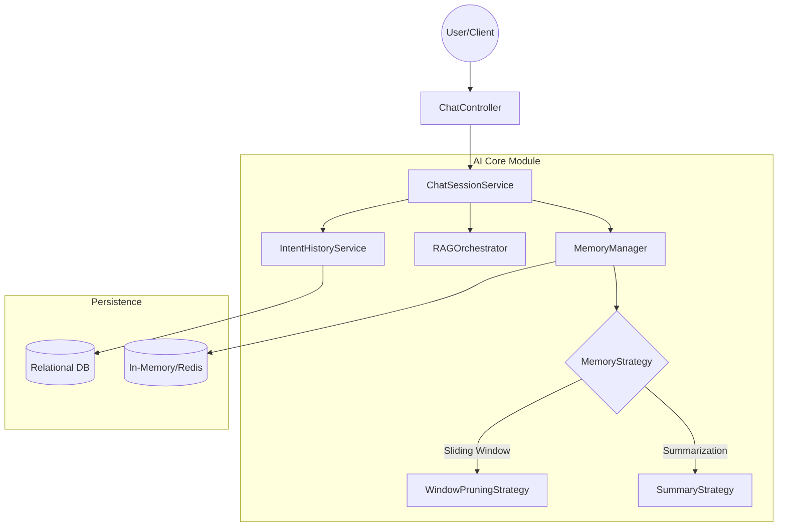

# AI Chat Session Management Technical Specification

**Version:** 1.0.0-TECHNICAL  
**Status:** Draft / Implementation Ready  
**Strategic Alignment:** AI Fabric Framework Core Capability  

---

## 1. Executive Summary

The **AI Chat Session Management** module provides a stateful layer over the stateless AI Core services. It enables multi-turn conversations by managing "Short-Term Memory" (recent context) and "Long-Term Memory" (historical logs). It is designed to be embedded directly into the `ai-infrastructure-core` module to allow all AI-enabled features to become session-aware seamlessly.

**Key Differentiators:**
- **Pluggable Memory Strategies**: Support for Sliding Window, Summarization, and Vector-based retrieval.
- **Unified Session ID**: Consistent tracking across RAG, Intent Extraction, and Analytics.
- **Automatic Pruning**: Managed context window to stay within LLM token limits.
- **Provider Agnostic**: Works with OpenAI, Azure, Anthropic, etc.

---

## 2. Architecture Deep Dive

### 2.1 Component Diagram



### 2.2 Data Flow: Multi-Turn Conversation

1. **Client** sends `query` + `sessionId`.
2. **ChatSessionService** retrieves the session state from `MemoryManager`.
3. **MemoryManager** fetches recent turns (e.g., last 5) from `Cache` or `DB`.
4. **MemoryStrategy** formats these turns into a `SystemContext` or `ConversationHistory` string.
5. **RAGOrchestrator** receives the query + history.
6. **LLM** generates a response using the provided context.
7. **ChatSessionService** updates the session state with the new turn and persists it.

---

## 3. Data Models

### 3.1 `ChatSession` (Domain Object)
Represents the active state of a conversation.
- `String id`: Unique Session UUID.
- `String userId`: Owner of the session.
- `LocalDateTime createdAt`: Start timestamp.
- `LocalDateTime lastInteractionAt`: For TTL management.
- `Map<String, Object> metadata`: Custom session-level data.

### 3.2 `ChatTurn` (Value Object)
Represents a single exchange.
- `String userQuery`: Original input.
- `String aiResponse`: LLM output.
- `LocalDateTime timestamp`: When it happened.
- `List<String> documentIds`: References to RAG documents used.

---

## 4. Core Service Implementation

### 4.1 `ChatSessionService.java`
The primary interface for applications.

```java
public interface ChatSessionService {
    // Session Lifecycle
    ChatSession createSession(String userId);
    Optional<ChatSession> getSession(String sessionId);
    void invalidateSession(String sessionId);

    // Context Management
    String getConversationContext(String sessionId, int windowSize);
    void recordTurn(String sessionId, ChatTurn turn);
}
```

### 4.2 `MemoryStrategy` (SPI)
Defines how history is processed before being sent to the LLM.

```java
public interface MemoryStrategy {
    /**
     * Transforms a list of turns into a prompt-ready string.
     */
    String processHistory(List<ChatTurn> history);
    
    /**
     * Determines if pruning is needed.
     */
    List<ChatTurn> prune(List<ChatTurn> history, int limit);
}
```

---

## 5. Integration Points

### 5.1 `RAGOrchestrator` Enhancement
The orchestrator will be updated to accept a `sessionId`. If present, it will automatically query the `ChatSessionService` to enrich the prompt.

### 5.2 `IntentHistoryService` Alignment
Currently, `IntentHistoryService` records every query. The `ChatSessionService` will act as a "Hot Layer" (fast access), while `IntentHistory` remains the "Cold Layer" (audit trail/long-term storage).

---

## 6. Configuration Options

New properties in `application.yml`:

```yaml
ai:
  session:
    enabled: true
    storage-type: IN_MEMORY # Options: IN_MEMORY, REDIS, DATABASE
    default-window-size: 5
    ttl-minutes: 60
    memory-strategy: SLIDING_WINDOW # Options: SLIDING_WINDOW, SUMMARY, VECTOR
    auto-summarize-threshold: 20    # Number of turns before summarizing
```

---

## 7. Implementation Sequence

1. **Phase 1: Foundation**
   - Create `ChatSession` and `ChatTurn` DTOs.
   - Implement `InMemoryChatSessionManager`.
2. **Phase 2: Logic**
   - Implement `SlidingWindowMemoryStrategy`.
   - Create `ChatSessionService`.
3. **Phase 3: Integration**
   - Update `RAGOrchestrator` to handle `sessionId`.
   - Wire `IntentHistoryService` to feed the session cache.
4. **Phase 4: API**
   - Expose `ChatSessionController` for frontend consumption.


