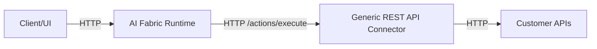
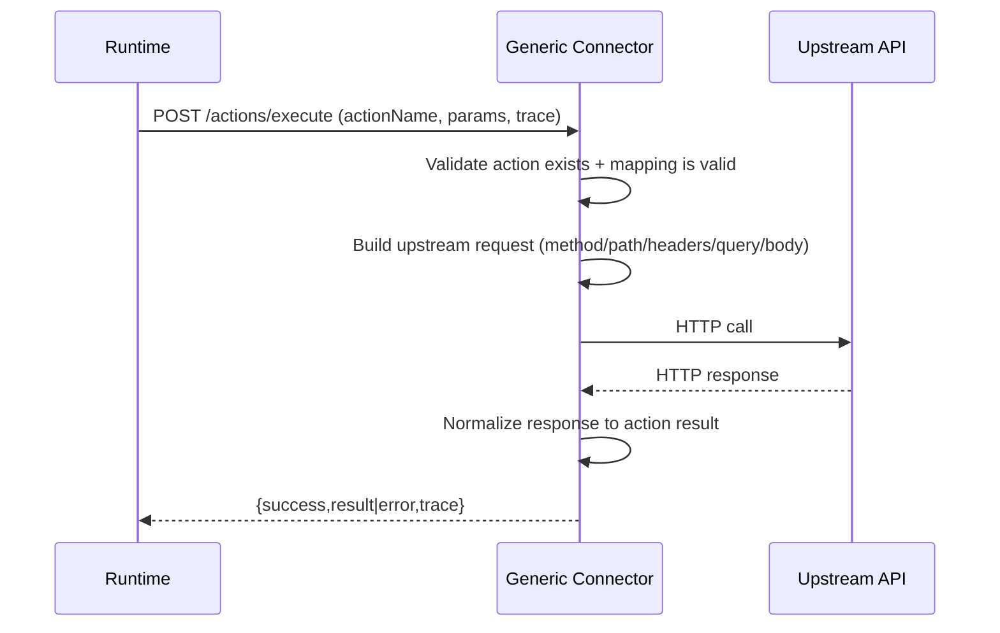

# Generic REST API Connector (Action → Endpoint) — Architecture & Flow Plan

## Status (as of 2026-02-19)

- **Implemented (MVP runnable service):** `ai-infrastructure-module/ai-infrastructure-generic-rest-connector`
  - `/actions/execute` (runtime-compatible)
  - file-based routing (`actions-routing.yml`)
  - inbound API key auth (fail-closed by default)
  - upstream HTTP execution (timeouts + optional bounded retries)
  - in-memory idempotency keyed by `idempotencyKey` + params fingerprint
  - response normalization to object/list `data` payload contracts
- **Guide:** `changes/Productization/GENERIC_REST_API_CONNECTOR_GUIDE.md`

## 0) Purpose

Build a **generic, domain-agnostic connector** that implements the **AI Fabric actions connector protocol** (runtime calls `POST /actions/execute`) but does **not** embed domain entities/logic.

Instead, the connector is configured with **`actionName -> HTTP endpoint`** mappings and acts as a secure, observable **API relay** for any “API-ready” system (Shopify, ERP, internal services, etc.).

This connector is intended for:
- **Fast productization** (drop-in connector for many customers)
- **BYO domain system** (customer keeps existing APIs)
- **AI integrator work** (you can ship curated action packs + templates)

Non-goals (MVP):
- Not a full control plane.
- Not a general ETL system.
- Not a full workflow engine (keep it “execute an action” + “return result”).

---

## 1) High-level components

### 1.1 Runtime (already exists)
**AI Fabric Runtime**:
- Orchestrates chat, RAG, modes, confirmation.
- Selects actions based on curated prompts + action contracts.
- Calls the connector to execute the chosen action:
  - `POST {connectorBaseUrl}/actions/execute`

### 1.2 Generic REST API Connector (new)
**Generic Connector**:
- Exposes `/actions/execute` (and optional `/health`, `/actions`, `/config`).
- Loads “action routing config” from file/DB.
- For each `actionName`, calls the configured upstream endpoint (HTTP).
- Handles:
  - Auth to upstream (API key / OAuth / HMAC / mTLS — staged)
  - Request building (method/path/query/body/headers)
  - Response normalization (map upstream response → action result)
  - Idempotency + retries + timeouts + audit logs

### 1.3 Upstream Domain APIs (customer systems)
Any HTTP API system that can:
- Read data needed by the action (optional; usually runtime already has context)
- Perform mutations (add-to-cart, create order, cancel order, apply coupon, etc.)

---

## 2) Deployment topologies (who runs where)

### Topology A — Connector as part of customer infra (recommended)



Pros: customer controls network access to internal APIs; simplest security story.

### Topology B — Connector inside your runtime deployment (only when safe)

```mermaid
flowchart LR
  UI[Client/UI] -->|HTTP| RT[AI Fabric Runtime]
  RT --> GC[Generic REST API Connector (same cluster/VPC)]
  GC -->|HTTP/VPN/PrivateLink| UP[Customer APIs]
```

Pros: fewer moving parts for the customer.  
Cons: harder network/security (VPNs, private connectivity, allowlists).

---

## 3) Contract: what the runtime calls

The runtime calls:
- `POST /actions/execute`

Request (conceptual):
- `actionName`
- `params` (JSON)
- `trace` (userId/sessionId/requestId/conversationId/tenantId)
- optional `idempotencyKey`

Response (conceptual):
- `success` boolean
- `status` (optional)
- `result` (JSON)
- `error` (code/message/details)
- `trace` echo

The generic connector must stay compatible with:
- `changes/Productization/ACTIONS_CONNECTOR_AND_RELAY_GUIDE.md`

---

## 4) Configuration model (Action → Endpoint routing)

### 4.1 Config sources
MVP sources (in order of implementation):
1) **File-based** (YAML): simplest for shipping + Docker mounts
2) **DB-backed** registry (later): register/deregister/list, multi-tenant operations

### 4.2 Suggested config schema (YAML)

```yaml
connector:
  tenant-mode: single   # single|multi (start with single)
  upstream:
    base-url: "https://customer-api.example.com"
    auth:
      type: api_key     # none|api_key|oauth2_client|hmac (stage)
      header: "Authorization"
      value: "Bearer ${UPSTREAM_API_KEY}"
  http:
    timeout-ms: 8000
    retry:
      enabled: true
      max-attempts: 2
      backoff-ms: 200
      retry-on: [429, 502, 503, 504]
  idempotency:
    enabled: true
    store: memory        # memory|jdbc (stage)
    ttl-seconds: 300

actions:
  add_to_cart:
    method: POST
    path: "/cart/items"
    headers:
      X-Request-Source: "ai-fabric"
    request:
      query: {}
      body:
        userId: "{{trace.userId}}"
        items: "{{params.items}}"
    response:
      success-http-status: [200, 201]
      result:
        cartId: "{{body.cartId}}"
        items: "{{body.items}}"
    confirmation:
      required: true
      message: "Add items to your cart?"
```

Notes:
- `{{...}}` indicates templating. Pick **one** engine for MVP (keep it strict).
- Keep MVP mapping limited:
  - allow `trace.*`, `params.*` inputs
  - allow upstream response `body.*` extraction

---

## 5) Execution flow (end-to-end)

### 5.1 Normal flow



### 5.2 Confirmation flow
Confirmation stays a **runtime responsibility**.
- Runtime uses the action contract metadata (or curated policy) to decide if confirmation is required.
- Generic connector is not responsible for multi-turn confirmation.

Optional later: connector can return `REQUIRES_CONFIRMATION` (but avoid for MVP).

---

## 6) Production-grade requirements (MVP baseline)

### 6.1 Security
- **Runtime → Connector**:
  - API key auth (header-based) for `/actions/execute`
  - Optional IP allowlist / mTLS (later)
- **Connector → Upstream**:
  - API key (MVP)
  - OAuth2 client credentials (phase 2)
- Multi-tenant safety (if/when enabled):
  - tenant id in `trace.tenantId` or a request header
  - per-tenant upstream credentials isolation

### 6.2 Reliability
- Timeouts per action
- Retry policy for safe/retriable status codes
- Idempotency store (memory first, JDBC later)
- Circuit breaker (later)

### 6.3 Observability
- Structured logs: requestId, actionName, tenantId, upstream status
- Metrics: latency, error rates, retries, idempotency hits
- Audit log hook (later): store minimal action execution record for compliance

### 6.4 Fail-safe behavior
- **Fail closed** if mapping missing/invalid (return a stable error code)
- Never “guess” endpoints
- Do not leak secrets in responses/logs

---

## 7) What changes vs the current demo connector

Current demo connector:
- Implements real domain logic (products/cart/orders) + persists state locally.

Generic connector:
- Does **not** have domain entities.
- Does **not** have domain DB (unless used for idempotency/audit).
- Only routes action executions to upstream APIs based on config.

Runtime does not need to change, as long as:
- `/actions/execute` contract remains stable
- action names + param schemas in the runtime action contract match the connector’s configured mappings

---

## 8) Implementation phases (recommended)

### Phase 1 — File-based single-tenant connector (fast)
- Implement `/actions/execute`
- Load `actions-routing.yml`
- Support:
  - method/path
  - headers
  - body templating from `params` + `trace`
  - response mapping to `result`
  - timeouts + retries
  - API-key auth (runtime→connector)

### Phase 2 — Harden (still single-tenant)
- Idempotency store (memory → JDBC)
- Better templating (strict mode, type checks)
- Error taxonomy (UPSTREAM_4XX/5XX, TIMEOUT, MAPPING_ERROR)
- Better metrics + tracing header propagation

### Phase 3 — Multi-tenant (optional)
- Tenant resolution (header/trace)
- Per-tenant config + secrets
- Admin APIs:
  - register/deregister/list actions
  - validate config

---

## 9) Deliverables (docs + code)

Docs:
- This architecture plan (current file)
- Configuration reference for `actions-routing.yml`
- Security guide (API key, OAuth2 later)
- Deployment guide (Docker + Kubernetes)

Code modules (suggested):
- `ai-infrastructure-actions-connector` (protocol types, shared client)
- `ai-fabric-generic-rest-connector` (new runnable service)
- Optional: `ai-fabric-connector-registry` (DB registry + migrations)
