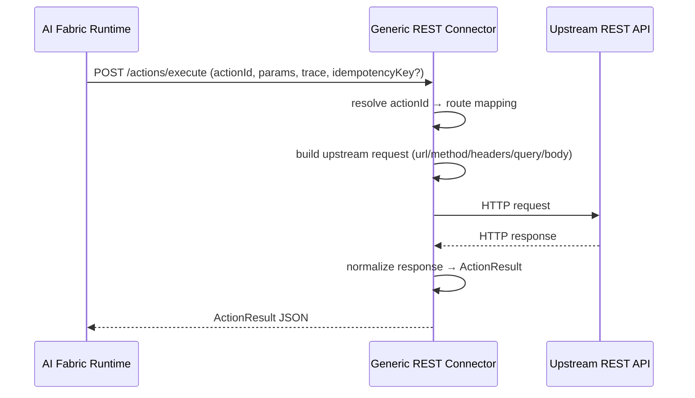

# Generic REST API Connector (Action → Endpoint) — Architecture & Developer Guide (V1)

This document describes the **Generic REST API Connector**: a runnable service that implements the **Customer Connector API** (`POST /actions/execute`) but executes actions by routing:

`actionId → upstream REST endpoint`

It is **domain-agnostic** and intended for “API-ready” systems (Shopify, ERP, internal services, etc.) where you want AI Fabric to orchestrate actions while you keep business logic in existing APIs.

Related docs:
- Customer Connector API contract: `changes/Productization/CUSTOMER_CONNECTOR_IMPLEMENTATION_GUIDE.md`
- Actions architecture (local + connector + relay): `changes/Productization/ACTIONS_CONNECTOR_AND_RELAY_GUIDE.md`

Code:
- Runnable service: `ai-infrastructure-module/ai-infrastructure-generic-rest-connector`

---

## Status (as of 2026-02-19)

- **Implemented (MVP):**
  - `/actions/execute` connector endpoint (runtime-compatible)
  - File-based routing config (`actions-routing.yml`)
  - API-key inbound auth (fail-closed by default)
  - Upstream HTTP execution with timeouts + optional bounded retries
  - Idempotency (in-memory) keyed by `idempotencyKey` + params fingerprint
  - Response normalization to `ActionResult` payload rules (object vs list payload)
- **Not implemented yet (planned):**
  - DB-backed routing/action registry (register/deregister/list)
  - OAuth2 client credentials to upstream
  - mTLS inbound auth
  - Per-tenant routing/secrets (multi-tenant mode)

---

## 1) When to use this vs the Relay

Use the **Generic REST Connector** when:
- You already have upstream APIs that do **not** implement the Customer Connector API
- You want a mapping layer: `actionId → method/url/body/headers`
- You want AI Fabric runtime to call **one** connector base URL, while upstream remains arbitrary REST

Use the **Relay** (`ai-infrastructure-relay`) when:
- Your upstream service already implements the Customer Connector API and returns `ActionResult`
- You mainly need security hardening (inbound auth, idempotency, SSRF-safe routing) + forwarding

---

## 2) Runtime ↔ Connector contract (stable)

AI Fabric Runtime calls:
- `POST {connectorBaseUrl}/actions/execute`

Request JSON:
- `actionId` (string, required)
- `params` (object, optional; defaults to `{}`)
- `idempotencyKey` (string, optional; present for write actions)
- `trace` (object, optional; `requestId`, `conversationId`, `userId`, `sessionId`, optional `tenantId`)

Response JSON (`ActionResult`-compatible):
- `success` (boolean)
- `message` (string, optional)
- `data` (object, optional)
- `pinnedTargets` (array, optional)
- `errorCode` (string, optional)

Payload rules:
- Object payload: any keys except reserved list keys
- List payload: must use `_items` (array) + `_count` (number equal to `_items.length`) + optional `_totalCount`, `_cursor`

---

## 3) Routing configuration (file-based)

### 3.1 Config file location

The service loads routing config from:
- `rest-connector.routing-config-location` (default `classpath:actions-routing.yml`)

You typically override it in Docker/Kubernetes via env:
- `REST_CONNECTOR_ROUTING_CONFIG_LOCATION=file:/config/actions-routing.yml`

### 3.2 YAML schema (MVP)

```yaml
connector:
  inbound-auth:
    allow-unauthenticated: false
    api-key:
      enabled: true
      header: X-AIFABRIC-API-KEY
      value: ${CONNECTOR_API_KEY}

  upstream:
    base-url: "https://customer-api.example.com"
    auth:
      type: api_key
      header: Authorization
      value: "Bearer ${UPSTREAM_API_KEY}"

  http:
    connect-timeout-ms: 2000
    timeout-ms: 8000
    retry:
      enabled: true
      max-attempts: 2
      backoff-ms: 200
      retry-on: [429, 502, 503, 504]

  idempotency:
    enabled: true
    ttl-seconds: 300
    in-progress-max-wait-ms: 2000

actions:
  add_to_cart:
    method: POST
    path: /cart/items
    headers:
      X-Request-Source: ai-fabric
    request:
      query: {}
      body:
        userId: "{{trace.userId}}"
        sku: "{{params.sku}}"
        quantity: "{{params.quantity}}"
    response:
      success-http-status: [200, 201]
      message: "Added to cart"
      result: "{{body}}"
```

### 3.3 Templating (supported roots)

The connector supports `{{...}}` placeholders in:
- `url`, `path`
- `headers[*]`
- `request.query[*]`
- `request.body`
- `response.message`
- `response.result`
- `response.pinned-targets`

Supported roots:
- `actionId`
- `idempotencyKey`
- `params.*`
- `trace.*`
- `body.*` (upstream JSON body)
- `status` (upstream HTTP status)
- `headers.*` (upstream response headers; first value only)

Notes:
- If the entire string is a placeholder (e.g. `"{{params.items}}"`), the value is inserted as its native JSON type.
- If the placeholder is part of a larger string, it is interpolated as text.
- Unsupported roots fail fast (mapping error).

---

## 4) Execution flow (who talks to whom)



---

## 5) Error codes (connector → runtime)

The connector returns stable `errorCode`s:
- `INVALID_REQUEST` (missing actionId, invalid JSON)
- `ACTION_NOT_SUPPORTED` (no route mapping)
- `MAPPING_ERROR` (invalid route config or template usage)
- `RATE_LIMITED` (upstream HTTP 429)
- `TIMEOUT` (timeout)
- `SERVICE_UNAVAILABLE` (upstream 5xx / network failure)
- `UPSTREAM_ERROR` (other upstream non-success statuses)

AI Fabric Runtime retry behavior is derived from `errorCode` + idempotency safety (`RATE_LIMITED`, `TIMEOUT`, `SERVICE_UNAVAILABLE` are retriable).

---

## 6) Deployment

### 6.1 Runnable module

- Service module: `ai-infrastructure-module/ai-infrastructure-generic-rest-connector`
- Default port: `8082` (supports `PORT` override via `server.port=${PORT:8082}`)

### 6.3 Verification endpoints (debug)

These endpoints help confirm which routes are loaded at runtime (useful for "ACTION_NOT_SUPPORTED" debugging):

- Health:
  - `GET /actuator/health`
- Routes overview (admin):
  - `GET /api/admin/overview`
  - `GET /api/admin/actions/overview`
  - `GET /api/admin/actions/{actionId}`

Security:
- When `connector.inbound-auth.allow-unauthenticated=false`, the admin endpoints are protected by the same inbound API key as `/actions/execute`.
- Send your inbound auth header (default `X-AIFABRIC-API-KEY`) when calling them.

### 6.4 Optional: Runtime Proxy (Indexing Alias)

For some demo setups you may want the connector to be the **single base URL** for both:
- action execution (`POST /actions/execute`)
- managed indexing calls (Runtime Data Sync push API)

When enabled, the connector exposes a small set of **alias** endpoints under:
- `/api/ai/data-sync/*`

These endpoints **forward** to the configured runtime.

Enable:

```bash
REST_CONNECTOR_RUNTIME_PROXY_ENABLED=true
REST_CONNECTOR_RUNTIME_PROXY_BASE_URL="https://<runtime>.up.railway.app"
```

Optional runtime auth header (only if your runtime is protected by an external gateway):

```bash
REST_CONNECTOR_RUNTIME_PROXY_API_KEY_HEADER="X-ADMIN-API-KEY"
REST_CONNECTOR_RUNTIME_PROXY_API_KEY="<secret>"
```

Exposed endpoints (when enabled):
- `GET /api/ai/data-sync/vector-spaces`
- `POST /api/ai/data-sync/upsert`
- `POST /api/ai/data-sync/delete`
- `POST /api/ai/data-sync/batch`

Also exposed (read-only admin inspection, when enabled):
- `GET /api/admin/indexing/overview`
- `GET /api/admin/indexing/vectors?entityType=...&offset=...&limit=...`

Security:
- These endpoints are protected by the same inbound API key filter as `/actions/execute` (unless you explicitly set `connector.inbound-auth.allow-unauthenticated=true`).

### 6.2 Docker image

Build:
- `ai-infrastructure-module/ai-infrastructure-generic-rest-connector/Dockerfile`
- Railway-friendly Dockerfile (bakes a template routing config):
  - `ai-infrastructure-module/ai-infrastructure-generic-rest-connector/deploy/railway/Dockerfile`
  - Guide: `ai-infrastructure-module/ai-infrastructure-generic-rest-connector/deploy/railway/RAILWAY_DEPLOYMENT_GUIDE.md`

Run pattern:
- mount `actions-routing.yml` to `/config/actions-routing.yml`
- set `REST_CONNECTOR_ROUTING_CONFIG_LOCATION=file:/config/actions-routing.yml`
- set secrets via env (`CONNECTOR_API_KEY`, `UPSTREAM_API_KEY`, etc)
