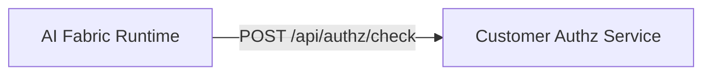

# Remote Access Control via REST Connector (Runtime Product) — Implementation Plan

Status: draft (2026-03-27)

This plan describes how we productize **runtime authorization** with **no customer code changes** by default, while still supporting the existing “framework user” path where customers implement Spring beans directly.

It is a concrete implementation plan for the direction agreed in:
- `changes/Productization/RUNTIME_AUTHORIZATION_AND_ACCESS_CONTROL_GUIDE.md`

Related productization context:
- `changes/Productization/GENERIC_REST_API_CONNECTOR_GUIDE.md` (REST connector: actionId → upstream endpoint routing)
- `changes/Productization/GENERIC_REST_CONNECTOR_ADOPTION_ROADMAP.md` (connector as “single point of contact”)
- `changes/Productization/DATA_SYNC_PUSH_API_GUIDE.md` (Data Sync uses the same access control hook)
- `changes/Productization/CUSTOMER_CONNECTOR_IMPLEMENTATION_GUIDE.md` (defense-in-depth: connector/relay re-authorize)

---

## 0) Decision / Goal

### 0.1 Runtime product deployments (primary)

For the **runtime product** (runnable runtime service / Docker image), access control should be:

- **REMOTE API based**: the customer provides an HTTP authorization service.
- **Routed through the Generic REST Connector by default**:
  - Runtime calls the REST connector.
  - REST connector forwards to the customer authorization service.
- **Optional direct mode** (config-driven):
  - Runtime can call the customer authorization service directly (no connector hop).

This avoids requiring customers to ship custom Java code for authorization.

### 0.2 Framework users (secondary)

If a customer is embedding AI Fabric libraries into their own Spring app, they can still provide:
- `EntityAccessPolicy` bean (and optionally `ChatSessionAccessControlPolicy`).

---

## 1) Architecture (Who Calls Whom)

### 1.1 Default topology (recommended)


Notes:
- Runtime already calls the REST connector for actions. We reuse the same “single point of contact”.
- REST connector becomes the network boundary and can live in the customer VPC / private network.

### 1.2 Optional topology (direct)



Use when:
- runtime has direct network access to the authz service (private connectivity),
- or the customer explicitly wants fewer hops.

---

## 2) Remote Authorization API Contract (Customer-Provided)

### 2.1 Endpoint

- `POST /api/authz/check`

### 2.2 Request (minimum)

```json
{
  "requestId": "rag-...",
  "authContext": {
    "subjectId": "u_123",
    "subjectType": "END_USER",
    "authMode": "PRIVATE_RUNTIME_BACKEND_MEDIATED",
    "callerType": "TRUSTED_BACKEND",
    "sessionId": "s_abc",
    "deploymentId": "dep_123",
    "customerId": "cus_123",
    "tenantId": "t_1",
    "issuer": "shop-backend",
    "grantedScopes": ["chat:query", "chat:actions"]
  },
  "userId": "u_123",
  "sessionId": "s_abc",
  "resourceId": "vectorSpace:product",
  "operationType": "WRITE",
  "metadata": {
    "tenantId": "t_1",
    "entityId": "SKU-123",
    "vectorSpace": "product"
  }
}
```

Sources:
- `resourceId`, `operationType`, and `metadata` come from the runtime’s existing `AIAccessControlRequest` construction
  (chat orchestration gate + Data Sync gate).
- `authContext` comes from the runtime’s verified auth context and is the canonical identity contract.
- top-level `userId` and `sessionId` remain migration-time compatibility aliases for existing customer authz services.

### 2.3 Response

```json
{
  "granted": true,
  "reason": "OK",
  "policyVersion": "2026-03-01"
}
```

Rules:
- Runtime treats missing/invalid response as `granted=false` (fail-closed).
- `reason` is for debugging/audit, not user-facing text.

### 2.4 What This Policy Can Enforce (Beyond Ownership)

Conversation ownership (user can only access their own `conversationId`) should be enforced **internally** by runtime (see 3.5).

The remote authz policy is for **additional rules** that vary per customer and should not require custom runtime code, for example:
- **Who can use chat at all**: deny `rag:intent` reads for blocked/suspended users.
- **Who can index**: allow `WRITE/DELETE` only for specific actors (system sync users) on `vectorSpace:*`.
- **Vector space allow/deny**: allow `vectorSpace:product` writes but deny `vectorSpace:policy` writes from non-system users.
- **Operation gating**: allow `READ` but deny `WRITE` for “browsing-only” users.
- **Rate/quota enforcement** (best-effort): deny when the user exceeds request limits or cost budgets (authz service maintains counters).
- **Time / geo / risk rules**: deny outside business hours, deny from disallowed regions, deny when user risk score is high.

Contract guidance:
- Keep the runtime’s contract stable and generic (`resourceId`, `operationType`, `metadata`) so customers can implement rules without runtime forks.
- Add new `metadata.*` keys only when there is a clear cross-customer need; avoid baking “business semantics” into the runtime.

---

## 3) Runtime Changes (Product Mode)

### 3.1 Ship a built-in remote `EntityAccessPolicy`

Add an out-of-the-box policy implementation in runtime packaging:

- `RemoteHttpEntityAccessPolicy` (new)
  - Calls remote authz API.
  - Short timeouts; deny on timeout/5xx/unparseable payload.
  - Optional short TTL cache (configurable) to protect the remote service.

Bean selection strategy (conceptual):
- If the app provides a custom `EntityAccessPolicy` bean: use it.
- Else if `ai.fabric.runtime.authz.remote.enabled=true`: use remote HTTP policy.
- Else if dev defaults enabled: use allow-all (demo only).
- Else: deny all (fail-closed) and surface a clear configuration error (see 3.3).

### 3.2 Add runtime config for remote policy

Proposed config keys (exact naming TBD during implementation, but keep them stable):

```yaml
ai:
  fabric:
    runtime:
      dev-defaults:
        enabled: ${AI_FABRIC_RUNTIME_DEV_DEFAULTS_ENABLED:false}
      authz:
        mode: REMOTE_HTTP # REMOTE_HTTP | CUSTOM_BEAN | DEV_ALLOW_ALL | DENY_ALL
        remote:
          base-url: ${AUTHZ_BASE_URL:${ACTIONS_CONNECTOR_BASE_URL:}}
          path: ${AUTHZ_PATH:/api/authz/check}
          timeout-ms: ${AUTHZ_TIMEOUT_MS:1500}
          connect-timeout-ms: ${AUTHZ_CONNECT_TIMEOUT_MS:500}
          cache:
            enabled: ${AUTHZ_CACHE_ENABLED:true}
            ttl-ms: ${AUTHZ_CACHE_TTL_MS:30000}
          outbound-auth:
            type: ${AUTHZ_OUTBOUND_AUTH_TYPE:INHERIT_ACTIONS_API_KEY} # NONE | API_KEY | INHERIT_ACTIONS_API_KEY
            api-key-header: ${AUTHZ_API_KEY_HEADER:X-AIFABRIC-API-KEY}
            api-key-value: ${AUTHZ_API_KEY:}
```

Defaults:
- In product mode, default `mode=REMOTE_HTTP`.
- Default `base-url` uses `ACTIONS_CONNECTOR_BASE_URL` so “everything goes through the REST connector” without extra wiring.
- In product mode, default `dev-defaults.enabled=false` (safer). Demo deployments explicitly set it to `true`.
  - Implementation note: ensure runtime code does not “matchIfMissing=true” its way into allow-all defaults; demos must opt in explicitly.

### 3.3 Fail-closed behavior without 500s

We want denial semantics (403/denied) instead of server errors if misconfigured.

Plan:
- If remote mode is enabled but `base-url` is blank or invalid:
  - log a single clear error at startup
  - deny checks with a deterministic “policy misconfigured” reason
  - do not throw uncaught exceptions from the pipeline

This may require one of:
- making `AIAccessControlService` treat missing policy as deny (instead of throwing), or
- ensuring runtime always registers a deny-all policy in “misconfigured” states.

### 3.4 Keep “bean path” supported

No change required for framework users:
- If they provide `EntityAccessPolicy`, it overrides the remote policy.

### 3.5 Conversation Ownership (Internal) + Optional Conversation Rules

Preferred baseline (no customer code, no extra network hop):
- Runtime enforces **conversation ownership** internally: a `conversationId` is bound to a `userId` (or anonymous `sessionId`) and later requests must match.
- This should be deterministic, fast, and not depend on an external authz service.

When customers need additional conversation-level rules (optional future):
- Example: support agents can view other users’ conversations; shared conversation links; org-wide “audit reader” roles; “read-only after close”.
- These should be implemented via a **separate** policy hook (existing `ChatSessionAccessControlPolicy`) and can follow the same “remote HTTP via REST connector” pattern, but it should not be a Phase 1 dependency.

---

## 4) REST Connector Changes (Default Path)

### 4.1 Add a dedicated authz proxy endpoint

Add to `ai-infrastructure-generic-rest-connector`:
- `POST /api/authz/check`
  - protected by existing inbound auth filter (same as `/actions/execute`)
  - forwards to the configured customer authz upstream

### 4.2 Add routing config for authz

Extend routing YAML schema (backwards compatible) with an `authz:` section:

```yaml
authz:
  enabled: true
  upstream:
    base-url: ${AUTHZ_UPSTREAM_BASE_URL:https://customer-authz.internal}
    path: ${AUTHZ_UPSTREAM_PATH:/api/authz/check}
    auth:
      type: ${AUTHZ_UPSTREAM_AUTH_TYPE:NONE} # NONE | API_KEY
      header: ${AUTHZ_UPSTREAM_AUTH_HEADER:Authorization}
      value: ${AUTHZ_UPSTREAM_AUTH_VALUE:}
  http:
    connect-timeout-ms: ${AUTHZ_CONNECT_TIMEOUT_MS:500}
    timeout-ms: ${AUTHZ_TIMEOUT_MS:1500}
```

Rules:
- Only allow routing to a configured base URL and path (no arbitrary URLs from callers).
- Do not reuse the `actions:` templating engine here; keep authz request/response “pass-through JSON”.

### 4.3 Add verification surfacing

Extend REST connector admin endpoints:
- `GET /api/admin/overview` should include `authz.enabled`, `authz.upstream.baseUrl`, `authz.timeoutMs`, and “auth configured” booleans.

---

## 5) Security Model (Defense In Depth)

### 5.1 Runtime → REST connector

- Use the existing connector API key (`ACTIONS_CONNECTOR_API_KEY`) by default.
- REST connector inbound auth remains fail-closed.

### 5.2 REST connector → customer authz service

Customer choice:
- no auth inside VPC, or
- API key / mTLS (later)

### 5.3 Customer connector/relay still re-authorizes actions

This plan does NOT remove the requirement that the customer connector (or relay) re-authorizes:
- The runtime access check is for runtime-owned resources (chat gate + indexing), not a replacement for business authorization.

---

## 6) Multi-Tenant

This repo supports multi-tenant concepts, but if each customer has a **separate deployment** then `tenantId` can be ignored for now.

If/when multi-tenant is required:
- propagate `tenantId` via:
  - chat: runtime identity layer (edge auth)
  - data sync: `trace.metadata.tenantId`
- runtime includes `tenantId` in `metadata` sent to authz service
- authz service enforces tenant boundaries (deny cross-tenant)

---

## 7) Verification Plan

### 7.1 Runtime

- `GET /api/admin/actions/overview` (verify action catalog loaded)
- `GET /api/admin/indexing/overview` (verify indexing is happening)
- Chat denial behavior: access denied yields a deterministic “Access denied by policy.” response (not a 500).

### 7.2 REST connector

- `GET /api/admin/overview` should show authz proxy config is loaded.
- Add a smoke endpoint call:
  - `POST /api/authz/check` with a known allow user and known deny user (in a test authz upstream).

---

## 8) Rollout Phases

### Phase 0: Spec + docs (now)
- Finalize this plan and the authz HTTP contract.
- Decide config key names and keep them stable.

### Phase 1: REST connector authz proxy
- Implement `POST /api/authz/check` proxy.
- Add `authz:` config section + admin visibility.

### Phase 2: Runtime remote policy (product mode)
- Implement `RemoteHttpEntityAccessPolicy` with fail-closed behavior.
- Add config keys and defaults (base-url defaults to REST connector).
- Ensure “misconfigured” does not cause 500s.

### Phase 3: Hardening
- Add metrics, structured logs, and optional caching in runtime policy.
- Consider circuit breaker to protect remote authz service.

### Phase 4: Multi-tenant ready
- Ensure tenant id propagation is consistent across chat + data sync.
- Add per-tenant caching keys and policy checks.

---

## 9) Open Questions (Resolve Before Coding)

Decisions to implement:
- `ai.fabric.runtime.dev-defaults.enabled` defaults to `false` (safer); demos explicitly set `true`.
- Runtime enforces conversation ownership internally; remote conversation-level policy is optional and not Phase 1.

Still open:
- Should the authz contract include a required `tenantId` field at top-level (not only in metadata), or keep it optional until we truly support multi-tenant runtime deployments?
