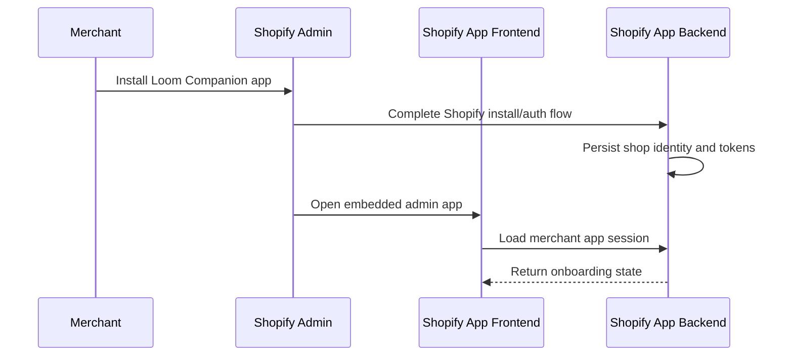
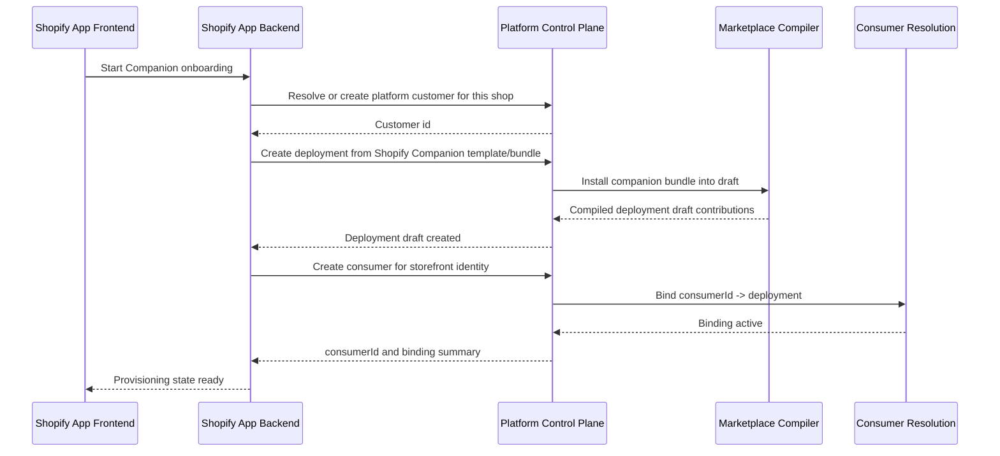
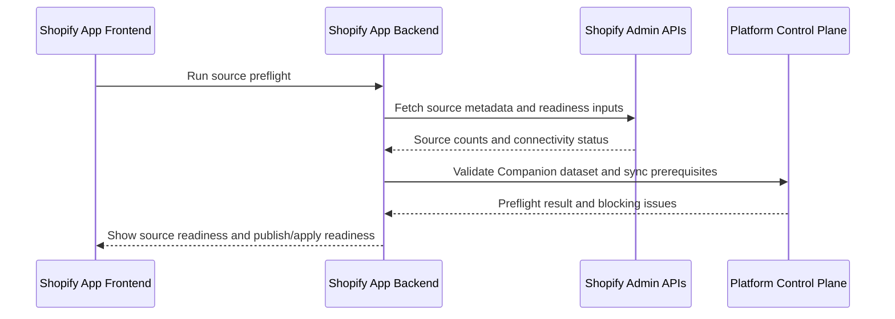
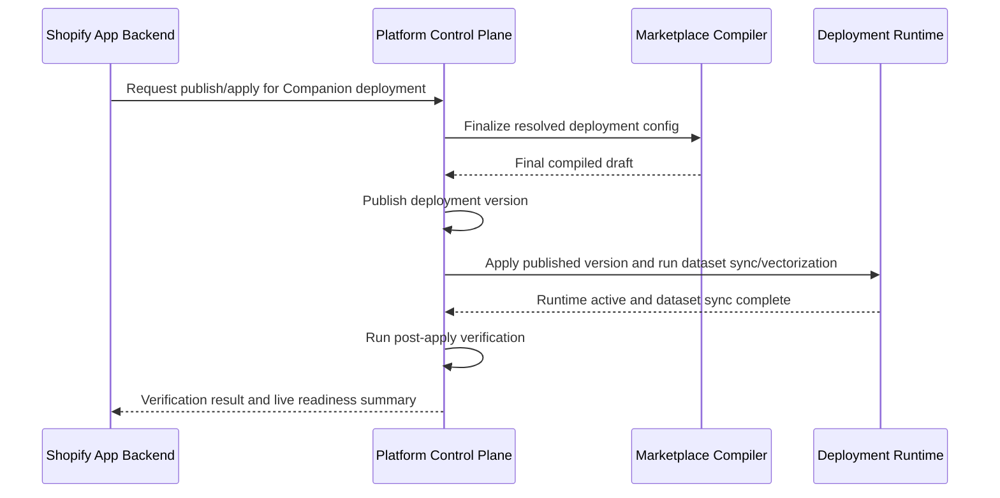
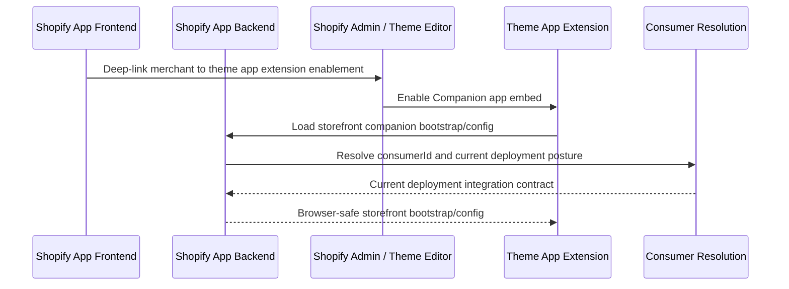
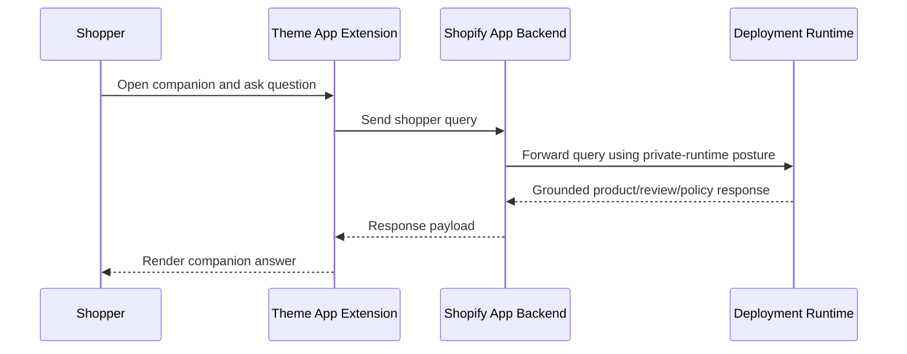
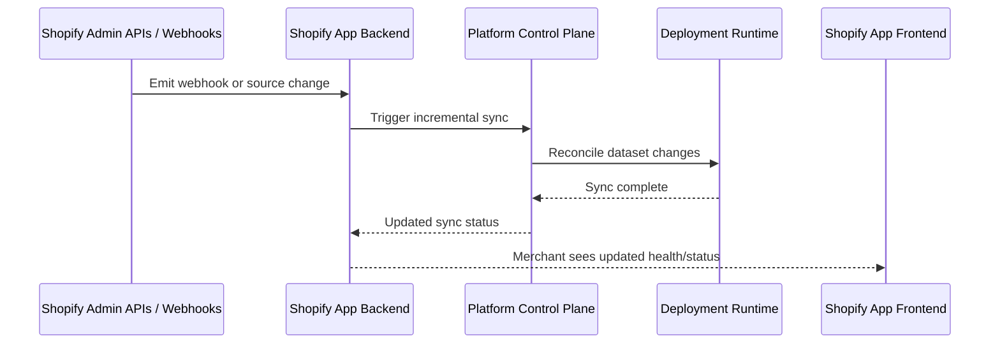
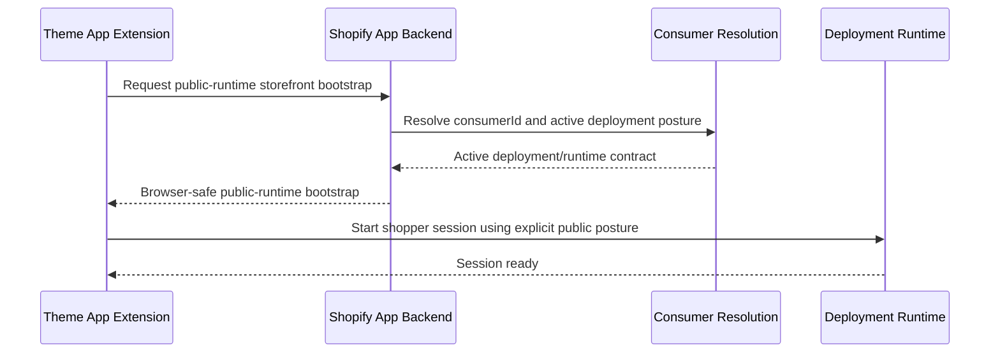
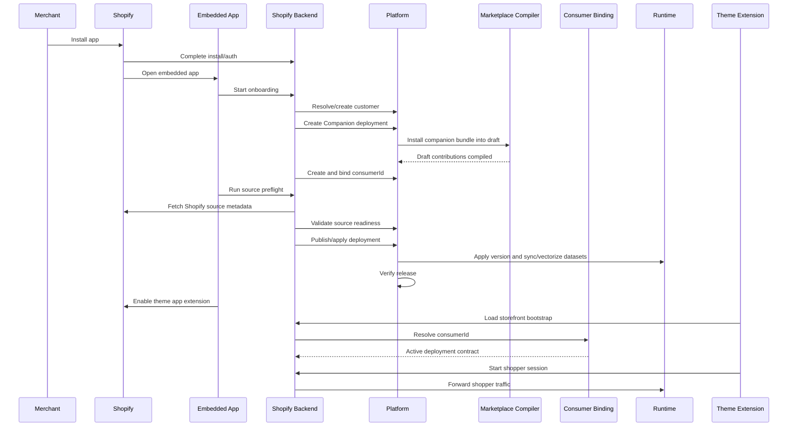

# Shopify Companion Subscription And Go-Live Flow

Status: sequence-style product flow document (2026-04-18)

This document explains what should happen when a Shopify store subscribes to the Companion product.

It is not a low-level API spec.
It is a product and platform execution flow that can be used by:

- product planning
- implementation planning
- merchant onboarding design
- verification and support planning

Read with:

- `doc/Productization/future-work/MarketPlace/Products/SHOPIFY_COMPANION_IMPLEMENTATION_PLAN.md`
- `doc/Productization/future-work/MarketPlace/Products/SHOPIFY_PRODUCTS_SHIPPING_ROADMAP.md`
- `doc/Productization/future-work/MarketPlace/CONSUMER_BOUND_DEPLOYMENT_RESOLUTION_PLAN.md`

---

## 1) Executive Summary

When a Shopify store subscribes to Companion, the platform should not simply "turn on chat."

It should execute a controlled flow:

1. install and authenticate the Shopify app
2. create or resolve the platform customer boundary
3. create the Shopify Companion deployment bundle
4. install and compile the default companion capabilities
5. create and bind a stable `consumerId`
6. run source preflight and readiness checks
7. publish, apply, and verify the deployment
8. enable the theme app extension
9. go live on the storefront

This preserves the platform’s core rule:

- no live behavior without draft -> publish -> apply -> verify

Default storefront auth posture for launch:

- browser -> Shopify app backend -> private runtime

Direct browser -> public runtime traffic is a later optional variant only when the deployment explicitly enables a public runtime posture.

---

## 2) Actors

Main actors in the flow:

- `Merchant`
- `Shopify Admin`
- `Shopify App Frontend` (embedded admin app)
- `Shopify App Backend`
- `Platform Control Plane`
- `Marketplace Compiler`
- `Deployment Runtime`
- `Consumer Resolution`
- `Storefront Theme App Extension`
- `Shopper`

---

## 3) High-Level Lifecycle

The full lifecycle has seven phases:

1. `Install and identity`
2. `Product provisioning`
3. `Source readiness and preflight`
4. `Publish, apply, sync, and verify`
5. `Storefront enablement`
6. `Live shopper use`
7. `Ongoing operation`

---

## 4) Phase 1: Install And Identity

### 4.1 Goal

Establish the merchant and shop identity safely and land the merchant in an operational embedded app.

### 4.2 Expected result

After this phase:

- the app is installed on the store
- the app backend has the necessary Shopify identity and tokens
- the merchant can continue onboarding in the embedded admin UI

### 4.3 Sequence

### 4.4 Verification

This phase is not complete unless:

- the embedded app loads with no critical UI errors
- the merchant session is valid
- the shop identity is stored

---

## 5) Phase 2: Product Provisioning

### 5.1 Goal

Provision the Companion as a real platform-backed product, not just a Shopify-side feature toggle.

### 5.2 Expected result

After this phase:

- the store is mapped to a platform customer boundary
- a Companion deployment exists
- the Companion bundle is installed into that deployment draft
- a stable `consumerId` is bound to it

### 5.3 Provisioning flow

### 5.4 What exactly gets provisioned

At minimum:

- platform customer
- one Shopify Companion deployment
- one draft containing:
  - companion template contributions
  - read-first action contributions
  - product/policy data contributions
  - default inference profile
- one `consumerId` for storefront traffic

### 5.5 Important rule

The merchant has not gone live yet.

At this point, the system is provisioned, but not ready for storefront exposure until data and deployment verification complete.

---

## 6) Phase 3: Source Readiness And Preflight

### 6.1 Goal

Validate source availability, source coverage, and sync prerequisites before publish/apply.

### 6.2 Expected result

After this phase:

- source preflight has succeeded
- blocking source or connector issues are visible before publish/apply
- the merchant can see source counts and readiness by category
- the deployment is ready to enter publish/apply

### 6.3 Sequence

### 6.4 Merchant experience

The merchant should see:

- source counts by category
- provider/connectivity readiness
- errors by source category if any
- a clear "ready to publish/apply" state

### 6.5 Important rule

Source readiness is not the same as live vectorized data.

Real dataset sync, vectorization, and live retrieval readiness happen during apply-time release execution.

---

## 7) Phase 4: Publish, Apply, Sync, Verify

### 7.1 Goal

Turn the drafted Companion configuration into a real live deployment version.

### 7.2 Expected result

After this phase:

- a version is published
- apply-time dataset sync and vectorization have succeeded
- that version is applied
- verification passes
- the merchant can test against real live companion data
- the deployment is safe to expose to storefront traffic

### 7.3 Sequence

### 7.4 Hard rule

If apply-time sync or verification fails:

- storefront go-live must remain blocked
- the merchant stays in repair/onboarding flow
- the system must not pretend the product is ready

---

## 8) Phase 5: Storefront Enablement

### 8.1 Goal

Expose the companion on the store through the approved Shopify storefront mechanism.

### 8.2 Expected result

After this phase:

- the merchant has enabled the theme app extension
- the storefront widget can load a browser-safe storefront bootstrap from the Shopify app backend
- the Shopify app backend can resolve the Companion deployment through `consumerId`
- shoppers can use the companion

### 8.3 Sequence

### 8.4 Storefront rule

The theme extension should depend on:

- `consumerId`

not:

- hardcoded deployment ids

In the default launch model, the theme extension should not call consumer-resolution credential endpoints directly from the browser.

Instead:

- the Shopify app backend resolves `consumerId`
- the Shopify app backend owns private-runtime access

This is what makes later rollout, replacement, and white-label evolution possible without breaking storefront installation.

---

## 9) Phase 6: Live Shopper Use

### 9.1 Goal

Serve grounded shopper conversations against the verified Companion deployment.

### 9.2 Sequence

### 9.3 Shopper-visible behavior

At minimum, the shopper should be able to:

- search products
- compare products
- ask about policies
- ask about product details
- get evidence-backed answers

---

## 10) Phase 7: Ongoing Operation

### 10.1 Goal

Keep the product healthy without reinstalling it.

### 10.2 Sequence

### 10.3 Operational capabilities

The merchant should be able to:

- view sync health
- resync manually
- view widget enablement
- view diagnostics
- later upgrade plan/tier

---

## 11) Optional Public-Runtime Variant

### 11.1 Purpose

Allow a later optimized storefront path where the browser talks directly to a public runtime surface.

### 11.2 Rules

This is valid only when:

- the deployment explicitly enables a public runtime auth posture
- the Shopify app backend resolves `consumerId`
- the Shopify app backend returns only browser-safe bootstrap or token material

### 11.3 Sequence

---

## 12) Failure Paths

### 12.1 Install/auth failure

If Shopify install/auth fails:

- merchant remains outside onboarding
- no provisioning should begin

### 12.2 Provisioning failure

If deployment or bundle provisioning fails:

- no consumer binding should be treated as live
- merchant remains in onboarding repair state

### 12.3 Sync failure

If initial sync fails:

- merchant can still access admin UI
- storefront go-live should remain blocked or clearly marked unhealthy

### 12.4 Verification failure

If publish/apply verification fails:

- the product must not be considered live
- the embedded admin app should show the failure clearly

### 12.5 Theme enablement failure

If the merchant does not enable the theme app extension:

- the deployment may still be healthy
- but the storefront product is not live

This distinction should be visible in the admin UI.

---

## 13) Sequence Diagram Summary

The canonical merchant subscription flow is:

---

## 14) Recommendation

The correct mental model is:

- subscription does not directly mean "chat is live"
- subscription means "provision product, sync data, verify deployment, then expose storefront"

This is the right flow because it preserves:

- the platform deployment lifecycle
- marketplace composition rules
- rollout safety
- stable storefront identity

That is how Shopify Companion should go live.
