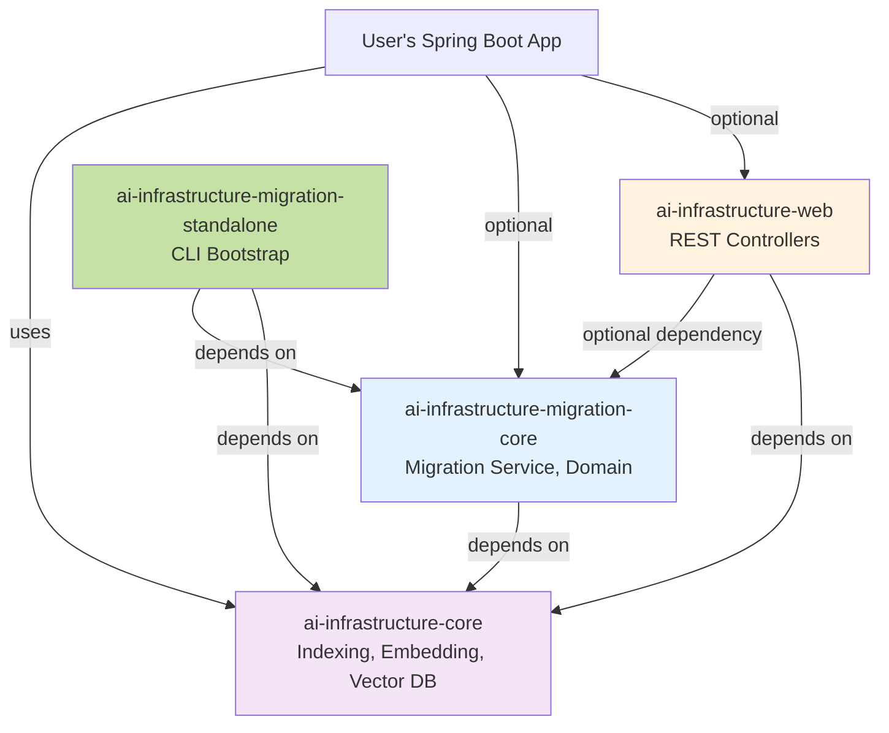

# AI Infrastructure Migration Module - Architecture Document

## Overview

The AI Infrastructure Migration Module provides a comprehensive solution for indexing existing data in applications that adopt the AI framework. It supports three critical use cases:

1. **New Adoption**: Apps with existing data (e.g., 100K products) need to backfill embeddings
2. **Config Changes**: Reindex entities when `ai-entity-config.yml` changes (e.g., new embeddable fields)
3. **Disaster Recovery**: Rebuild vector indices if vector database is lost

## Module Structure

### Separate Module from Day 1

The migration functionality is implemented as a **separate module** with clear boundaries:

```
ai-infrastructure-migration/              # Parent module
├── pom.xml
├── ai-infrastructure-migration-core/     # Core migration library
│   └── src/main/java/.../migration/
│       ├── service/
│       │   ├── DataMigrationService.java      # Main orchestration service
│       │   ├── EntityRepositoryScanner.java   # Runtime JPA repo discovery
│       │   └── MigrationProgressTracker.java  # Progress calculation
│       ├── domain/
│       │   ├── MigrationJob.java              # JPA entity for job tracking
│       │   ├── MigrationRequest.java          # Request DTO
│       │   ├── MigrationStatus.java           # Enum (RUNNING, PAUSED, etc.)
│       │   └── MigrationFilters.java          # Filter criteria
│       ├── repository/
│       │   └── MigrationJobRepository.java    # Spring Data JPA repo
│       └── config/
│           ├── MigrationAutoConfiguration.java
│           └── MigrationProperties.java
└── ai-infrastructure-migration-standalone/    # Standalone deployment wrapper
    ├── pom.xml
    └── src/main/java/
        └── MigrationApplication.java          # Spring Boot main class
```

### REST API in Web Module

The REST API is **conditionally loaded** in the existing `ai-infrastructure-web` module:

```
ai-infrastructure-web/
└── src/main/java/.../web/
    └── migration/
        ├── MigrationController.java           # @ConditionalOnBean
        └── dto/
            ├── MigrationRequestDTO.java
            ├── MigrationProgressDTO.java
            └── MigrationFiltersDTO.java
```

## Dependency Architecture



**Key Points:**

1. **Migration-core has no web dependencies** - Pure service/domain layer
2. **Web module optionally depends on migration** - Uses `@ConditionalOnBean` to enable REST API
3. **Standalone depends on both** - Gets services from core, uses them via migration
4. **Users can mix and match**: Core only, Core + Migration, Core + Web, or all three

## Deployment Options

### Option 1: Embedded - Programmatic API Only

For applications that want migration capabilities without REST endpoints:

```xml
<dependencies>
  <dependency>
    <groupId>com.ai.infrastructure</groupId>
    <artifactId>ai-infrastructure-core</artifactId>
    <version>1.0.0</version>
  </dependency>
  <dependency>
    <groupId>com.ai.infrastructure</groupId>
    <artifactId>ai-infrastructure-migration-core</artifactId>
    <version>1.0.0</version>
  </dependency>
  <!-- No web module -->
</dependencies>
```

**Usage:**

```java
@Service
public class DataMigrationInitializer {
    
    @Autowired
    private DataMigrationService migrationService;
    
    public void migrateAllProducts() {
        // Simple one-liner
        MigrationJob job = migrationService.indexAllEntities("product");
        log.info("Started migration: {}", job.getId());
    }
}
```

### Option 2: Embedded - With REST API

For applications that want both programmatic and REST API access:

```xml
<dependencies>
  <dependency>
    <groupId>com.ai.infrastructure</groupId>
    <artifactId>ai-infrastructure-core</artifactId>
  </dependency>
  <dependency>
    <groupId>com.ai.infrastructure</groupId>
    <artifactId>ai-infrastructure-migration-core</artifactId>
  </dependency>
  <dependency>
    <groupId>com.ai.infrastructure</groupId>
    <artifactId>ai-infrastructure-web</artifactId>
  </dependency>
</dependencies>
```

**Usage:**

```bash
# Start migration via REST API
curl -X POST http://localhost:8080/api/ai/migration/start \
  -H "Content-Type: application/json" \
  -d '{"entityType": "product", "batchSize": 500}'

# Check progress
curl http://localhost:8080/api/ai/migration/jobs/mig-123

# Pause migration
curl -X POST http://localhost:8080/api/ai/migration/jobs/mig-123/pause
```

### Option 3: Standalone Deployment (Enterprise)

For large-scale migrations or maintenance windows, deploy as a separate Spring Boot application:

```bash
# Package standalone app
mvn clean package -pl ai-infrastructure-migration-standalone

# Run with database configuration
java -jar migration-standalone.jar \
  --spring.datasource.url=jdbc:postgresql://prod-db:5432/app \
  --spring.datasource.username=admin \
  --spring.datasource.password=${DB_PASS} \
  --ai.entity-config-path=/path/to/ai-entity-config.yml \
  --ai.user-entity-packages=com.mycompany.domain \
  --migration.entity-type=product \
  --migration.batch-size=1000 \
  --migration.auto-start=true
```

**Use Cases:**
- **Large-scale migrations**: 1M+ entities without impacting main application
- **Maintenance windows**: Run during off-hours
- **CI/CD automation**: Include in deployment pipeline
- **Multi-tenant**: Migrate one tenant at a time

## Conditional REST API Loading

### Implementation

The `MigrationController` in `ai-infrastructure-web` uses Spring's conditional bean creation:

```java
package com.ai.infrastructure.web.migration;

@RestController
@RequestMapping("/api/ai/migration")
@ConditionalOnBean(DataMigrationService.class)  // Key: Only loads if migration present
public class MigrationController {
    
    private final DataMigrationService migrationService;
    
    public MigrationController(DataMigrationService migrationService) {
        this.migrationService = migrationService;
    }
    
    @PostMapping("/start")
    public ResponseEntity<MigrationJob> startMigration(
        @RequestBody @Valid MigrationRequestDTO request) {
        MigrationJob job = migrationService.startMigration(request.toRequest());
        return ResponseEntity.ok(job);
    }
    
    @GetMapping("/jobs/{id}")
    public MigrationProgress getProgress(@PathVariable String id) {
        return migrationService.getProgress(id);
    }
    
    // ... other endpoints
}
```

### Web Module Dependency Configuration

In `ai-infrastructure-web/pom.xml`:

```xml
<dependencies>
    <!-- Required dependencies -->
    <dependency>
        <groupId>com.ai.infrastructure</groupId>
        <artifactId>ai-infrastructure-core</artifactId>
        <version>${project.version}</version>
    </dependency>
    
    <dependency>
        <groupId>org.springframework.boot</groupId>
        <artifactId>spring-boot-starter-web</artifactId>
    </dependency>
    
    <!-- Optional migration dependency -->
    <dependency>
        <groupId>com.ai.infrastructure</groupId>
        <artifactId>ai-infrastructure-migration-core</artifactId>
        <version>${project.version}</version>
        <optional>true</optional>  <!-- Key: Not required for web to work -->
    </dependency>
</dependencies>
```

### Behavior Matrix

| Dependencies | Web Endpoints | Migration Endpoints | Programmatic API |
|-------------|--------------|---------------------|------------------|
| Core only | ❌ No | ❌ No | ❌ No |
| Core + Web | ✅ Yes | ❌ No | ❌ No |
| Core + Migration | ❌ No | ❌ No | ✅ Yes |
| Core + Migration + Web | ✅ Yes | ✅ Yes | ✅ Yes |

**Example 1: App with web but without migration**

```xml
<dependencies>
  <dependency><artifactId>ai-infrastructure-core</artifactId></dependency>
  <dependency><artifactId>ai-infrastructure-web</artifactId></dependency>
  <!-- No migration dependency -->
</dependencies>
```

Result:
- ✅ `/api/ai/monitoring/*` endpoints work
- ✅ `/api/ai/audit/*` endpoints work  
- ✅ `/api/ai/security/*` endpoints work
- ❌ `/api/ai/migration/*` endpoints NOT loaded (MigrationController bean not created)

**Example 2: App with migration and web**

```xml
<dependencies>
  <dependency><artifactId>ai-infrastructure-core</artifactId></dependency>
  <dependency><artifactId>ai-infrastructure-migration-core</artifactId></dependency>
  <dependency><artifactId>ai-infrastructure-web</artifactId></dependency>
</dependencies>
```

Result:
- ✅ All existing web endpoints work
- ✅ `/api/ai/migration/*` endpoints loaded (DataMigrationService detected)
- ✅ Programmatic API also available via `@Autowired DataMigrationService`

## Standalone Deployment Architecture

### How Standalone Mode Accesses Everything

The standalone deployment connects to the **same database** as the main application and reuses all existing infrastructure:

```mermaid
flowchart TB
    subgraph MainApp[Main Application - Production Server]
        App[Your Spring Boot App<br/>with @AICapable entities]
        App --> DB[(PostgreSQL<br/>Shared Database)]
        App --> Queue[(indexing_queue<br/>table)]
        Workers[AsyncIndexingWorker] -->|Processes| Queue
        Workers --> VectorDB[(Vector Database)]
    end
    
    subgraph StandaloneServer[Migration Server - Separate Deployment]
        Standalone[MigrationApplication.java<br/>Standalone Spring Boot App]
        
        Standalone -->|Depends on| Core[ai-infrastructure-core.jar]
        Standalone -->|Loads| ConfigYML[ai-entity-config.yml<br/>Same file]
        Standalone -->|Scans classpath| EntityJars[User entity JARs<br/>Product.class, Order.class]
        
        Core -->|Provides| Services[IndexingQueueService<br/>AIEntityConfigurationLoader<br/>AICapabilityService]
    end
    
    Standalone -->|Connects to same| DB
    Standalone -->|Enqueues work to| Queue
    
    ConfigYML -.->|Read by| Core
    EntityJars -.->|Discovered via| Reflection[@AICapable annotation<br/>runtime detection]
    
    style StandaloneServer fill:#e3f2fd
    style MainApp fill:#fff3e0
    style Standalone fill:#c5e1a5
    style Core fill:#ffecb3
```

### Three Ways Standalone App Gets Configuration

#### 1. Reading `ai-entity-config.yml`

The standalone app reads the **same YAML file** as the main app:

```yaml
# application-standalone.yml
ai:
  entity-config-path: /shared/config/ai-entity-config.yml  # Same file!
  
spring:
  datasource:
    url: jdbc:postgresql://prod-db:5432/myapp  # Same database
    username: app_user
    password: ${DB_PASSWORD}
```

The existing `AIEntityConfigurationLoader` from `ai-infrastructure-core` reads this file.

#### 2. Discovering `@AICapable` Entities

**Approach A: Include Entity JARs in Classpath (Recommended)**

```xml
<!-- In ai-infrastructure-migration-standalone/pom.xml -->
<dependencies>
  <dependency>
    <groupId>com.ai.infrastructure</groupId>
    <artifactId>ai-infrastructure-migration-core</artifactId>
  </dependency>
  
  <!-- User's entity JAR -->
  <dependency>
    <groupId>com.mycompany</groupId>
    <artifactId>myapp-domain</artifactId>
    <version>1.0.0</version>
    <scope>runtime</scope>
  </dependency>
</dependencies>
```

**Approach B: Package Scanning via Configuration**

```yaml
ai:
  user-entity-packages:
    - com.mycompany.domain
    - com.mycompany.catalog
```

The `EntityRepositoryScanner` scans these packages:

```java
@Component
public class EntityRepositoryScanner {
    
    private final ApplicationContext context;
    
    public <T> JpaRepository<T, ?> findRepository(Class<T> entityClass) {
        // Find by naming convention
        String repoName = entityClass.getSimpleName() + "Repository";
        try {
            return (JpaRepository<T, ?>) context.getBean(repoName);
        } catch (NoSuchBeanDefinitionException e) {
            // Find by generic type inspection
            return findRepositoryByEntityType(entityClass);
        }
    }
}
```

#### 3. Database Connection (Shared)

Both apps connect to the **same database**, giving standalone access to:
- User entity tables (`products`, `orders`, etc.)
- AI infrastructure tables (`ai_searchable_entities`, `indexing_queue`, `ai_migration_jobs`)

### Execution Flow Example

**Scenario: Migrate 100K existing products**

```
┌─────────────────────────────────────────────────────────┐
│ Step 1: Start Standalone App                           │
└─────────────────────────────────────────────────────────┘

server-2$ java -jar migration-standalone.jar \
  --spring.datasource.url=jdbc:postgresql://db:5432/myapp \
  --ai.entity-config-path=/configs/ai-entity-config.yml \
  --ai.user-entity-packages=com.mycompany.domain \
  --migration.entity-type=product \
  --migration.batch-size=1000 \
  --migration.auto-start=true

[INFO] Loading ai-entity-config.yml...
[INFO] Found entity config for 'product'
[INFO] Scanning package: com.mycompany.domain
[INFO] Found @AICapable entity: Product.class
[INFO] Discovering repository: ProductRepository
[INFO] Connected to database: prod-db:5432/myapp
[INFO] Starting migration job: mig-abc-123

┌─────────────────────────────────────────────────────────┐
│ Step 2: Migration Service Queries Entities in Batches  │
└─────────────────────────────────────────────────────────┘

DataMigrationService:
  ├─ Count total: SELECT COUNT(*) FROM products → 100,000
  ├─ Create job: INSERT INTO ai_migration_jobs (...)
  │
  ├─ Batch 1: SELECT * FROM products LIMIT 1000 OFFSET 0
  │   └─ For each product: enqueue(product, IndexingOperation.CREATE)
  │       └─ INSERT INTO indexing_queue (entity_type='product', ...)
  │
  ├─ Batch 2: SELECT * FROM products LIMIT 1000 OFFSET 1000
  │   └─ Enqueue 1000 more entries...
  │
  └─ ... continues until all 100K are enqueued

[INFO] Enqueued batch 1/100 (1000 entities)
[INFO] Enqueued batch 2/100 (1000 entities)

┌─────────────────────────────────────────────────────────┐
│ Step 3: Main App's Workers Process Queue               │
└─────────────────────────────────────────────────────────┘

server-1 (Main App):
  AsyncIndexingWorker (thread pool):
    ├─ Worker 1: Process product #1
    │   ├─ Generate embedding via OpenAI
    │   ├─ Store in vector DB
    │   └─ UPDATE indexing_queue SET status='COMPLETED'
    │
    ├─ Worker 2: Process product #2
    └─ ... (concurrent processing)

[INFO] Processed 1000/100000 entities (1%)
[INFO] Processed 5000/100000 entities (5%)
```

## Core Service Architecture

### DataMigrationService

Central orchestration service that coordinates the migration:

```java
@Service
public class DataMigrationService {
    
    private final IndexingQueueService queueService;
    private final AIEntityConfigurationLoader configLoader;
    private final EntityRepositoryScanner repoScanner;
    private final MigrationJobRepository jobRepository;
    private final ExecutorService executorService;
    
    // Simple API
    public MigrationJob indexAllEntities(String entityType) {
        return startMigration(MigrationRequest.builder()
            .entityType(entityType)
            .build());
    }
    
    // Advanced API with full control
    public MigrationJob startMigration(MigrationRequest request) {
        // 1. Validate entity config exists
        AIEntityConfig config = configLoader.getEntityConfig(request.entityType());
        
        // 2. Discover repository at runtime
        Class<?> entityClass = findEntityClass(request.entityType());
        JpaRepository repository = repoScanner.findRepository(entityClass);
        
        // 3. Create job tracking record
        MigrationJob job = createJob(request, repository.count());
        
        // 4. Start async batch processing
        executorService.submit(() -> processBatches(job, repository, config));
        
        return job;
    }
    
    private void processBatches(MigrationJob job, JpaRepository repo, AIEntityConfig config) {
        int currentPage = job.getCurrentPage();
        
        while (!job.isPaused() && !job.isCancelled()) {
            PageRequest page = PageRequest.of(currentPage, job.getBatchSize());
            List<?> entities = repo.findAll(page).getContent();
            
            if (entities.isEmpty()) break;
            
            for (Object entity : entities) {
                if (shouldReindex(entity, job)) {
                    enqueueMigration(entity, config);
                }
            }
            
            updateProgress(job, entities.size());
            currentPage++;
            applyRateLimit(job);  // Prevent API quota exhaustion
        }
        
        completeJob(job);
    }
    
    private void enqueueMigration(Object entity, AIEntityConfig config) {
        // Reuse existing IndexingQueueService
        String entityId = extractEntityId(entity);
        String payload = objectMapper.writeValueAsString(entity);
        
        IndexingRequest request = IndexingRequest.builder()
            .entityType(config.getEntityType())
            .entityId(entityId)
            .entityClassName(entity.getClass().getName())
            .operation(IndexingOperation.CREATE)
            .actionPlan(IndexingActionPlan.forCreate(config))
            .strategy(IndexingStrategy.ASYNC)
            .priority(IndexingPriority.LOW)  // Don't interfere with live traffic
            .payload(payload)
            .build();
        
        queueService.enqueue(request);
    }
    
    // Management operations
    public MigrationProgress getProgress(String jobId);
    public void pauseMigration(String jobId);
    public void resumeMigration(String jobId);
    public void cancelMigration(String jobId);
}
```

### Key Design Decisions

1. **Reuses Existing Queue Infrastructure**: Leverages `IndexingQueueService` instead of building new queue
2. **Chunked Processing**: Fetches entities in configurable batches (default 500-1000)
3. **Rate Limiting**: Prevents API quota exhaustion with configurable requests/minute
4. **Progress Tracking**: Stores state in `ai_migration_jobs` table for pause/resume
5. **Smart Reindexing**: Can skip entities that already have embeddings

## Database Schema

### Migration Jobs Table

```sql
-- V1.3__Create_Migration_Jobs_Table.sql
CREATE TABLE ai_migration_jobs (
    id VARCHAR(255) PRIMARY KEY,
    entity_type VARCHAR(255) NOT NULL,
    status VARCHAR(50) NOT NULL, -- RUNNING, PAUSED, COMPLETED, FAILED, CANCELLED
    total_entities BIGINT NOT NULL DEFAULT 0,
    processed_entities BIGINT NOT NULL DEFAULT 0,
    failed_entities BIGINT NOT NULL DEFAULT 0,
    current_page INT NOT NULL DEFAULT 0,
    batch_size INT NOT NULL DEFAULT 500,
    rate_limit INT, -- requests per minute
    reindex_existing BOOLEAN NOT NULL DEFAULT false,
    filter_config TEXT, -- JSON serialized filters
    started_at TIMESTAMP,
    completed_at TIMESTAMP,
    last_updated_at TIMESTAMP,
    error_message TEXT,
    created_by VARCHAR(255),
    INDEX idx_status (status),
    INDEX idx_entity_type (entity_type),
    INDEX idx_started_at (started_at)
);
```

## Configuration

### Migration Properties

```yaml
ai:
  migration:
    enabled: true
    default-batch-size: 500
    default-rate-limit: 100  # requests/minute
    max-concurrent-jobs: 3
    cleanup-completed-after-days: 30
```

### Standalone Configuration

```yaml
spring:
  application:
    name: ai-migration-standalone
  datasource:
    url: ${DATABASE_URL:jdbc:postgresql://localhost:5432/myapp}
    username: ${DATABASE_USER}
    password: ${DATABASE_PASSWORD}

ai:
  entity-config-path: ${AI_CONFIG_PATH:/configs/ai-entity-config.yml}
  user-entity-packages: ${USER_ENTITY_PACKAGES:com.mycompany.domain}
  
  migration:
    enabled: true
    auto-start: ${MIGRATION_AUTO_START:false}
    entity-type: ${MIGRATION_ENTITY_TYPE:}
    batch-size: ${MIGRATION_BATCH_SIZE:1000}
    rate-limit: ${MIGRATION_RATE_LIMIT:100}
    
server:
  port: ${SERVER_PORT:8090}  # Different port from main app
```

## API Reference

### Programmatic API

```java
@Service
public class ProductMigrationService {
    
    @Autowired
    private DataMigrationService migrationService;
    
    // Simple migration
    public void migrateAll() {
        MigrationJob job = migrationService.indexAllEntities("product");
        log.info("Started: {}", job.getId());
    }
    
    // Advanced migration with filters
    public void migrateOldProducts() {
        MigrationRequest request = MigrationRequest.builder()
            .entityType("product")
            .batchSize(1000)
            .filters(MigrationFilters.builder()
                .createdBefore(LocalDate.of(2024, 1, 1))
                .build())
            .rateLimit(50)
            .reindexExisting(false)
            .build();
        
        MigrationJob job = migrationService.startMigration(request);
        
        // Monitor progress
        while (!job.isComplete()) {
            MigrationProgress progress = migrationService.getProgress(job.getId());
            log.info("Progress: {}%", progress.getPercentComplete());
            Thread.sleep(5000);
        }
    }
}
```

### REST API

**Start Migration**

```bash
POST /api/ai/migration/start
Content-Type: application/json

{
  "entityType": "product",
  "batchSize": 500,
  "filters": {
    "createdBefore": "2024-01-01"
  },
  "rateLimit": 100,
  "reindexExisting": false
}

Response: 200 OK
{
  "id": "mig-abc-123",
  "entityType": "product",
  "status": "RUNNING",
  "totalEntities": 100000,
  "processedEntities": 0,
  "startedAt": "2025-12-18T10:00:00"
}
```

**Get Progress**

```bash
GET /api/ai/migration/jobs/mig-abc-123

Response: 200 OK
{
  "jobId": "mig-abc-123",
  "status": "RUNNING",
  "progress": {
    "total": 100000,
    "processed": 25000,
    "failed": 12,
    "percentComplete": 25.0,
    "estimatedTimeRemaining": "PT45M"
  }
}
```

**Pause/Resume/Cancel**

```bash
POST /api/ai/migration/jobs/mig-abc-123/pause
POST /api/ai/migration/jobs/mig-abc-123/resume
DELETE /api/ai/migration/jobs/mig-abc-123
```

## Architectural Decisions

### Decision 1: Why Separate Module?

**Reasons:**

1. **Clear separation of concerns**: Migration is distinct from core AI capabilities
2. **Optional dependency**: Apps can exclude if not needed
3. **Independent versioning**: Evolve migration features without affecting core
4. **Standalone deployment option**: Enterprise requirement from start
5. **Easier testing**: Isolated test suite
6. **Future-proof**: Room for complex features (distributed migration, sharding, etc.)

**Why not in `ai-infrastructure-core`?**

- ❌ Bloats core module
- ❌ All apps load migration code even if unused
- ❌ Harder to deploy standalone
- ❌ Mixed concerns in single module

### Decision 2: Why REST API in Web Module?

**Reasons:**

1. **Separation of Concerns**: Migration-core stays pure service/domain layer (no Spring MVC)
2. **Consistent with Framework**: All other controllers already in web module
3. **Conditional Loading**: `@ConditionalOnBean` ensures endpoints only exist when migration present
4. **Flexible Dependencies**: Users can have web without migration, or migration without web
5. **No Circular Dependencies**: Clean dependency tree (web → migration → core)
6. **Testing Isolation**: Can test migration service without web layer

**Why not in `migration-core`?**

- ❌ Forces Spring MVC dependency on all migration users (even if they don't want REST)
- ❌ Creates circular dependency if web module wants to use migration
- ❌ Inconsistent with framework pattern (other controllers in web)
- ❌ Harder to test service layer in isolation

### Decision 3: Why Reuse IndexingQueueService?

**Reasons:**

1. **No duplicate infrastructure**: Queue, workers, retries already exist
2. **Consistent processing**: Migration entries processed same way as live traffic
3. **Proven scalability**: Existing queue handles high throughput
4. **Lower maintenance**: Less code to maintain
5. **Unified monitoring**: All indexing operations in one place

**Alternative considered: Separate migration queue**

- ❌ Duplicate queue implementation
- ❌ Separate worker pool to maintain
- ❌ Split monitoring/metrics
- ❌ More complex codebase

## Benefits

### For Framework Users

- ✅ **Zero-friction adoption**: Add `@AICapable`, call one method, done
- ✅ **Production-ready**: Handle 1M+ entities with progress tracking
- ✅ **Safe**: Rate limiting prevents API quota exhaustion
- ✅ **Flexible**: Embedded or standalone deployment
- ✅ **Non-blocking**: Pause during high traffic, resume later

### For Framework Maintainers

- ✅ **Separate module**: Clean separation, evolves independently
- ✅ **Reuses infrastructure**: Leverages existing queue, workers, services (90% code reuse)
- ✅ **Consistent**: Same patterns as rest of framework
- ✅ **Extensible**: Easy to add new features
- ✅ **Observable**: Built-in metrics, audit logs, health checks

### For Enterprise Users

- ✅ **Standalone deployment**: Isolate migration workload from production traffic
- ✅ **Resource control**: Dedicated server for massive migrations
- ✅ **Automation-ready**: CI/CD integration, scheduled migrations
- ✅ **Multi-tenant**: Migrate one tenant at a time

## Implementation Phases

### Phase 1: Module Structure & Domain (Day 1-2)

- Create `ai-infrastructure-migration` parent module
- Create `ai-infrastructure-migration-core` submodule  
- Add to parent pom.xml modules list
- Build domain objects (MigrationJob, MigrationRequest, MigrationStatus, MigrationFilters)
- Create `ai_migration_jobs` table migration script

### Phase 2: Repository Discovery & Core Service (Day 3-5)

- Implement `EntityRepositoryScanner` to find JPA repositories at runtime
- Implement `DataMigrationService` with batch processing
- Integrate with existing `IndexingQueueService`
- Add configuration properties (`MigrationProperties`)
- Implement auto-configuration for embedded mode

### Phase 3: Progress Tracking & Control (Day 6-7)

- Add pause/resume functionality with state management
- Implement job cancellation
- Build progress calculation with ETA
- Add error logging and retry logic
- Integrate with existing audit logging

### Phase 4: REST API in Web Module (Day 8-9)

- Add optional dependency on migration-core to `ai-infrastructure-web/pom.xml`
- Build `MigrationController` in web module with `@ConditionalOnBean`
- Create DTOs (MigrationRequestDTO, MigrationProgressDTO, MigrationFiltersDTO)
- Add OpenAPI documentation
- Implement Prometheus metrics
- Add Spring Boot Actuator health indicator
- Write integration tests

### Phase 5: Advanced Features (Day 10-12)

- Selective reindexing filters (date ranges, custom predicates)
- Rate limiting implementation (requests/minute)
- Disaster recovery presets (one-click rebuild all)
- Config change detection (auto-trigger on YAML change)

### Phase 6: Standalone Deployment (Day 13-15)

- Create `ai-infrastructure-migration-standalone` submodule
- Implement `MigrationApplication.java` main class
- Add CLI argument parsing (entity type, batch size, etc.)
- Create standalone application.yml with profiles
- Package as executable JAR with spring-boot-maven-plugin
- Write comprehensive deployment documentation
- Test standalone mode with sample data

## Future Enhancements

1. **Distributed Migration**: Shard large migrations across multiple workers
2. **Incremental Sync**: Continuous background reindexing of changed entities
3. **Custom Filters**: User-defined predicates for selective reindexing
4. **Migration Templates**: Pre-configured migration strategies
5. **Rollback Support**: Undo migration if errors detected
6. **Health Checks**: Integration with Spring Boot Actuator
7. **Metrics Dashboard**: Real-time migration monitoring UI

## Related Documentation

- [User Guide](./MIGRATION_GUIDE.md) - How to use migration in your app
- [Standalone Deployment Guide](./MIGRATION_STANDALONE_DEPLOYMENT.md) - Enterprise deployment
- [Project Overview](./PROJECT_OVERVIEW_TECHNICAL.md) - Overall framework architecture
- [Entity Indexing Guide](./Fixing_Arch/ENTITY_INDEXING_REGISTRATION_GUIDE.md) - How indexing works
