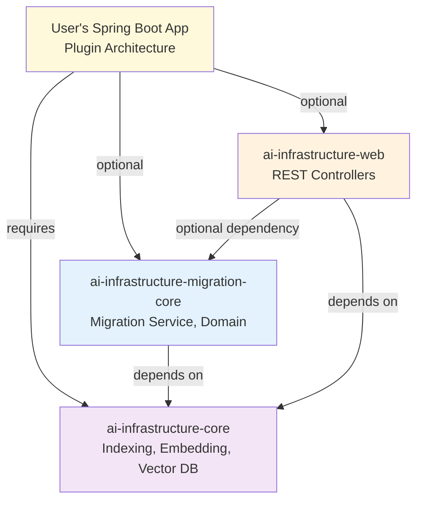
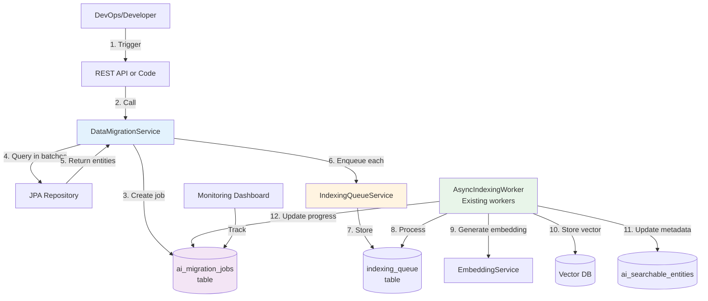

# AI Infrastructure Migration Module - Architecture Document

## Vision

The AI Infrastructure framework is an **AI enablement framework that makes AI and RAG available to apps as a simple plugin**. The migration module is a supporting capability that makes adoption frictionless by enabling backfilling of existing data.

```java
// Framework's value proposition: Plugin AI with one annotation
@Entity
@AICapable(
    entityType = "product",
    migrationRepository = ProductRepository.class
)
public class Product {
    String description;
}

// Migration when needed: One line
migrationService.indexAllEntities("product");
```

**Philosophy**: Start simple, validate, iterate. Build advanced features only when users need them.

---

## Overview

The Migration Module provides a comprehensive solution for indexing existing data in applications that adopt the AI framework. It supports three critical use cases:

1. **New Adoption**: Apps with existing data (e.g., 100K products) need to backfill embeddings
2. **Config Changes**: Reindex entities when `ai-entity-config.yml` changes (e.g., new embeddable fields)
3. **Disaster Recovery**: Rebuild vector indices if vector database is lost

**Approach**: Embedded plugin with REST API for maximum flexibility and minimal complexity.

---

## Module Structure

### Separate Module (Not Standalone Deployment)

The migration functionality is implemented as a **separate module** that integrates with your application:

```
ai-infrastructure-migration/              # Parent module
├── pom.xml
└── ai-infrastructure-migration-core/    # Core migration library
    └── src/main/java/.../migration/
        ├── service/
        │   ├── DataMigrationService.java      # Main orchestration service
        │   ├── EntityRepositoryRegistry.java  # Annotation-based registration
        │   └── MigrationProgressTracker.java  # Progress calculation
        ├── domain/
        │   ├── MigrationJob.java              # JPA entity for job tracking
        │   ├── MigrationRequest.java          # Request DTO
        │   ├── MigrationStatus.java           # Enum (RUNNING, PAUSED, etc.)
        │   └── MigrationFilters.java          # Filter criteria
        ├── repository/
        │   └── MigrationJobRepository.java    # Spring Data JPA repo
        └── config/
            ├── MigrationAutoConfiguration.java
            └── MigrationProperties.java
```

### REST API in Web Module

The REST API is **conditionally loaded** in the existing `ai-infrastructure-web` module:

```
ai-infrastructure-web/
└── src/main/java/.../web/
    └── migration/
        ├── MigrationController.java           # @ConditionalOnBean
        └── dto/
            ├── MigrationRequestDTO.java
            ├── MigrationProgressDTO.java
            └── MigrationFiltersDTO.java
```

---

## Dependency Architecture



**Key Points:**

1. **Migration-core has no web dependencies** - Pure service/domain layer
2. **Web module optionally depends on migration** - Uses `@ConditionalOnBean` to enable REST API
3. **Plugin architecture** - Users add only what they need
4. **Users can mix and match**: Core only, Core + Migration, Core + Web, or all three

---

## Deployment: Embedded Plugin with REST API

### Adding to Your Application

```xml
<dependencies>
  <!-- Core AI functionality -->
  <dependency>
    <groupId>com.ai.infrastructure</groupId>
    <artifactId>ai-infrastructure-core</artifactId>
  </dependency>
  
  <!-- Migration capabilities -->
  <dependency>
    <groupId>com.ai.infrastructure</groupId>
    <artifactId>ai-infrastructure-migration-core</artifactId>
  </dependency>
  
  <!-- REST API (auto-detects migration and adds endpoints) -->
  <dependency>
    <groupId>com.ai.infrastructure</groupId>
    <artifactId>ai-infrastructure-web</artifactId>
  </dependency>
</dependencies>
```

### Usage Options

#### 1. Programmatic API

Use directly in your application code:

```java
@Service
public class DataInitializer {
    
    @Autowired
    private DataMigrationService migrationService;
    
    // Simple migration - one line
    public void migrateAllProducts() {
        MigrationJob job = migrationService.indexAllEntities("product");
        log.info("Started migration: {}", job.getId());
    }
    
    // Advanced migration with filters and control
    public void migrateOldProducts() {
        MigrationRequest request = MigrationRequest.builder()
            .entityType("product")
            .batchSize(1000)
            .filters(MigrationFilters.builder()
                .createdBefore(LocalDate.of(2024, 1, 1))
                .build())
            .rateLimit(50)  // 50 requests/minute to OpenAI
            .reindexExisting(false)  // Skip already indexed
            .build();
        
        MigrationJob job = migrationService.startMigration(request);
        
        // Monitor progress
        while (!job.isComplete()) {
            MigrationProgress progress = migrationService.getProgress(job.getId());
            log.info("Progress: {}% ({}/{})", 
                progress.getPercentComplete(),
                progress.getProcessed(),
                progress.getTotal());
            Thread.sleep(5000);
        }
    }
}
```

#### 2. REST API (Remote Triggering)

Trigger migrations from anywhere:

```bash
# Start migration
curl -X POST https://my-app.com/api/ai/migration/start \
  -H "Authorization: Bearer ${TOKEN}" \
  -H "Content-Type: application/json" \
  -d '{
    "entityType": "product",
    "batchSize": 500,
    "filters": {
      "createdBefore": "2024-01-01"
    },
    "rateLimit": 100
  }'

# Response
{
  "id": "mig-abc-123",
  "entityType": "product",
  "status": "RUNNING",
  "totalEntities": 100000,
  "processedEntities": 0,
  "startedAt": "2025-12-18T10:00:00"
}

# Check progress
curl https://my-app.com/api/ai/migration/jobs/mig-abc-123

# Response
{
  "jobId": "mig-abc-123",
  "status": "RUNNING",
  "progress": {
    "total": 100000,
    "processed": 25000,
    "failed": 12,
    "percentComplete": 25.0,
    "estimatedTimeRemaining": "PT45M"
  }
}

# Pause during high traffic
curl -X POST https://my-app.com/api/ai/migration/jobs/mig-abc-123/pause

# Resume later
curl -X POST https://my-app.com/api/ai/migration/jobs/mig-abc-123/resume

# Cancel if needed
curl -X DELETE https://my-app.com/api/ai/migration/jobs/mig-abc-123
```

#### 3. Scheduled Migrations (Kubernetes CronJob)

```yaml
apiVersion: batch/v1
kind: CronJob
metadata:
  name: weekly-product-reindex
spec:
  schedule: "0 2 * * SUN"  # Every Sunday at 2 AM
  jobTemplate:
    spec:
      template:
        spec:
          containers:
          - name: trigger-migration
            image: curlimages/curl
            env:
            - name: API_TOKEN
              valueFrom:
                secretKeyRef:
                  name: api-credentials
                  key: token
            command:
            - curl
            - -X
            - POST
            - https://my-app.com/api/ai/migration/start
            - -H
            - "Authorization: Bearer $(API_TOKEN)"
            - -H
            - "Content-Type: application/json"
            - -d
            - '{"entityType":"product","reindexExisting":false}'
          restartPolicy: OnFailure
```

#### 4. CI/CD Integration

```yaml
# GitHub Actions
name: Deploy and Migrate

jobs:
  deploy:
    runs-on: ubuntu-latest
    steps:
      - name: Deploy Application
        run: kubectl apply -f k8s/
        
      - name: Trigger Data Migration
        run: |
          curl -X POST https://staging.myapp.com/api/ai/migration/start \
            -H "Authorization: Bearer ${{ secrets.API_TOKEN }}" \
            -H "Content-Type: application/json" \
            -d '{"entityType":"product","reindexExisting":false}'
```

#### 5. Simple Bash Script

```bash
#!/bin/bash
# migrate.sh - CLI wrapper for migration REST API

HOST=${1:-localhost:8080}
ENTITY_TYPE=${2}
BATCH_SIZE=${3:-500}

if [ -z "$ENTITY_TYPE" ]; then
  echo "Usage: ./migrate.sh <host> <entity-type> [batch-size]"
  echo "Example: ./migrate.sh prod-app.com product 1000"
  exit 1
fi

echo "Starting migration for $ENTITY_TYPE on $HOST..."

RESPONSE=$(curl -s -X POST "http://${HOST}/api/ai/migration/start" \
  -H "Content-Type: application/json" \
  -d "{\"entityType\":\"${ENTITY_TYPE}\",\"batchSize\":${BATCH_SIZE}}")

JOB_ID=$(echo $RESPONSE | jq -r '.id')
echo "Migration job started: $JOB_ID"

# Monitor progress
while true; do
  PROGRESS=$(curl -s "http://${HOST}/api/ai/migration/jobs/${JOB_ID}" | jq -r '.progress.percentComplete')
  STATUS=$(curl -s "http://${HOST}/api/ai/migration/jobs/${JOB_ID}" | jq -r '.status')
  
  echo "Progress: ${PROGRESS}% - Status: ${STATUS}"
  
  if [ "$STATUS" = "COMPLETED" ] || [ "$STATUS" = "FAILED" ]; then
    break
  fi
  
  sleep 5
done

echo "Migration finished with status: $STATUS"
```

---

## Architecture: How It Works



**Flow Explanation**:

1. Developer/DevOps triggers migration (REST API or programmatic)
2. `DataMigrationService` receives request
3. Creates `MigrationJob` record to track progress
4. Queries entities from database in configurable batches (e.g., 500 at a time)
5. For each entity, creates an `IndexingRequest`
6. Enqueues to existing `IndexingQueueService` (reuses infrastructure!)
7. Queue stores entries in `indexing_queue` table
8. Existing `AsyncIndexingWorker` processes queue normally (same workers that handle live traffic)
9. Workers generate embeddings via `EmbeddingService` (calls OpenAI, etc.)
10. Workers store vectors in configured vector database
11. Workers update metadata in `ai_searchable_entities` table
12. Workers update job progress after each batch

**Key Design Principles:**

- ✅ **Reuses existing infrastructure** - No new queue, workers, or services
- ✅ **Non-blocking** - Migration entries don't block live indexing
- ✅ **Rate limited** - Prevents API quota exhaustion
- ✅ **Resumable** - Can pause and resume at any time
- ✅ **Observable** - Progress tracking and monitoring built-in

---

## REST API Specification

### MigrationController (Conditional Loading)

The controller is in `ai-infrastructure-web` and only loads when migration module is present:

```java
@RestController
@RequestMapping("/api/ai/migration")
@ConditionalOnBean(DataMigrationService.class)  // Key: Conditional loading
public class MigrationController {
    
    private final DataMigrationService migrationService;
    
    @PostMapping("/start")
    public ResponseEntity<MigrationJob> startMigration(
        @RequestBody @Valid MigrationRequestDTO request) {
        MigrationJob job = migrationService.startMigration(request.toRequest());
        return ResponseEntity.ok(job);
    }
    
    @GetMapping("/jobs")
    public List<MigrationJob> listJobs() {
        return migrationService.getAllJobs();
    }
    
    @GetMapping("/jobs/{id}")
    public MigrationProgress getProgress(@PathVariable String id) {
        return migrationService.getProgress(id);
    }
    
    @PostMapping("/jobs/{id}/pause")
    public ResponseEntity<Void> pauseJob(@PathVariable String id) {
        migrationService.pauseMigration(id);
        return ResponseEntity.ok().build();
    }
    
    @PostMapping("/jobs/{id}/resume")
    public ResponseEntity<Void> resumeJob(@PathVariable String id) {
        migrationService.resumeMigration(id);
        return ResponseEntity.ok().build();
    }
    
    @DeleteMapping("/jobs/{id}")
    public ResponseEntity<Void> cancelJob(@PathVariable String id) {
        migrationService.cancelMigration(id);
        return ResponseEntity.noContent().build();
    }
}
```

### Conditional Loading Behavior

| Dependencies | Other Web Endpoints | Migration Endpoints | Programmatic API |
|-------------|---------------------|---------------------|------------------|
| Core + Web | ✅ Yes | ❌ No | ❌ No |
| Core + Migration | ❌ No | ❌ No | ✅ Yes |
| Core + Migration + Web | ✅ Yes | ✅ Yes | ✅ Yes |

**Example: App without migration module**

```xml
<dependencies>
  <dependency><artifactId>ai-infrastructure-core</artifactId></dependency>
  <dependency><artifactId>ai-infrastructure-web</artifactId></dependency>
  <!-- No migration -->
</dependencies>
```

Result:
- ✅ `/api/ai/monitoring/*` works
- ✅ `/api/ai/audit/*` works
- ✅ `/api/ai/security/*` works
- ❌ `/api/ai/migration/*` NOT loaded (MigrationController bean not created)

**Example: App with all modules**

```xml
<dependencies>
  <dependency><artifactId>ai-infrastructure-core</artifactId></dependency>
  <dependency><artifactId>ai-infrastructure-migration-core</artifactId></dependency>
  <dependency><artifactId>ai-infrastructure-web</artifactId></dependency>
</dependencies>
```

Result:
- ✅ All web endpoints work
- ✅ `/api/ai/migration/*` endpoints loaded (DataMigrationService detected)
- ✅ Programmatic API available via `@Autowired DataMigrationService`

### Web Module Dependency Configuration

```xml
<!-- ai-infrastructure-web/pom.xml -->
<dependencies>
    <!-- Required -->
    <dependency>
        <groupId>com.ai.infrastructure</groupId>
        <artifactId>ai-infrastructure-core</artifactId>
        <version>${project.version}</version>
    </dependency>
    
    <dependency>
        <groupId>org.springframework.boot</groupId>
        <artifactId>spring-boot-starter-web</artifactId>
    </dependency>
    
    <!-- Optional - Migration REST API only loads if present -->
    <dependency>
        <groupId>com.ai.infrastructure</groupId>
        <artifactId>ai-infrastructure-migration-core</artifactId>
        <version>${project.version}</version>
        <optional>true</optional>
    </dependency>
</dependencies>
```

---

## Core Service Architecture

### DataMigrationService

Central orchestration service:

```java
@Service
public class DataMigrationService {
    
    private final IndexingQueueService queueService;
    private final AIEntityConfigurationLoader configLoader;
    private final EntityRepositoryRegistry repositoryRegistry;
    private final MigrationJobRepository jobRepository;
    private final ExecutorService executorService;
    private final ObjectMapper objectMapper;
    
    // Simple API
    public MigrationJob indexAllEntities(String entityType) {
        return startMigration(MigrationRequest.builder()
            .entityType(entityType)
            .build());
    }
    
    // Advanced API with full control
    public MigrationJob startMigration(MigrationRequest request) {
        // 1. Validate entity config exists
        AIEntityConfig config = configLoader.getEntityConfig(request.entityType());
        if (config == null) {
            throw new IllegalArgumentException("No config for entity type: " + request.entityType());
        }
        
        // 2. Get repository from registry
        EntityRegistration registration = repositoryRegistry.getRegistration(request.entityType());
        JpaRepository repository = registration.getRepository();
        
        // 3. Create job tracking record
        long totalCount = repository.count();
        MigrationJob job = createJob(request, totalCount);
        jobRepository.save(job);
        
        // 4. Start async batch processing
        executorService.submit(() -> processBatches(job, repository, config));
        
        return job;
    }
    
    private void processBatches(MigrationJob job, JpaRepository repo, AIEntityConfig config) {
        int currentPage = job.getCurrentPage();
        
        try {
            while (!job.isPaused() && !job.isCancelled()) {
                PageRequest page = PageRequest.of(currentPage, job.getBatchSize());
                List<?> entities = repo.findAll(page).getContent();
                
                if (entities.isEmpty()) break;
                
                int successCount = 0;
                int failureCount = 0;
                
                for (Object entity : entities) {
                    try {
                        if (shouldReindex(entity, job)) {
                            enqueueForIndexing(entity, config);
                            successCount++;
                        }
                    } catch (Exception e) {
                        log.error("Failed to enqueue entity", e);
                        failureCount++;
                    }
                }
                
                // Update progress
                job.setProcessedEntities(job.getProcessedEntities() + successCount);
                job.setFailedEntities(job.getFailedEntities() + failureCount);
                job.setCurrentPage(currentPage + 1);
                job.setLastUpdatedAt(LocalDateTime.now());
                jobRepository.save(job);
                
                currentPage++;
                applyRateLimit(job);
            }
            
            if (!job.isCancelled() && !job.isPaused()) {
                job.setStatus(MigrationStatus.COMPLETED);
                job.setCompletedAt(LocalDateTime.now());
                jobRepository.save(job);
            }
        } catch (Exception e) {
            log.error("Migration job failed", e);
            job.setStatus(MigrationStatus.FAILED);
            job.setErrorMessage(e.getMessage());
            jobRepository.save(job);
        }
    }
    
    private void enqueueForIndexing(Object entity, AIEntityConfig config) {
        String entityId = extractEntityId(entity);
        String payload = objectMapper.writeValueAsString(entity);
        
        IndexingRequest request = IndexingRequest.builder()
            .entityType(config.getEntityType())
            .entityId(entityId)
            .entityClassName(entity.getClass().getName())
            .operation(IndexingOperation.CREATE)
            .actionPlan(IndexingActionPlan.forCreate(config))
            .strategy(IndexingStrategy.ASYNC)
            .priority(IndexingPriority.LOW)  // Don't interfere with live traffic
            .payload(payload)
            .maxRetries(3)
            .build();
        
        queueService.enqueue(request);
    }
    
    private boolean shouldReindex(Object entity, MigrationJob job) {
        if (job.isReindexExisting()) {
            return true;  // Always reindex
        }
        
        // Check if entity already has embeddings
        String entityId = extractEntityId(entity);
        return !searchableEntityRepository.existsByEntityIdAndEntityType(
            entityId, 
            job.getEntityType()
        );
    }
    
    private void applyRateLimit(MigrationJob job) {
        if (job.getRateLimit() != null && job.getRateLimit() > 0) {
            // Calculate delay based on rate limit
            long delayMs = (60 * 1000) / job.getRateLimit();
            Thread.sleep(delayMs);
        }
    }
    
    // Management operations
    public MigrationProgress getProgress(String jobId) {
        MigrationJob job = jobRepository.findById(jobId)
            .orElseThrow(() -> new IllegalArgumentException("Job not found: " + jobId));
        
        return MigrationProgress.builder()
            .jobId(job.getId())
            .status(job.getStatus())
            .total(job.getTotalEntities())
            .processed(job.getProcessedEntities())
            .failed(job.getFailedEntities())
            .percentComplete(calculatePercentComplete(job))
            .estimatedTimeRemaining(calculateETA(job))
            .build();
    }
    
    public void pauseMigration(String jobId) {
        MigrationJob job = jobRepository.findById(jobId)
            .orElseThrow(() -> new IllegalArgumentException("Job not found: " + jobId));
        
        job.setStatus(MigrationStatus.PAUSED);
        jobRepository.save(job);
    }
    
    public void resumeMigration(String jobId) {
        MigrationJob job = jobRepository.findById(jobId)
            .orElseThrow(() -> new IllegalArgumentException("Job not found: " + jobId));
        
        if (job.getStatus() != MigrationStatus.PAUSED) {
            throw new IllegalStateException("Can only resume paused jobs");
        }
        
        job.setStatus(MigrationStatus.RUNNING);
        jobRepository.save(job);
        
        // Restart processing
        AIEntityConfig config = configLoader.getEntityConfig(job.getEntityType());
        EntityRegistration registration = repositoryRegistry.getRegistration(job.getEntityType());
        JpaRepository repository = registration.getRepository();
        
        executorService.submit(() -> processBatches(job, repository, config));
    }
    
    public void cancelMigration(String jobId) {
        MigrationJob job = jobRepository.findById(jobId)
            .orElseThrow(() -> new IllegalArgumentException("Job not found: " + jobId));
        
        job.setStatus(MigrationStatus.CANCELLED);
        job.setCompletedAt(LocalDateTime.now());
        jobRepository.save(job);
    }
}
```

### Entity & Repository Registration: Annotation-Based

All entities MUST declare their repository in `@AICapable` annotation using the **required** `migrationRepository` attribute.

#### Updated @AICapable Annotation

The `@AICapable` annotation now requires explicit repository declaration:

```java
@Retention(RetentionPolicy.RUNTIME)
@Target(ElementType.TYPE)
public @interface AICapable {
    
    /**
     * Entity type identifier (e.g., "product", "order")
     */
    String entityType();
    
    /**
     * JPA Repository for this entity.
     * REQUIRED for migration to work - no default value.
     * 
     * Example: 
     * @AICapable(
     *     entityType = "product", 
     *     migrationRepository = ProductRepository.class
     * )
     */
    Class<? extends JpaRepository> migrationRepository();  // REQUIRED
}
```

#### Usage Example

```java
@Entity
@AICapable(
    entityType = "product",
    migrationRepository = ProductRepository.class  // Explicit, required
)
public class Product {
    @Id private UUID id;
    private String name;
    private String description;
}

public interface ProductRepository extends JpaRepository<Product, UUID> {
}
```

**If user forgets:**

```java
@AICapable(entityType = "product")  // ← Compile error: missing required attribute 'migrationRepository'
```

#### EntityRepositoryRegistry (Simplified)

```java
@Component
public class EntityRepositoryRegistry {
    
    private final ApplicationContext context;
    private final AIEntityConfigurationLoader configLoader;
    private final Map<String, EntityRegistration> registry = new ConcurrentHashMap<>();
    
    @PostConstruct
    public void discoverEntities() {
        Map<String, AIEntityConfig> configs = configLoader.getAllEntityConfigs();
        
        for (AIEntityConfig config : configs.values()) {
            // 1. Find entity class
            Class<?> entityClass = findEntityClass(config.getEntityType());
            
            // 2. Get repository from @AICapable annotation (REQUIRED)
            AICapable annotation = entityClass.getAnnotation(AICapable.class);
            if (annotation == null) {
                throw new IllegalStateException(
                    "Entity must be annotated with @AICapable: " + entityClass.getName());
            }
            
            // 3. Get repository bean from Spring context
            Class<? extends JpaRepository> repoClass = annotation.migrationRepository();
            JpaRepository repository = context.getBean(repoClass);
            
            // 4. Register
            registry.put(config.getEntityType(), 
                new EntityRegistration(config.getEntityType(), entityClass, repository));
            
            log.info("Registered entity '{}' with repository {}", 
                config.getEntityType(), repoClass.getSimpleName());
        }
    }
    
    public EntityRegistration getRegistration(String entityType) {
        EntityRegistration registration = registry.get(entityType);
        if (registration == null) {
            throw new IllegalArgumentException("No registration found for: " + entityType);
        }
        return registration;
    }
}

@Value
public class EntityRegistration {
    String entityType;
    Class<?> entityClass;
    JpaRepository repository;
}
```

#### Benefits

✅ **Explicit** - No magic, clear intent  
✅ **Type-Safe** - Compile-time verification  
✅ **No Runtime Errors** - Can't forget repository  
✅ **Simple Code** - Single strategy, ~30 lines  
✅ **Better Error Messages** - Compile-time  
✅ **Co-Located** - Configuration right next to entity


---

## Database Schema (Hibernate-Driven)

Table creation is handled by **Hibernate/JPA** via the `MigrationJob` entity. No SQL migration scripts needed!

### MigrationJob Entity

```java
@Entity
@Table(name = "ai_migration_jobs", indexes = {
    @Index(name = "idx_status", columnList = "status"),
    @Index(name = "idx_entity_type", columnList = "entity_type"),
    @Index(name = "idx_started_at", columnList = "started_at")
})
@Getter
@Setter
@Builder
@NoArgsConstructor
@AllArgsConstructor
public class MigrationJob {
    
    @Id
    @Column(length = 255)
    private String id;
    
    @Column(name = "entity_type", nullable = false, length = 255)
    private String entityType;
    
    @Enumerated(EnumType.STRING)
    @Column(nullable = false, length = 50)
    private MigrationStatus status;
    
    @Column(name = "total_entities", nullable = false)
    private Long totalEntities = 0L;
    
    @Column(name = "processed_entities", nullable = false)
    private Long processedEntities = 0L;
    
    @Column(name = "failed_entities", nullable = false)
    private Long failedEntities = 0L;
    
    @Column(name = "current_page", nullable = false)
    private Integer currentPage = 0;
    
    @Column(name = "batch_size", nullable = false)
    private Integer batchSize = 500;
    
    @Column(name = "rate_limit")
    private Integer rateLimit;
    
    @Column(name = "reindex_existing", nullable = false)
    private Boolean reindexExisting = false;
    
    @Column(name = "filter_config", columnDefinition = "TEXT")
    @Convert(converter = MigrationFiltersConverter.class)
    private MigrationFilters filters; // JSON conversion via AttributeConverter
    
    @Column(name = "started_at")
    private LocalDateTime startedAt;
    
    @Column(name = "completed_at")
    private LocalDateTime completedAt;
    
    @Column(name = "last_updated_at")
    private LocalDateTime lastUpdatedAt;
    
    @Column(name = "error_message", columnDefinition = "TEXT")
    private String errorMessage;
    
    @Column(name = "created_by", length = 255)
    private String createdBy;
    
    // Helper methods
    public boolean isPaused() {
        return status == MigrationStatus.PAUSED;
    }
    
    public boolean isCancelled() {
        return status == MigrationStatus.CANCELLED;
    }
    
    public boolean isComplete() {
        return status == MigrationStatus.COMPLETED || 
               status == MigrationStatus.FAILED || 
               status == MigrationStatus.CANCELLED;
    }
}
```

**Benefits:**
- ✅ No SQL migration scripts needed
- ✅ Hibernate creates/updates table automatically
- ✅ Type-safe (Java types → DB types)
- ✅ Portable across databases (PostgreSQL, MySQL, H2)
- ✅ Consistent with other framework entities (`IndexingQueueEntry`, `AISearchableEntity`)

**Hibernate Configuration:**
```yaml
spring:
  jpa:
    hibernate:
      ddl-auto: update  # or validate in production
    show-sql: false
```

---

## Configuration

### Migration Properties

```yaml
ai:
  migration:
    enabled: true
    default-batch-size: 500
    default-rate-limit: 100  # requests/minute
    max-concurrent-jobs: 3
    cleanup-completed-after-days: 30
    
    # No entity-discovery configuration needed!
    # Repositories are declared via @AICapable.migrationRepository attribute
```

### Complete Example

```yaml
spring:
  application:
    name: my-app
  datasource:
    url: jdbc:postgresql://localhost:5432/myapp
    username: ${DB_USER}
    password: ${DB_PASSWORD}
  jpa:
    hibernate:
      ddl-auto: update  # Hibernate creates migration tables
    show-sql: false

ai:
  providers:
    llm-provider: openai
    embedding-provider: openai
    openai:
      api-key: ${OPENAI_API_KEY}
  
  vector-db:
    type: lucene
    lucene:
      index-path: ./data/vector-index
  
  migration:
    enabled: true
    default-batch-size: 500
    default-rate-limit: 100
    max-concurrent-jobs: 3
    cleanup-completed-after-days: 30
    
    # No entity-discovery configuration needed!
    # Repositories declared via @AICapable.migrationRepository attribute
```

---

## Implementation Phases

### Phase 1: Module Structure & Domain (Day 1-2)

- Create `ai-infrastructure-migration` parent module with pom.xml
- Create `ai-infrastructure-migration-core` submodule
- Add to parent pom.xml modules list
- Build domain objects:
  - `MigrationJob` JPA entity with @Entity annotations (Hibernate creates table)
  - `MigrationRequest` DTO
  - `MigrationStatus` enum
  - `MigrationFilters` with JSON converter
- Add configuration properties (no entity-discovery config needed)
- No SQL migration scripts needed (Hibernate-driven)

### Phase 2: Entity/Repository Registry & Core Service (Day 3-5)

- Update `@AICapable` annotation to add `migrationRepository` attribute (required, no default)
- Implement `EntityRepositoryRegistry` with annotation-based registration (simple, ~30 lines)
- Implement `DataMigrationService` with batch processing
- Integrate with existing `IndexingQueueService`
- Implement auto-configuration
- Write unit tests for registry and service

### Phase 3: Progress Tracking & Control (Day 6-7)

- Add pause/resume functionality
- Implement job cancellation
- Build progress calculation with ETA
- Add error logging and retry logic
- Integrate with existing audit logging

### Phase 4: REST API in Web Module (Day 8-9)

- Add optional dependency on migration-core to `ai-infrastructure-web/pom.xml`
- Build `MigrationController` with `@ConditionalOnBean`
- Create DTOs (MigrationRequestDTO, MigrationProgressDTO, MigrationFiltersDTO)
- Add OpenAPI documentation
- Write integration tests for REST endpoints

### Phase 5: Advanced Features (Day 10)

- Selective reindexing filters (date ranges, IDs, custom predicates)
- Rate limiting implementation
- Smart reindexing (skip already indexed)
- Prometheus metrics

### Phase 6: Documentation & Examples (Day 11-12)

- User guide (how to use embedded mode)
- REST API documentation with examples
- Example curl scripts
- K8s CronJob manifest examples
- CI/CD integration examples
- Update main README with migration section

**Total: ~12 days**

---

## Architectural Decisions

### Decision 1: Why Separate Module?

**Reasons:**

1. **Clear separation of concerns**: Migration is distinct from core AI capabilities
2. **Optional dependency**: Apps can exclude if not needed
3. **Independent versioning**: Evolve migration features without affecting core
4. **Easier testing**: Isolated test suite
5. **Future-proof**: Can add standalone mode later if needed

**Why not in `ai-infrastructure-core`?**

- ❌ Bloats core module
- ❌ All apps load migration code even if unused
- ❌ Mixed concerns in single module

### Decision 2: Why REST API in Web Module?

**Reasons:**

1. **Separation of concerns**: Migration-core stays pure service/domain layer (no Spring MVC)
2. **Consistent with framework**: All other controllers already in web module
3. **Conditional loading**: `@ConditionalOnBean` ensures endpoints only exist when migration present
4. **Flexible dependencies**: Users can have web without migration, or migration without web
5. **No circular dependencies**: Clean dependency tree (web → migration → core)
6. **Testing isolation**: Can test migration service without web layer

**Why not in `migration-core`?**

- ❌ Forces Spring MVC dependency on all migration users (even if they don't want REST)
- ❌ Creates circular dependency if web module wants to use migration
- ❌ Inconsistent with framework pattern
- ❌ Harder to test service layer in isolation

### Decision 3: Why Reuse IndexingQueueService?

**Reasons:**

1. **No duplicate infrastructure**: Queue, workers, retries already exist
2. **Consistent processing**: Migration entries processed same way as live traffic
3. **Proven scalability**: Existing queue handles high throughput
4. **Lower maintenance**: Less code to maintain
5. **Unified monitoring**: All indexing operations in one place

**Alternative considered: Separate migration queue**

- ❌ Duplicate queue implementation
- ❌ Separate worker pool to maintain
- ❌ Split monitoring/metrics
- ❌ More complex codebase

### Decision 4: Why Start Simple (No Standalone Mode)?

**Reasons:**

1. **YAGNI principle**: Build it when users actually need it
2. **Validate first**: Embedded + REST covers 90% of use cases
3. **Faster delivery**: 12 days vs 15 days
4. **Lower complexity**: Less code to maintain
5. **Easy to add later**: Architecture designed for extensibility

**Embedded mode + REST API achieves:**
- ✅ Control (trigger from ops/DevOps)
- ✅ Scheduling (K8s CronJob, cron)
- ✅ Automation (CI/CD integration)
- ✅ Monitoring (REST API progress)
- ✅ Simple (no extra deployments)

**When to build standalone mode:**
- Users request resource isolation
- Need to use separate OpenAI API keys
- Want independent scaling
- Need to run migrations with zero production impact

---

## Benefits

### For Framework Users

- ✅ **Simple adoption**: Add one dependency, call one method
- ✅ **Flexible control**: Programmatic API or REST API
- ✅ **Production-ready**: Handle 1M+ entities with progress tracking
- ✅ **Safe**: Rate limiting prevents API quota exhaustion
- ✅ **Non-blocking**: Pause during high traffic, resume later
- ✅ **Observable**: Built-in progress tracking and monitoring

### For Framework Maintainers

- ✅ **Separate module**: Clean separation, evolves independently
- ✅ **Reuses infrastructure**: 90% code reuse (existing queue, workers, services)
- ✅ **Consistent**: Same patterns as rest of framework
- ✅ **Extensible**: Easy to add new features
- ✅ **Less complexity**: No separate deployment to maintain
- ✅ **Faster to market**: 12 days vs 15 days with standalone

### For Enterprise Users

- ✅ **Remote triggering**: Call REST API from ops machines, Jenkins, etc.
- ✅ **Scheduled migrations**: K8s CronJob, cron, scheduled tasks
- ✅ **CI/CD integration**: Automate migrations in deployment pipeline
- ✅ **Monitoring**: Track progress via REST API or programmatic queries

---

## Future Enhancements

### Standalone Deployment Mode (When Needed)

If users need to run migrations with zero production impact:

**Create separate module:**
```
ai-infrastructure-migration/
└── ai-infrastructure-migration-standalone/
    ├── pom.xml
    └── src/main/java/
        └── MigrationApplication.java
```

**Capabilities:**
- Separate deployment (Docker, K8s Job)
- Direct processing (bypass queue, do heavy work locally)
- Separate OpenAI API key
- Independent resource scaling
- Complete isolation from production app

**Effort**: 3-4 days (module structure already supports it)

**Triggers to build:**
- Multiple user requests for standalone mode
- Proven pattern of needing resource isolation
- Use cases requiring separate API keys/quotas

### Other Future Features

- **Distributed migration**: Shard large migrations across multiple workers
- **Incremental sync**: Continuous background reindexing of changed entities
- **Custom filter predicates**: User-defined lambdas for selective reindexing
- **Migration templates**: Pre-configured migration strategies
- **Rollback support**: Undo migration if errors detected
- **Real-time metrics dashboard**: UI for monitoring migrations
- **Webhook notifications**: Alert on migration completion/failure
- **Multi-tenancy support**: Per-tenant migration isolation

---

## Related Documentation

- [User Guide](./MIGRATION_GUIDE.md) - How to use migration in your app
- [Project Overview](./PROJECT_OVERVIEW_TECHNICAL.md) - Overall framework architecture
- [Entity Indexing Guide](./Fixing_Arch/ENTITY_INDEXING_REGISTRATION_GUIDE.md) - How indexing works

---

## Summary

**Start Simple, Validate, Iterate**

The AI Infrastructure Migration Module is designed as an **embedded plugin** that:

1. ✅ Integrates seamlessly with existing applications
2. ✅ Provides both programmatic and REST API access
3. ✅ Reuses existing infrastructure (90% code reuse)
4. ✅ Supports all common use cases (manual, scheduled, CI/CD)
5. ✅ Can evolve to standalone mode if users need it

**This aligns with the framework's vision**: Make AI and RAG available to apps as a simple plugin. Migration should be simple too.
