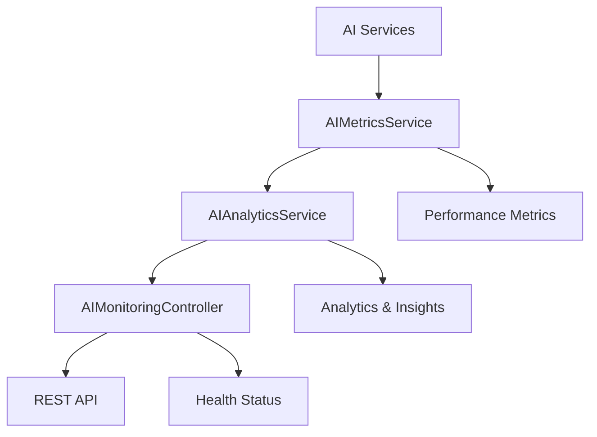
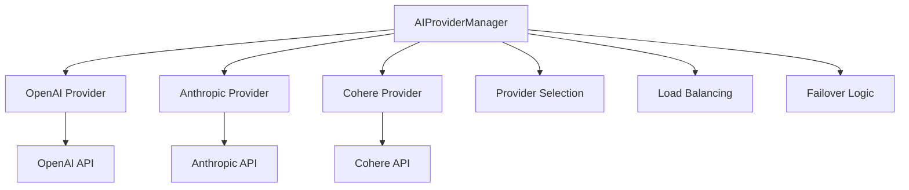

# Technical Use Cases - Sequence 12 (P3.1-E, P3.2-A)

## P3.1-E: Develop AI Health Monitoring and Observability

### Technical Challenges Solved

#### 1. **Real-time Health Monitoring Architecture**
- **Challenge**: Need to monitor AI services in real-time without impacting performance
- **Solution**: Lightweight monitoring with asynchronous data collection and caching
- **Technical Implementation**:
  ```java
  @Service
  public class AIHealthService {
      private final AIMetricsService metricsService;
      private final AIAnalyticsService analyticsService;
      
      public AIHealthDto getHealthStatus() {
          // Real-time health aggregation
          AIHealthDto health = healthIndicator.getDetailedHealth();
          health.setPerformanceMetrics(metricsService.getPerformanceMetrics());
          health.setProviderStatus(getProviderStatus());
          return health;
      }
  }
  ```

#### 2. **Comprehensive Metrics Collection**
- **Challenge**: Collect and aggregate metrics from multiple AI services and providers
- **Solution**: Centralized metrics service with atomic counters and performance tracking
- **Technical Implementation**:
  ```java
  @Service
  public class AIMetricsService {
      private final AtomicLong totalRequests = new AtomicLong(0);
      private final AtomicLong successfulRequests = new AtomicLong(0);
      private final AtomicReference<Double> averageResponseTime = new AtomicReference<>(0.0);
      
      public void recordSuccess(String serviceName, String providerName, long responseTimeMs) {
          totalRequests.incrementAndGet();
          successfulRequests.incrementAndGet();
          updateResponseTime(responseTimeMs);
      }
  }
  ```

#### 3. **Advanced Analytics and Insights**
- **Challenge**: Transform raw metrics into actionable insights and recommendations
- **Solution**: Machine learning-based analytics with trend analysis and predictive insights
- **Technical Implementation**:
  ```java
  @Service
  public class AIAnalyticsService {
      public Map<String, Object> getAnalyticsReport() {
          Map<String, Object> report = new HashMap<>();
          report.put("trends", analyzeTrends());
          report.put("performanceInsights", getPerformanceInsights());
          report.put("recommendations", generateRecommendations());
          return report;
      }
  }
  ```

#### 4. **REST API for Monitoring**
- **Challenge**: Provide easy access to monitoring data through REST APIs
- **Solution**: Comprehensive REST API with health checks, metrics, and analytics endpoints
- **Technical Implementation**:
  ```java
  @RestController
  @RequestMapping("/api/ai/monitoring")
  public class AIMonitoringController {
      @GetMapping("/health")
      public ResponseEntity<AIHealthDto> getHealth() {
          return ResponseEntity.ok(healthService.getHealthStatus());
      }
      
      @GetMapping("/metrics")
      public ResponseEntity<Map<String, Object>> getMetrics() {
          return ResponseEntity.ok(metricsService.getPerformanceMetrics());
      }
  }
  ```

### Technical Use Cases

#### **Health Check Endpoint**
```bash
# Get overall AI health status
curl -X GET http://localhost:8080/api/ai/monitoring/health

# Response
{
  "enabled": true,
  "status": "UP",
  "configurationValid": true,
  "performanceMetrics": {
    "totalRequests": 1500,
    "successRate": 0.98,
    "averageResponseTime": 1200
  },
  "providerStatus": {
    "openai": {"available": true, "healthy": true},
    "anthropic": {"available": true, "healthy": true}
  }
}
```

#### **Performance Metrics Collection**
```java
// Automatic metrics collection
@Service
public class AICoreService {
    @Autowired
    private AIMetricsService metricsService;
    
    public AIGenerationResponse generateContent(AIGenerationRequest request) {
        long startTime = System.currentTimeMillis();
        
        try {
            AIGenerationResponse response = // ... AI generation logic
            metricsService.recordSuccess("aiCoreService", "openai", 
                System.currentTimeMillis() - startTime);
            return response;
        } catch (Exception e) {
            metricsService.recordFailure("aiCoreService", "openai", 
                e.getClass().getSimpleName(), System.currentTimeMillis() - startTime);
            throw e;
        }
    }
}
```

#### **Analytics and Insights**
```bash
# Get comprehensive analytics report
curl -X GET http://localhost:8080/api/ai/monitoring/analytics

# Response
{
  "currentMetrics": {...},
  "trends": {
    "responseTimeTrend": {"trend": "decreasing", "changePercent": -15.2},
    "successRateTrend": {"trend": "stable", "changePercent": 0.5}
  },
  "recommendations": [
    "Consider implementing caching to reduce response times",
    "Cache hit rate is low - review cache configuration"
  ],
  "healthScore": 87.5
}
```

## P3.2-A: Add Multi-Provider Support for LLMs and Embeddings

### Technical Challenges Solved

#### 1. **Provider Abstraction Layer**
- **Challenge**: Create unified interface for different AI providers with varying APIs
- **Solution**: Common provider interface with adapter pattern for different providers
- **Technical Implementation**:
  ```java
  public interface AIProvider {
      String getProviderName();
      boolean isAvailable();
      AIGenerationResponse generateContent(AIGenerationRequest request);
      AIEmbeddingResponse generateEmbedding(AIEmbeddingRequest request);
      ProviderStatus getStatus();
      ProviderConfig getConfig();
  }
  ```

#### 2. **Real Provider Implementations**
- **Challenge**: Implement actual API calls to different AI providers (OpenAI, Anthropic, Cohere)
- **Solution**: REST-based implementations with proper authentication and error handling
- **Technical Implementation**:
  ```java
  @Component
  public class OpenAIProvider implements AIProvider {
      private final RestTemplate restTemplate;
      private final ProviderConfig config;
      
      @Override
      public AIGenerationResponse generateContent(AIGenerationRequest request) {
          String url = "https://api.openai.com/v1/completions";
          HttpHeaders headers = new HttpHeaders();
          headers.set("Authorization", "Bearer " + config.getApiKey());
          
          // Real API call implementation
          ResponseEntity<Map> response = restTemplate.exchange(url, HttpMethod.POST, entity, Map.class);
          return processResponse(response.getBody());
      }
  }
  ```

#### 3. **Intelligent Provider Selection**
- **Challenge**: Select best provider based on availability, performance, and cost
- **Solution**: Multi-strategy provider selection with priority, health, and performance-based algorithms
- **Technical Implementation**:
  ```java
  @Service
  public class AIProviderManager {
      private AIProvider selectProvider(List<AIProvider> providers, String operationType) {
          // Strategy 1: Priority-based selection
          AIProvider priorityProvider = selectByPriority(providers);
          if (priorityProvider != null) return priorityProvider;
          
          // Strategy 2: Health-based selection
          AIProvider healthProvider = selectByHealth(providers);
          if (healthProvider != null) return healthProvider;
          
          // Strategy 3: Performance-based selection
          return selectByPerformance(providers);
      }
  }
  ```

#### 4. **Automatic Failover and Load Balancing**
- **Challenge**: Handle provider failures and distribute load across multiple providers
- **Solution**: Automatic failover with fallback providers and intelligent load balancing
- **Technical Implementation**:
  ```java
  public AIGenerationResponse generateContent(AIGenerationRequest request) {
      AIProvider selectedProvider = selectProvider(availableProviders, "generation");
      
      try {
          return selectedProvider.generateContent(request);
      } catch (Exception e) {
          // Automatic failover to backup providers
          return tryFallbackProviders(request, availableProviders, selectedProvider);
      }
  }
  ```

### Technical Use Cases

#### **Multi-Provider Configuration**
```yaml
# application.yml
ai:
  providers:
    openai:
      api-key: ${OPENAI_API_KEY}
      model: gpt-4o-mini
      priority: 1
      enabled: true
    anthropic:
      api-key: ${ANTHROPIC_API_KEY}
      model: claude-3-sonnet
      priority: 2
      enabled: true
    cohere:
      api-key: ${COHERE_API_KEY}
      model: command
      priority: 3
      enabled: true
```

#### **Provider Status Monitoring**
```bash
# Get all provider statuses
curl -X GET http://localhost:8080/api/ai/monitoring/providers

# Response
{
  "openai": {
    "available": true,
    "healthy": true,
    "totalRequests": 500,
    "successRate": 0.98,
    "averageResponseTime": 1200
  },
  "anthropic": {
    "available": true,
    "healthy": true,
    "totalRequests": 300,
    "successRate": 0.95,
    "averageResponseTime": 1500
  }
}
```

#### **Intelligent Provider Selection**
```java
// Automatic provider selection based on strategy
@Service
public class AICoreService {
    @Autowired
    private AIProviderManager providerManager;
    
    public AIGenerationResponse generateContent(AIGenerationRequest request) {
        // Provider manager automatically selects best provider
        return providerManager.generateContent(request);
    }
}
```

#### **Fallback and Error Handling**
```java
// Automatic failover implementation
private AIGenerationResponse tryFallbackProviders(AIGenerationRequest request, 
                                                List<AIProvider> availableProviders, 
                                                AIProvider failedProvider) {
    List<AIProvider> fallbackProviders = availableProviders.stream()
        .filter(p -> !p.getProviderName().equals(failedProvider.getProviderName()))
        .collect(Collectors.toList());
    
    for (AIProvider provider : fallbackProviders) {
        try {
            return provider.generateContent(request);
        } catch (Exception e) {
            log.warn("Fallback provider {} also failed", provider.getProviderName());
        }
    }
    
    throw new RuntimeException("All providers failed");
}
```

## Implementation Architecture

### Health Monitoring Architecture


### Multi-Provider Architecture


## Performance Considerations

### Health Monitoring Performance
- **Asynchronous Collection**: Metrics collected asynchronously to avoid performance impact
- **Caching**: Health status cached with TTL to reduce computation
- **Batch Processing**: Analytics processed in batches to optimize performance

### Multi-Provider Performance
- **Connection Pooling**: HTTP connections pooled for better performance
- **Caching**: Provider responses cached to reduce API calls
- **Load Balancing**: Intelligent load distribution across providers

## Security Considerations

### Health Monitoring Security
- **Data Anonymization**: Sensitive data anonymized in metrics
- **Access Control**: Monitoring endpoints secured with authentication
- **Audit Logging**: All monitoring activities logged for compliance

### Multi-Provider Security
- **API Key Management**: Secure storage and rotation of API keys
- **Encryption**: All API calls encrypted in transit
- **Access Control**: Provider access controlled by configuration

## Testing Strategy

### Health Monitoring Testing
- **Unit Tests**: Individual service testing with mocked dependencies
- **Integration Tests**: End-to-end monitoring workflow testing
- **Performance Tests**: Load testing for metrics collection

### Multi-Provider Testing
- **Provider Tests**: Individual provider implementation testing
- **Manager Tests**: Provider selection and failover testing
- **End-to-End Tests**: Complete multi-provider workflow testing

This technical implementation provides a robust, scalable, and maintainable foundation for AI health monitoring and multi-provider support.